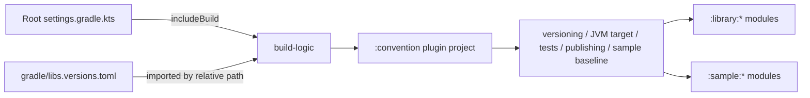

# `build-logic` Logic Graph

## Purpose

Provides the included Gradle build that hosts repository-local convention plugins without adding build logic to runtime modules.

## Owns

- Included-build repository and version-catalog wiring.
- The [`build-logic:convention`](convention/README.md) child project.

## Does not own

- Android runtime code or dependencies.
- Individual convention-plugin behavior, owned by the child project.

## Depends on

No application Gradle modules. Its settings import the root version catalog for plugin compilation.

## Used by

The root build includes `build-logic` through `pluginManagement`, allowing active Android modules to apply its convention plugin.

## Flow chart

## Architectural decisions

- Build conventions live in an included build so they are compiled, typed, and available in every
  project `plugins` block without becoming runtime dependencies.
- The included build reuses the root version catalog instead of maintaining a second set of AGP,
  Kotlin, and test-plugin versions.
- Runtime modules apply narrow convention plugins; the composite `sample-module` plugin is reserved
  for the sample's Android library modules, which intentionally share one baseline.

## Public contracts

- The included-build name and plugins published by its child projects.

## Internal implementations

- Repository setup and version-catalog import.

## Current risks

The included build imports the root catalog by relative path, so relocating it requires updating that path and root plugin management together.
