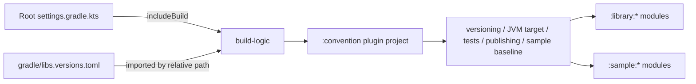

# `build-logic` Logic Graph

## Purpose

Provides the included Gradle build that hosts repository-local convention plugins without adding build logic to runtime modules.

## Owns

- Included-build repository and version-catalog wiring.
- The [`build-logic:convention`](convention/README.md) child project.

## Does not own

- Android runtime code or dependencies.
- Individual convention-plugin behavior, owned by the child project.

## Depends on

No application Gradle modules. Its settings import the root version catalog for plugin compilation.

## Used by

The root build includes `build-logic` through `pluginManagement`, allowing active Android modules to apply its convention plugin.

## Flow chart



## Architectural decisions

- Build conventions live in an included build so they are compiled, typed, and available in every
  project `plugins` block without becoming runtime dependencies.
- The included build reuses the root version catalog instead of maintaining a second set of AGP,
  Kotlin, and test-plugin versions.
- Runtime modules apply narrow convention plugins; the composite `sample-module` plugin is reserved
  for the sample's Android library modules, which intentionally share one baseline.
- `applicationId` (`com.d4rk.android.apps.apptoolkit`) is intentionally decoupled from `namespace`
  (`com.mihaicristiancondrea.*`) to preserve Google Play identity for existing installs.
- `build-logic:convention` explicitly pins `id("org.gradle.kotlin.kotlin-dsl")` to the version bundled with the Gradle wrapper for JitPack compatibility and Kotlin compiler alignment. See [Pinning explicit kotlin-dsl version](convention/README.md#pinning-explicit-kotlin-dsl-version).

## Application ID

The sample app ships to Google Play as:

```text
com.d4rk.android.apps.apptoolkit
```

This is fixed. It is not derived from the Kotlin package or the Gradle `namespace`, and it must not
be changed to match them.

### Why it does not follow the source packages

The project's source packages and Gradle namespaces use `com.mihaicristiancondrea.*`. The app was
released under `com.d4rk.*` before that rename, and Google Play treats the application ID as the
app's permanent identity:

- publishing under a different ID creates a **new** app rather than an update;
- every existing install is stranded on the last build of the old ID, with no update path;
- the old ID cannot be reused or reclaimed once taken.

Android separates the two concepts precisely so a rename like this is possible:

| Setting         | What it names                                | Safe to change         |
|-----------------|----------------------------------------------|------------------------|
| `namespace`     | Generated `R` and `BuildConfig` classes      | Yes, it is source-only |
| `applicationId` | The app's identity on the device and on Play | No, once released      |

So `sample/app/build.gradle.kts` deliberately sets an `applicationId` that does not match its
`namespace`. That mismatch is correct and should not be "tidied up".

There is no `applicationIdSuffix`. The ID is written out in full, because a suffix split across two
declarations is how the wrong value got shipped in the first place, the pieces read as plausible
on their own.

### What is tied to the application ID

Changing it, or getting it wrong, breaks all of these:

- **Firebase**, `google-services.json` is matched by package name.
- **AdMob**, the app ID in the manifest belongs to a specific Play listing.
- **Play Billing**, products are registered against the application ID.
- **Deep links, backup, shortcuts**, anything keyed on the package name.

### google-services.json

The file is **not committed**, it is gitignored, and holds API keys and client IDs issued by
Firebase. Each machine that needs Firebase keeps its own copy at `sample/app/google-services.json`,
downloaded from the Firebase console for the app registered as `com.d4rk.android.apps.apptoolkit`.

The build applies the Firebase plugins only when that file contains a client matching the
application ID. The check distinguishes two states that a plain file-exists test cannot:

| State                       | Meaning             | Build behaviour                  |
|-----------------------------|---------------------|----------------------------------|
| File absent                 | Not configured here | Firebase skipped, build proceeds |
| File present, wrong package | Configured wrong    | Warning; **release builds fail** |
| File present, right package | Configured          | Firebase plugins applied         |

Absence is the normal state on CI and on a fresh clone. It is obvious and harmless, so it must not
fail the build, `./gradlew build` assembles release variants, so failing on absence would break CI
for everyone.

A file that is present but names a different package is the case worth failing on. Nothing looks
wrong: the Google Services plugin is simply never applied, and the release ships with Crashlytics
silently doing nothing. That is how a renamed application ID turns into a release with no crash
reporting, which is exactly what happened when the ID was corrected.

### Verifying

```bash
# Confirm the ID that will actually be packaged.
./gradlew :sample:app:assembleDebug
unzip -p sample/app/build/outputs/apk/debug/app-debug.apk AndroidManifest.xml | strings | grep -i d4rk
```

This warning means a `google-services.json` is present but registered to a different package,
re-download it from the Firebase console for `com.d4rk.android.apps.apptoolkit`:

```text
google-services.json has no client for 'com.d4rk.android.apps.apptoolkit', so Firebase
(Analytics, Crashlytics, Performance) is disabled for this build.
```

No warning and no Firebase simply means the file is absent, which is expected on CI.

## Public contracts

- The included-build name and plugins published by its child projects.
- Sample application ID policy (`com.d4rk.android.apps.apptoolkit`). See [Application ID](#application-id).
- `kotlin-dsl` version pinning convention. See [Pinning explicit kotlin-dsl version](convention/README.md#pinning-explicit-kotlin-dsl-version).

## Internal implementations

- Repository setup and version-catalog import.

## Current risks

The included build imports the root catalog by relative path, so relocating it requires updating that path and root plugin management together.
