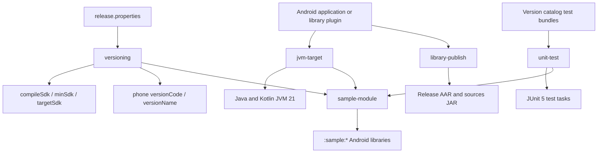

# `build-logic:convention` Logic Graph

## Purpose

Provides the repository's local Gradle convention plugins for SDK/version values, JVM targets,
JUnit 5, library publication, and the shared sample-module baseline.

## Owns

- `versioning`, which reads SDK and application-version inputs from `release.properties`.
- `jvm-target`, which keeps Java and Kotlin bytecode on JVM 21.
- `unit-test`, which installs the JUnit 5 platform and shared test bundles.
- `library-publish`, which publishes each Android library's release variant and sources.
- `sample-module`, which composes the Android-library, Compose, versioning, testing, and JVM-target
  baseline used by `:sample:*` library modules.

## Does not own

- Android build types, dependency declarations, or application version codes; those remain in each consuming module.
- Runtime application behavior.

## Depends on

This included-build module has no dependencies on application Gradle projects. It compiles against
the Android, Kotlin, and Android JUnit 5 Gradle plugin APIs.

## Used by

All active Android projects apply at least one of these plugins. Sample library modules normally
apply only `sample-module`; published library modules apply the narrower conventions explicitly.

## Flow chart



## Architectural decisions

- Convention plugins use the repository-neutral `com.mihaicristiancondrea.android.apptoolkit`
  namespace. The `apps` and `libs` segments distinguish runtime sample and library code and do not
  apply to build-time Gradle plugins.
- `jvm-target` fails when applied before an Android plugin because AGP's compile options are the
  source of truth for Java compatibility; plugin order is therefore part of its contract.
- Test dependencies and `useJUnitPlatform()` are installed together so a module cannot compile test
  sources while silently omitting their engine.
- Every published library produces its own artifact because the apptoolkit POM refers to sibling module
  coordinates; publishing only apptoolkit would leave those dependencies unresolved.
- Version codes encode product family, target SDK, and upload counter, while version names use the
  Bucharest calendar month and upload counter. `release.properties` is the sole input.
- `id("org.gradle.kotlin.kotlin-dsl")` is applied in `build.gradle.kts` with a full plugin ID and an
  explicit version matching the Gradle wrapper distribution rather than the implicit `kotlin-dsl` accessor.

## Pinning explicit kotlin-dsl version

`build-logic/convention/build.gradle.kts` applies the plugin like this:

```kotlin
plugins {
    id("org.gradle.kotlin.kotlin-dsl") version "6.7.3"
}
```

Both halves of that line are deliberate, and each one has bitten this repo before.

### Why the full id and an explicit version, rather than the `` `kotlin-dsl` `` accessor

The idiomatic form in a normal project is the accessor:

```kotlin
plugins {
    `kotlin-dsl`
}
```

That accessor is generated for the build script from the Gradle distribution running the build, and
it carries no coordinates. JitPack resolves this project's included build separately from the main
build when it produces a publication, and the accessor is not on the plugin classpath it assembles;
the build fails there while succeeding locally. Spelling out the plugin id and version makes the
plugin resolvable from coordinates alone, which is what JitPack needs.

This is the reason the version cannot simply be deleted, even though Gradle's own warning text
suggests deleting it.

### Why the version must match the Gradle release

`kotlin-dsl` is versioned in lockstep with Gradle, and it drags in the Kotlin version that Gradle
embeds. Applying a version other than the one bundled with the Gradle in
`gradle/wrapper/gradle-wrapper.properties` produces two warnings on every single task:

```text
This version of Gradle expects version '6.7.3' of the `kotlin-dsl` plugin but version '6.7.6' has
been applied to project ':build-logic:convention'.

WARNING: Unsupported Kotlin plugin version.
The `embedded-kotlin` and `kotlin-dsl` plugins rely on features of Kotlin `2.4.0` that might work
differently than in the requested version `2.4.10`.
```

The second one is the one that matters: a mismatched `kotlin-dsl` pulls a different Kotlin compiler
and standard library into the build-logic classpath than the one Gradle's Kotlin DSL was compiled
against. That is unsupported, not merely noisy.

Note that this is independent of the `kotlin` version in `gradle/libs.versions.toml` (currently
`2.4.10`), which is the Kotlin the *application and library modules* compile with. Build logic
compiles against Gradle's embedded Kotlin; the two do not have to agree and should not be kept in
sync with each other.

### When bumping Gradle

1. Update the wrapper.
2. Run any task (`./gradlew help` is enough).
3. If Gradle warns about the `kotlin-dsl` version, it names the version it expects, set that value
   here.
4. Re-run to confirm both warnings are gone.

| Gradle | `kotlin-dsl` |
|--------|--------------|
| 9.7    | 6.7.3        |

## Public contracts

- The five plugin IDs, their ordering requirements, and the expected `release.properties` keys form
  the build-time contract.

## Internal implementations

- The five `Plugin<Project>` implementations and their shared constants.

## Current risks

These plugins affect most projects at configuration time. A plugin-order, catalog-key, publication,
or property-name change can therefore break the whole graph before compilation starts.
