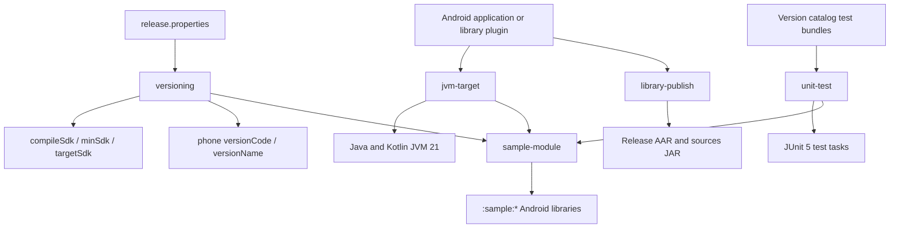

# `build-logic:convention` Logic Graph

## Purpose

Provides the repository's local Gradle convention plugins for SDK/version values, JVM targets,
JUnit 5, library publication, and the shared sample-module baseline.

## Owns

- `versioning`, which reads SDK and application-version inputs from `release.properties`.
- `jvm-target`, which keeps Java and Kotlin bytecode on JVM 21.
- `unit-test`, which installs the JUnit 5 platform and shared test bundles.
- `library-publish`, which publishes each Android library's release variant and sources.
- `sample-module`, which composes the Android-library, Compose, versioning, testing, and JVM-target
  baseline used by `:sample:*` library modules.

## Does not own

- Android build types, dependency declarations, or application version codes; those remain in each consuming module.
- Runtime application behavior.

## Depends on

This included-build module has no dependencies on application Gradle projects. It compiles against
the Android, Kotlin, and Android JUnit 5 Gradle plugin APIs.

## Used by

All active Android projects apply at least one of these plugins. Sample library modules normally
apply only `sample-module`; published library modules apply the narrower conventions explicitly.

## Flow chart

## Architectural decisions

- Convention plugins use the repository-neutral `com.mihaicristiancondrea.android.apptoolkit`
  namespace. The `apps` and `libs` segments distinguish runtime sample and library code and do not
  apply to build-time Gradle plugins.
- `jvm-target` fails when applied before an Android plugin because AGP's compile options are the
  source of truth for Java compatibility; plugin order is therefore part of its contract.
- Test dependencies and `useJUnitPlatform()` are installed together so a module cannot compile test
  sources while silently omitting their engine.
- Every published library produces its own artifact because the facade POM refers to sibling module
  coordinates; publishing only the facade would leave those dependencies unresolved.
- Version codes encode product family, target SDK, and upload counter, while version names use the
  Bucharest calendar month and upload counter. `release.properties` is the sole input.

## Public contracts

- The five plugin IDs, their ordering requirements, and the expected `release.properties` keys form
  the build-time contract.

## Internal implementations

- The five `Plugin<Project>` implementations and their shared constants.

## Current risks

These plugins affect most projects at configuration time. A plugin-order, catalog-key, publication,
or property-name change can therefore break the whole graph before compilation starts.
