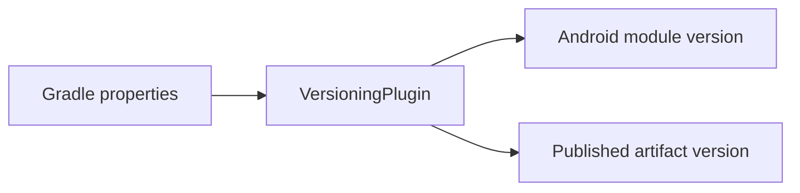

# `build-logic:convention` Logic Graph

## Purpose

Provides the repository's local Gradle convention plugin for deriving and publishing Android module versions from project properties.

## Owns

- The `com.mihaicristiancondrea.android.apptoolkit.versioning` plugin.
- Validation and propagation of the shared publishing version.

## Does not own

- Android build types, dependency declarations, or application version codes; those remain in each consuming module.
- Runtime application behavior.

## Depends on

This included-build module has no dependencies on application Gradle projects. It compiles against the Android and Kotlin Gradle plugin APIs.

## Used by

All active Android projects (`:sample` and every active `:library:*` project) apply its versioning plugin.

## Flow chart

## Public contracts

- The versioning plugin ID and its expected Gradle properties form the build-time contract.

## Internal implementations

- `VersioningPlugin` reads providers, validates values, and configures compatible Android/publishing extensions.

## Current risks

Versioning behavior is shared by every published module, so property-name or validation changes have repository-wide impact.
