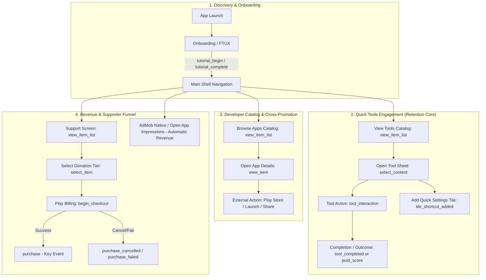

Viewed SKILL.md:1-353
Viewed project-review.md:1-156
Viewed app-toolkit-analytics.md:1-182
Viewed monetization-and-marketing.md:1-161
Listed directory App-Toolkit-for-Android
Viewed README.md:1-100
Viewed README.md:1-95
Searched for files: *analytics*
Searched for "FirebaseController"
Listed directory feature
Listed directory apps
Viewed README.md:1-100
Viewed README.md:1-77
Searched for files: *Tally*
Listed directory feature
Searched for "tally"
Viewed README.md:1-100
Listed directory core
Listed directory analytics
Viewed README.md:1-34
Searched for files: *.kt
Viewed AppGa4Contract.kt:1-123
Viewed AppScreenTracking.kt:1-42
Searched for "TrackScreenView"
Searched for "AppScreenTracking"
Viewed LoggedScreenViewModel.kt:1-100
Searched for "TrackScreenView"
Searched for "logScreenView"
Searched for files: *AppsListScreen*
Searched for files: AppsListScreen.kt
Viewed AppsListScreen.kt:1-100
Viewed AppsListScreen.kt:101-200
Viewed AppsListScreen.kt:201-261
Searched for files: *.kt
Viewed AppInteractionAnalytics.kt:1-73
Viewed AnalyticsAppActionLauncher.kt:1-61
Searched for "Firebase"
Viewed ToolkitTilesScreen.kt:145-180
Viewed ToolkitTilesScreen.kt:181-311
Searched for "firebaseController"
Viewed ReactionTestTool.kt:1-80
Viewed BreathingTool.kt:1-75
Listed directory tools
Listed directory faq
Viewed README.md:1-58
Listed directory onboarding
Viewed README.md:1-52
Searched for "tutorial"
Viewed OnboardingViewModel.kt:50-100
Viewed OnboardingViewModel.kt:120-145
Viewed FirebaseAnalyticsExtensions.kt:1-100
Viewed FirebaseAnalyticsExtensions.kt:101-137
Searched for "unlock_achievement"
Viewed ShowcaseUnlockRepository.kt:1-60
Viewed README.md:1-60
Viewed README.md:1-61
Viewed README.md:1-60
Searched for "purchase"
Viewed SupportViewModel.kt:90-140
Viewed SupportViewModel.kt:200-260
Viewed DefaultFirebaseController.kt:1-100
Viewed DefaultFirebaseController.kt:101-200
Viewed DefaultFirebaseController.kt:201-275
Viewed README.md:1-60
Viewed README.md:1-60
Searched for files: *Navigation*
Viewed c:\Users\d4rk7\StudioProjects\App-Toolkit-for-Android\sample\app\src\main\kotlin\com\mihaicristiancondrea\android\apps\apptoolkit\app\navigation\NavigationRoutes.kt
Searched for files: *NavigationRoutes*.kt
Viewed AppNavigationRoutes.kt:1-53
Viewed AppNavigationGraph.kt:1-53
Viewed c:\Users\d4rk7\StudioProjects\App-Toolkit-for-Android\library\apptoolkit\src\main\kotlin\com\mihaicristiancondrea\android\libs\apptoolkit\app\main\ui\navigation\AppToolkitNavigationEntries.kt:2-101
Searched for "fun appToolkitNavigationEntryBuilders"
Viewed AppToolkitNavigationBuilders.kt:1-100
Searched for "logSearch"
Searched for "logViewItemList"
Viewed ToolkitTilesViewModel.kt:100-155
Viewed AppsListViewModel.kt:175-240
Searched for "firebaseController"
Viewed IssueReporterContent.kt:210-235
Searched for "IssueReporterActionNames"
Viewed IssueReporterAnalytics.kt:1-50
Listed directory analytics
Viewed SettingsAnalytics.kt:1-42
Searched for "SettingsAnalytics"
Viewed README.md:1-60
Searched for "OnPaidEventListener"
Searched for "ad_impression"
Viewed AdLoadReporter.kt:1-146

# Google Analytics 4 (GA4) Project Review & Telemetry Strategy

I have conducted a thorough inspection of the repository across `:library:*` and `:sample:*`, following the principles in the [GA4 skill](file:///c:/Users/d4rk7/StudioProjects/App-Toolkit-for-Android/.agents/skills/ga4-app-analytics/SKILL.md) and [`AGENTS.md`](file:///c:/Users/d4rk7/StudioProjects/App-Toolkit-for-Android/AGENTS.md).

Here is the comprehensive review, findings, and strategic recommendations to maximize **product intelligence** and **revenue growth** (ad optimization and Google Play donation conversions).

---

## 1. Project Audit: Current Architecture & Blind Spots

### Architectural Strengths
1. **Centralized Transport**: [`FirebaseController`](file:///c:/Users/d4rk7/StudioProjects/App-Toolkit-for-Android/library/core/common/src/main/kotlin/com/mihaicristiancondrea/android/libs/apptoolkit/core/common/data/repositories/FirebaseController.kt) and [`DefaultFirebaseController`](file:///c:/Users/d4rk7/StudioProjects/App-Toolkit-for-Android/library/integration/firebase/src/main/kotlin/com/mihaicristiancondrea/android/libs/apptoolkit/integration/firebase/data/repositories/DefaultFirebaseController.kt) provide robust validation, character limits, reserved prefix rejection, and consent alignment.
2. **Centralized Consent**: Analytics and ad storage consent are handled cleanly through UMP and [`DefaultConsentRepository`](file:///c:/Users/d4rk7/StudioProjects/App-Toolkit-for-Android/library/integration/consent/src/main/kotlin/com/mihaicristiancondrea/android/libs/apptoolkit/integration/consent/data/repositories/DefaultConsentRepository.kt).
3. **Contract Protection**: [`AppGa4Contract`](file:///c:/Users/d4rk7/StudioProjects/App-Toolkit-for-Android/sample/core/analytics/src/main/kotlin/com/mihaicristiancondrea/android/apps/apptoolkit/core/analytics/domain/contracts/AppGa4Contract.kt) in `:sample:core:analytics` defines stable event names, required parameters, and forbidden parameter keys (`email`, `user_id`, `text`, etc.) validated by unit tests.

---

### Critical Telemetry Gaps & Quality Issues Discovered

#### 🔴 Blind Spot 1: The Core Value Moment is Completely Untracked (Quick Tools)
* **What happens now**: In [`ToolkitTilesScreen.kt`](file:///c:/Users/d4rk7/StudioProjects/App-Toolkit-for-Android/sample/feature/tiles/src/main/kotlin/com/mihaicristiancondrea/android/apps/apptoolkit/feature/tiles/ui/ToolkitTilesScreen.kt#L247-L255), clicking a tool tile card logs a preview event.
* **The Problem**: Once the tool bottom sheet opens (`ReactionTestTool`, `BreathingTool`, `CounterTool`, `DiceRollTool`, `CoinFlipTool`, `CompassTool`, `LevelTool`, `MorseTool`, `SosTool`, `FlashDimmerTool`), **zero events are logged during or after usage**.
* **Impact**: You cannot tell if users actually roll dice, test their reflexes, finish a breathing exercise, send SOS signals, or abandon the tool immediately. This makes it impossible to know which utilities drive day-7 / day-30 retention or which tools high-value users engage with.

#### 🔴 Blind Spot 2: Missing Screen Views on Primary Compose Destinations
* **What happens now**: [`AppScreenTracking`](file:///c:/Users/d4rk7/StudioProjects/App-Toolkit-for-Android/sample/core/analytics/src/main/kotlin/com/mihaicristiancondrea/android/apps/apptoolkit/core/analytics/domain/models/AppScreenTracking.kt) defines `MAIN`, `APPS_LIST`, `TOOLKIT_TILES`, and `COMPONENTS`. However, [`TrackScreenView`](file:///c:/Users/d4rk7/StudioProjects/App-Toolkit-for-Android/library/core/ui/src/main/kotlin/com/mihaicristiancondrea/android/libs/apptoolkit/core/ui/views/layouts/TrackScreenView.kt) is **only called in `ComponentsScreen.kt`**.
* **The Problem**: [`LoggedScreenViewModel`](file:///c:/Users/d4rk7/StudioProjects/App-Toolkit-for-Android/library/core/ui/src/main/kotlin/com/mihaicristiancondrea/android/libs/apptoolkit/core/ui/base/LoggedScreenViewModel.kt#L75-L88) writes **Crashlytics breadcrumbs**, but does **not** log GA4 `screen_view` events.
* **Impact**: In Google Analytics, top-level navigation between the Quick Tools tab, the Apps Catalog tab, and tool sheets is invisible or recorded only as generic `MainActivity` sessions.

#### 🔴 Blind Spot 3: Google Play In-App Purchase & Donation Funnel is Untracked
* **What happens now**: In [`SupportViewModel.kt`](file:///c:/Users/d4rk7/StudioProjects/App-Toolkit-for-Android/library/feature/support/src/main/kotlin/com/mihaicristiancondrea/android/libs/apptoolkit/feature/support/ui/SupportViewModel.kt#L220-L257), when `PurchaseResult.Success` is received from Google Play Billing, the ViewModel simply shows a thank-you snackbar.
* **The Problem**: No GA4 `purchase` recommended event or donation funnel events (`select_item`, `begin_checkout`, `purchase_cancelled`, `purchase_failed`) are emitted.
* **Impact**: You cannot track donation conversion rates, revenue per user cohort, or drop-off points in the support funnel. You also cannot configure Google Ads key events (conversions) for paying supporters.

#### ⚠️ Issue 4: Event Duplication & High-Frequency Scroll Noise
* **Double Logging on Clicks**:
    1. Clicking an app card in [`AppsListScreen.kt`](file:///c:/Users/d4rk7/StudioProjects/App-Toolkit-for-Android/sample/feature/apps/src/main/kotlin/com/mihaicristiancondrea/android/apps/apptoolkit/feature/apps/ui/AppsListScreen.kt#L240-L247) emits custom event `app_card_interaction` (`interaction = opendetailsbottomsheet`) while [`AppsListViewModel.kt`](file:///c:/Users/d4rk7/StudioProjects/App-Toolkit-for-Android/sample/feature/apps/src/main/kotlin/com/mihaicristiancondrea/android/apps/apptoolkit/feature/apps/ui/AppsListViewModel.kt#L240) simultaneously emits recommended event `view_item`.
    2. Clicking a tool card in [`ToolkitTilesScreen.kt`](file:///c:/Users/d4rk7/StudioProjects/App-Toolkit-for-Android/sample/feature/tiles/src/main/kotlin/com/mihaicristiancondrea/android/apps/apptoolkit/feature/tiles/ui/ToolkitTilesScreen.kt#L247-L255) emits both `view_item` and `select_content` for the same action.
* **Scroll Flooding**:
  [`AppsListScreen.kt`](file:///c:/Users/d4rk7/StudioProjects/App-Toolkit-for-Android/sample/feature/apps/src/main/kotlin/com/mihaicristiancondrea/android/apps/apptoolkit/feature/apps/ui/AppsListScreen.kt#L249-L255) fires `app_card_interaction` (`interaction = gridappimpression`) on `onFirstVisibleAppChanged` during every scroll frame, generating high event volume with little analytical value and consuming GA4 per-user quotas.

---

## 2. Analytics & Revenue Map (Core Value Journeys)



---

## 3. High-Quality Event Catalog (Recommended & Custom)

### A. Recommended GA4 Events (Standardized Semantics)

| Event Name | Key Parameters | When Emitted | Primary Purpose |
| :--- | :--- | :--- | :--- |
| `screen_view` | `screen_name`, `screen_class` | Top-level Compose destination enters visible composition via `TrackScreenView` | Product insight, retention |
| `purchase` | `transaction_id`, `value`, `currency`, `items` (`item_id`, `item_name`, `item_category`) | On `PurchaseResult.Success` in [`SupportViewModel`](file:///c:/Users/d4rk7/StudioProjects/App-Toolkit-for-Android/library/feature/support/src/main/kotlin/com/mihaicristiancondrea/android/libs/apptoolkit/feature/support/ui/SupportViewModel.kt) | **Revenue measurement, Google Ads key event** |
| `begin_checkout` | `value`, `currency`, `items` | User taps "Donate" before launching Google Play Billing flow | **Donation funnel abandonment** |
| `select_item` | `item_list_id`, `item_id`, `item_name` | User selects a donation tier card or clicks an app in the catalog | Monetization analysis, funnel |
| `view_item` | `item_id`, `item_name`, `item_category` | Details bottom sheet opens for an app or tool | Content discovery, product insight |
| `view_item_list` | `item_list_id`, `item_list_name` | Catalog loaded (All, Favorites, Installed) - deduplicated | Browsing patterns |
| `share` | `method`, `content_type`, `item_id` | User shares an app or toolkit link | Virality, marketing |
| `post_score` | `score` (ms), `level` (rating category), `character` ("visual_reflex") | User finishes reaction test | Engagement, gamification |
| `tutorial_begin` / `tutorial_complete` | *(standard)* | Onboarding start and finish (already in place) | FTUX activation |
| `unlock_achievement` | `achievement_id` | Unlocking hidden component showcase (already in place) | Power-user engagement |

### B. Product-Specific Custom Events (Quick Tools & Features)

| Event Name | Key Parameters | When Emitted | Primary Purpose |
| :--- | :--- | :--- | :--- |
| `tool_completed` | `tool_id`, `category_id`, `duration_bracket`, `outcome` | Breathing cycle done, SOS stopped, Morse transmitted, dice rolled, coin flipped | **Core value moment, retention correlation** |
| `tile_shortcut_action` | `tile_id`, `action` (`add_to_qs`, `open_setup`, `sync_status`) | User adds or taps Quick Settings tile integration from app | System engagement, retention |
| `donation_funnel_outcome` | `product_id`, `outcome` (`cancelled`, `failed`, `pending`), `error_reason` | Non-successful Google Play purchase outcomes | **Monetization recovery, friction analysis** |
| `widget_interaction` | `widget_type`, `action` (`open_app`, `open_store`, `refresh`) | Glance home-screen widget interaction | Widget adoption & retention |
| `settings_preference_toggle` | `preference_key`, `enabled`, `screen` | Toggling dark mode, reduced ads, haptics, etc. | User customization insights |

---

## 4. Proposed Analytics Strategies

To give you complete control over scope and architecture, here are three progressive strategies:

```
┌────────────────────────────────────────────────────────────────────────┐
│                        STRATEGY COMPARISON                             │
├───────────────────┬───────────────────┬────────────────────────────────┤
│    ESSENTIAL      │     BALANCED      │            DETAILED            │
│  (Fixes & Core)   │   (Recommended)   │        (Deep Telemetry)        │
├───────────────────┼───────────────────┼────────────────────────────────┤
│ • Add ScreenViews │ • All of Essential│ • All of Balanced              │
│ • Purchase event  │ • tool_completed  │ • Breathing duration brackets  │
│ • Deduplicate     │ • Reaction score  │ • Morse payload char count     │
│   clicks          │ • QS Tile actions │ • Widget interaction tracking  │
│ • Drop scroll     │ • Clean donation  │ • Ad reduction impact analysis │
│   flooding        │   funnel events   │ • Detailed tool parameter sets │
└───────────────────┴───────────────────┴────────────────────────────────┘
```

### Option 1: Essential (Accuracy, Clean-up & Monetization Baseline)
Focuses on fixing critical reporting bugs and capturing missing revenue conversions with minimal changes.
* **What changes**:
    1. **Fix Missing Screen Views**: Add [`TrackScreenView`](file:///c:/Users/d4rk7/StudioProjects/App-Toolkit-for-Android/library/core/ui/src/main/kotlin/com/mihaicristiancondrea/android/libs/apptoolkit/core/ui/views/layouts/TrackScreenView.kt) to `AppsListScreen`, `ToolkitTilesScreen`, and main top-level shells.
    2. **Track Monetization (Key Event)**: In [`SupportViewModel`](file:///c:/Users/d4rk7/StudioProjects/App-Toolkit-for-Android/library/feature/support/src/main/kotlin/com/mihaicristiancondrea/android/libs/apptoolkit/feature/support/ui/SupportViewModel.kt), emit GA4 recommended `purchase` upon `PurchaseResult.Success` with product ID, value, and currency.
    3. **Eliminate Noisy & Duplicate Events**:
        - Remove `GridAppImpression` on every scroll step in `AppsListScreen`.
        - Deduplicate app-card click logging (unify under `view_item` + explicit launcher events for Play Store/Installed app).
        - Remove duplicate `select_content` on tile preview in `ToolkitTilesScreen` (keep `view_item`).
* **Value**: Clean GA4 dashboards without quota-draining noise, correct screen navigation flows, and immediate tracking of Google Play donation revenue.

---

### Option 2: Balanced (Recommended: Core Value Moments + Revenue Funnel)
Includes everything in **Essential**, plus full measurement of the actual tool utilities and the donation conversion funnel.
* **What changes**:
    1. **All changes in Essential**.
    2. **Quick Tools Outcomes (`tool_completed` & `post_score`)**:
        - Guided Breathing: log `tool_completed` when user finishes at least one breathing cycle.
        - Reaction Test: log Google recommended `post_score` with `score` (reaction time in ms) and `level` (rating category: Fast, Normal, Slow).
        - Decision Tools (Coin / Dice): log `tool_completed` on flip/roll with bounded parameters (`tool_id` = `"coin_flip"` or `"dice_roll"`, `outcome` = `"completed"`).
        - Flashlight / SOS / Morse: log `tool_completed` on stop with duration brackets (`<10s`, `10-30s`, `>30s`).
        - Counter: log `tool_completed` when user completes an active counting session.
    3. **Complete Donation Funnel**:
        - `begin_checkout`: logged when user taps "Donate" on a selected tier.
        - `purchase`: logged on `PurchaseResult.Success`.
        - `donation_funnel_outcome`: logged on `PurchaseResult.UserCancelled` or `Failed` to identify where users drop out.
    4. **Quick Settings Tile Adoption (`tile_shortcut_action`)**:
        - Track when a user taps "Add Tile" (`add_to_qs`) or "Setup Tile" (`open_setup`), letting you analyze if users who add system tiles have higher long-term retention.
    5. **Contract Updates**:
        - Update [`AppGa4Contract.kt`](file:///c:/Users/d4rk7/StudioProjects/App-Toolkit-for-Android/sample/core/analytics/src/main/kotlin/com/mihaicristiancondrea/android/apps/apptoolkit/core/analytics/domain/contracts/AppGa4Contract.kt) and test suite in `:sample:core:analytics` to enforce new schemas and protect against forbidden parameters.
* **Value**: Gives product intelligence on which tools users love, enables funnel analysis for donations, and connects feature usage to revenue.

---

### Option 3: Detailed (Advanced Product Telemetry & Ecosystem Correlation)
Includes everything in **Balanced**, plus deep engagement metrics, widget telemetry, and ad-preference analysis.
* **What changes**:
    1. **All changes in Balanced**.
    2. **Home Screen Glance Widget Telemetry**:
        - Track widget usage via [`AppIconsWidgetReceiver`](file:///c:/Users/d4rk7/StudioProjects/App-Toolkit-for-Android/sample/widget/src/main/kotlin/com/mihaicristiancondrea/android/apps/apptoolkit/widget/receiver/AppIconsWidgetReceiver.kt) when launching apps or refreshing the widget.
    3. **Granular Tool Configuration & State Telemetry**:
        - Morse code: transmission count and character count length bracket (without logging the actual text to protect privacy).
        - Flash Dimmer: initial vs selected brightness level (1–10).
        - Compass & Level: calibration completion and hold duration.
        - Material Colors Explorer: selected palette export or preview interaction.
    4. **Ad Reduction & Preference Correlation**:
        - Log `settings_preference_toggle` when the user enables "Reduce Ads" or changes ad consent to analyze whether ad reduction improves or hurts overall app LTV.
* **Value**: Provides exhaustive telemetry for power users, widgets, and A/B test experiments. Slightly higher maintenance surface.

---

## 5. Privacy & Data Quality Verification

Every proposed event strictly follows the [GA4 Privacy Reference](file:///c:/Users/d4rk7/StudioProjects/App-Toolkit-for-Android/.agents/skills/ga4-app-analytics/references/privacy-and-data-quality.md):
- **Zero PII**: No emails, device IDs, GPS coordinates, or raw user-typed strings.
- **Bounded Values**: Durations, lengths, and levels are represented as bounded categories (e.g. `duration_bracket` = `"under_10s"` | `"10s_to_30s"`, `length_bracket` = `short` | `medium` | `long`).
- **Forbidden Parameters**: Enforced by [`AppGa4ContractValidator`](file:///c:/Users/d4rk7/StudioProjects/App-Toolkit-for-Android/sample/core/analytics/src/main/kotlin/com/mihaicristiancondrea/android/apps/apptoolkit/core/analytics/domain/contracts/AppGa4Contract.kt#L112) so no sensitive keys can be passed.

---

## Recommendation & Approval Gate

I think the **Balanced** strategy is the best fit for this project because it captures the important product journey (active tool completions and the full donation funnel) without adding noisy analytics or high maintenance overhead.

Can I prepare the implementation plan for the **Balanced** strategy, or would you prefer the **Essential** or **Detailed** scope?