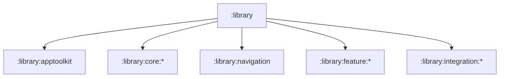

# `:library` Logic Graph

## Purpose

Acts as the implicit Gradle parent project for all reusable AppToolkit artifacts. It groups projects
by architectural role but has no build script or runtime artifact of its own.

## Owns

- The filesystem and Gradle hierarchy below `:library`.
- Grouping for the façade, core, navigation, feature, and integration projects.

## Does not own

- Source code, resources, dependencies, publishing configuration, or APIs; each child module owns
  those concerns.

## Depends on

No internal Gradle modules.

## Used by

No internal module declares a dependency on `:library`; consumers depend on its child modules
directly.

## Flow chart

## Public contracts

No runtime contracts are exposed.

## Internal implementations

There is no implementation; this is an implicit Gradle hierarchy node.

## Current risks

The container appears in Gradle project reports despite producing no artifact, so it should not be
mistaken for an umbrella dependency.
