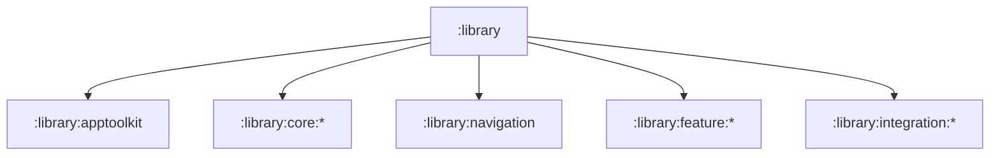

# `:library` Logic Graph

## Purpose

Acts as the implicit Gradle parent project for all reusable AppToolkit artifacts. It groups projects
by architectural role but has no build script or runtime artifact of its own.

## Owns

- The filesystem and Gradle hierarchy below `:library`.
- Grouping for the façade, core, navigation contract/UI, feature, and integration projects.

## Does not own

- Source code, resources, dependencies, publishing configuration, or APIs; each child module owns
  those concerns.

## Depends on

No internal Gradle modules.

## Used by

No internal module declares a dependency on `:library`; consumers depend on its child modules
directly.

## Flow chart

## Public contracts

No runtime contracts are exposed.

### Manifest contract

Library manifests contribute the components and permissions owned by their modules:

- the components it owns, each declaring `android:exported` explicitly, and exported only when an
  intent filter makes it a genuine entry point;
- the permissions and metadata its own code or wrapped SDK integration needs.

`:library:apptoolkit` is the deliberate application-default facade. Its manifest contributes the
common theme, backup, RTL, resizing, back-navigation, cleartext, acceleration and soft-input
defaults used by toolkit hosts. Its resources own `AppTheme`, `SplashScreenTheme`, shared colors,
splash assets, and backup/data-extraction rules.

`ManifestContractTest` in `:library:apptoolkit` keeps application attributes out of every other
library module, pins the facade defaults/resources, and verifies component export declarations.

### What a host declares

The host owns application identity and product-specific policy: its application class, icons,
label, locale configuration, SDK IDs and any intentional overrides. It does not need to copy the
toolkit's themes, colors, backup XML or common manifest defaults.

Android gives the consuming application higher manifest-merger and resource priority. A host that
needs different backup exclusions, theme values, colors, RTL behavior, or another default declares
that attribute or same-named resource locally, using the normal manifest/resource override
mechanism. `:sample:app` demonstrates the minimal host boundary.

## Internal implementations

There is no implementation; this is an implicit Gradle hierarchy node.

## Current risks

The container appears in Gradle project reports despite producing no artifact, so it should not be
mistaken for an umbrella dependency.

Manifest merging stays the quietest coupling between the toolkit and its hosts: it has no
compile-time surface, so both adding and removing a facade default changes every host silently.
`ManifestContractTest` therefore pins the defaults and their ownership in the facade.
