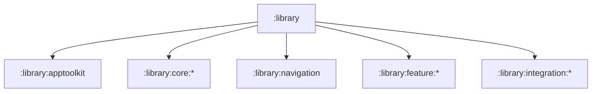

# `:library` Logic Graph

## Purpose

Acts as the implicit Gradle parent project for all reusable AppToolkit artifacts. It groups projects
by architectural role but has no build script or runtime artifact of its own.

## Owns

- The filesystem and Gradle hierarchy below `:library`.
- Grouping for the façade, core, navigation contract/UI, feature, and integration projects.

## Does not own

- Source code, resources, dependencies, publishing configuration, or APIs; each child module owns
  those concerns.

## Depends on

No internal Gradle modules.

## Used by

No internal module declares a dependency on `:library`; consumers depend on its child modules
directly.

## Flow chart

## Public contracts

No runtime contracts are exposed.

### Manifest contract

Every library manifest below `:library` contributes only:

- the components it owns, each declaring `android:exported` explicitly, and exported only when an
  intent filter makes it a genuine entry point;
- the permissions its own code needs. Permissions belonging to a wrapped SDK arrive from that SDK's
  own manifest and are not restated here.

A library manifest declares **no `<application>` attributes**. `theme`, `icon`, `label`, `name`,
`allowBackup`, `dataExtractionRules`, `fullBackupContent`, `supportsRtl`, `usesCleartextTraffic`,
`localeConfig`, `hardwareAccelerated`, `resizeableActivity`, `enableOnBackInvokedCallback` and
`windowSoftInputMode` describe the application as a whole, and the application is the host's.

`ManifestContractTest` in `:library:apptoolkit` enforces all three rules.

### What a host must declare

The merger silently folds library `<application>` attributes into the host, which means removing one
from the library removes it from every app with no build error. 2.0.19 shipped ten of them; 3.0.0-pre1
dropped them all, and consuming apps lost their theme, RTL support and backup rules at once — the
missing `android:theme` crashed every toolkit screen with `IllegalStateException: You need to use a
Theme.AppCompat theme (or descendant) with this activity`.

A host therefore owns its whole `<application>` element. At minimum it declares:

| Attribute | Why the toolkit needs it |
| --- | --- |
| `android:theme` | Toolkit activities extend `AppCompatActivity`; the platform default is not an AppCompat descendant and they will not start |
| `android:supportsRtl` | Toolkit layouts mirror in RTL locales only when the host opts in |

Everything else on `<application>` — backup rules, cleartext policy, locale config, window
behaviour — is the host's own policy, and the toolkit neither sets nor requires it. `:sample:app`
is the reference host.

## Internal implementations

There is no implementation; this is an implicit Gradle hierarchy node.

## Current risks

The container appears in Gradle project reports despite producing no artifact, so it should not be
mistaken for an umbrella dependency.

Manifest merging stays the quietest coupling between the toolkit and its hosts: it has no compile-time
surface, so both adding and removing a library `<application>` attribute changes every host silently.
`ManifestContractTest` covers the library side; the host side is a documented checklist, not something
this repository can enforce.
