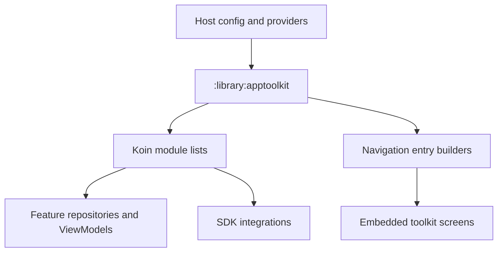

# `:library:apptoolkit` Logic Graph

## Purpose

Acts as the host-facing façade and composition root for reusable AppToolkit features. It assembles
Koin modules and Navigation 3 destinations while re-exporting the toolkit modules through Gradle
`api` dependencies.

## Owns

- `appToolkitFoundationModules`, `appToolkitFeatureModules`, and `appToolkitSettingsModules`.
- `appToolkitNavigationEntryBuilders` for shared embedded destinations.
- Host-to-library composition using `AppToolkitHostBuildConfig` and host provider factories.

## Does not own

- Feature screens, repositories, use cases, or SDK implementations; those stay in their
  feature/core/integration modules.
- Host application startup, app-specific routes, providers, and business logic, owned by `:sample`.

## Depends on

- `:library:core:common`, `:library:core:datastore`, `:library:core:network`, `:library:core:ui`,
  `:library:core:designsystem` and `:library:navigation` to assemble common infrastructure and UI
  contracts.
- `:library:feature:about`, `:library:feature:help`, `:library:feature:issuereporter`,
  `:library:feature:onboarding`, `:library:feature:permissions`, `:library:feature:settings`, and
  `:library:feature:support` to provision toolkit ViewModels, repositories, and destinations.
- `:library:integration:ads`, `:library:integration:billing`, `:library:integration:consent`,
  `:library:integration:firebase`, `:library:integration:review`, and `:library:integration:update`
  to connect SDK implementations.

All dependencies are exported with `api`, making this a convenience façade rather than an isolation
boundary.

## Used by

- `:sample`, which loads the assembled DI modules and navigation builders.

## Flow chart

## Public contracts

- The three DI module-list factories and `appToolkitNavigationEntryBuilders`.
- Transitive APIs from all `api(project(...))` dependencies are also visible to consumers.

## Internal implementations

- Koin binding details, qualifier wiring, default palette registration, and private destination
  builders.

## Current risks

The façade exports nearly the complete internal graph, so consumers can couple to implementation
modules transitively. Its DI files also instantiate implementations owned by many other modules,
making constructor changes ripple into this composition module.

## Architecture guards

`RepositoryConventionsTest` runs here rather than in any single feature module, because this is the
only module that depends on every library module. It scans active production sources in `library`
and `sample` and fails when a repository breaks the project-wide convention:

- repository contracts and concrete repositories live in `data/repository`,
- concrete implementations do not use the ambiguous `Impl` suffix,
- a retained `XRepository` interface uses `DefaultXRepository` for its general implementation,
- a single implementation may be the concrete `XRepository` when an interface adds no boundary.

It replaces a hand-written list of interface/implementation pairs checked with `isAssignableFrom`,
which the compiler already guaranteed and which had fallen six repositories behind.

The test reads source files, not the classpath, so production Kotlin sources are declared as an
explicit input of this module's `Test` tasks in `build.gradle.kts`. Removing that declaration lets
Gradle treat the task as up to date after a file moves, which is precisely when the test needs to
run.

### Fixed: `Unable to start activity` from an unresolvable Koin definition

A definition that cannot be created does not fail when Koin starts — it fails the first time
something asks for it. In practice that is `MainActivity.onCreate` resolving `MainViewModel`, which
reports as `RuntimeException: Unable to start activity` caused by `InstanceCreationException`. The
trace names only the outermost ViewModel and the innermost definition, never the dependency that was
actually missing, and the app is dead before its first frame.

`HostKoinGraphTest` in `:sample:app` now resolves the whole graph by reflection in a plain unit
test,
so a missing binding fails the build instead of a launch. It checks two things:

- every definition in the graph `initializeKoin` builds can be resolved;
- the toolkit's own modules ask a host for nothing beyond four documented extension points
  (`SettingsProvider`, `AboutSettingsProvider`, `AdvancedSettingsProvider`, and the default
  `ColorPalette`). Adding a fifth is a new integration requirement that would crash every existing
  host, so it has to be added to that list deliberately.

Two mechanics are easy to get wrong when editing that test. Koin resolves a definition against its
own module plus that module's `includes`, so the graph must be wrapped as
`module { includes(allModules) }` — verifying a flat list makes every cross-module dependency read
as
missing. And `verify` reflects on the produced type's constructor regardless of how the definition
builds it, so types created by a factory function (`HttpClient`, `ColorPalette`) need their
constructor parameters listed as externally supplied rather than the check being skipped.

## Migration notes

Bindings were moved out of the sample app so other hosts can integrate the toolkit using explicit
host configuration and provider factories.
