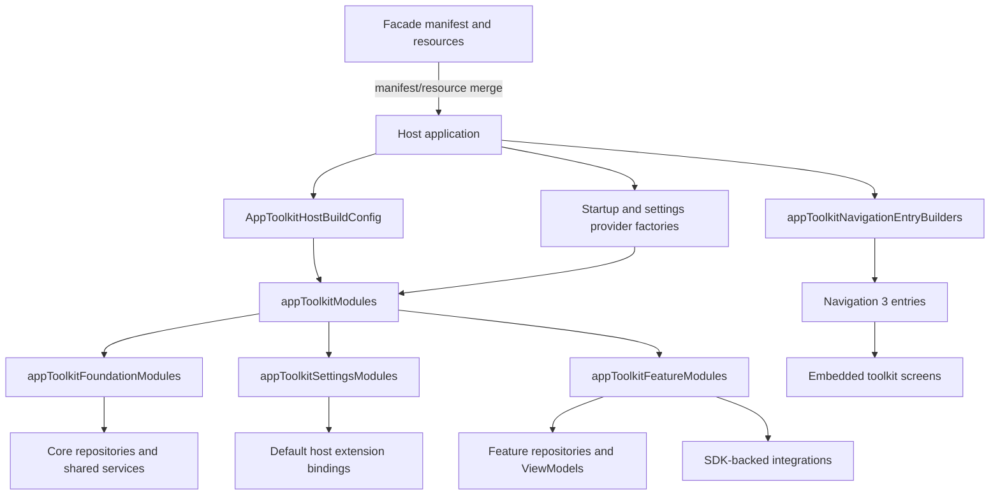

# `:library:apptoolkit` Logic Graph

## Purpose

Acts as the host-facing façade and composition root for reusable AppToolkit features. It assembles
Koin modules and Navigation 3 destinations while re-exporting the toolkit modules through Gradle
`api` dependencies.

## Owns

- `appToolkitModules`, the single entry point returning the toolkit's whole Koin graph.
- `appToolkitFoundationModules`, `appToolkitFeatureModules`, and `appToolkitSettingsModules`, the
  granular lists `appToolkitModules` composes.
- `appToolkitNavigationEntryBuilders` for shared embedded destinations.
- Host-to-library composition using `AppToolkitHostBuildConfig` and host provider factories.
- Common host defaults contributed through manifest/resource merging: the AppCompat application
  theme, RTL/window behavior, backup and data-extraction rules, locale configuration resource,
  splash resources, shared colors, and host identity fallbacks.

## Does not own

- Feature screens, repositories, use cases, or SDK implementations; those stay in their
  feature/core/integration modules.
- Host application startup, app-specific routes, providers, and business logic, owned by `:sample`.
- Host identity and policy overrides such as the application class, icons, label, locale list,
  AdMob application ID, or any explicit replacement for a toolkit default.

## Depends on

- `:library:core:common`, `:library:core:datastore`, `:library:core:network`, `:library:core:ui`,
  `:library:core:designsystem` and `:library:navigation` to assemble common infrastructure and UI
  contracts.
- `:library:feature:about`, `:library:feature:help`, `:library:feature:issuereporter`,
  `:library:feature:onboarding`, `:library:feature:permissions`, `:library:feature:settings`, and
  `:library:feature:support` to provision toolkit ViewModels, repositories, and destinations.
- `:library:integration:ads`, `:library:integration:billing`, `:library:integration:consent`,
  `:library:integration:firebase`, `:library:integration:review`, and `:library:integration:update`
  to connect SDK implementations.

All dependencies are exported with `api`, making this a convenience façade rather than an isolation
boundary.

## Used by

- `:sample`, which loads the assembled DI modules and navigation builders.

## Flow chart



## Architectural decisions

- The facade is a composition boundary, not an implementation layer: constructors, SDK behavior,
  and Koin bindings remain owned by their source modules; this module only assembles their public
  DI modules.
- The all-in-one `appToolkitModules` entry point includes every toolkit-owned binding. A host still
  supplies the documented settings/startup provider contracts; granular factories remain public
  for hosts intentionally building a partial graph.
- All production child modules are `api` dependencies so a host can configure their public types;
  this convenience intentionally trades away strict implementation hiding.
- Manifest and resource values are overridable defaults. Product identity and policy remain owned
  by the consuming application, which has higher merger priority.

## Public contracts

- `appToolkitModules`, the three DI module-list factories it composes, and
  `appToolkitNavigationEntryBuilders`.
- Transitive APIs from all `api(project(...))` dependencies are also visible to consumers.

### Manifest and resource defaults

Depending on this facade contributes the common `<application>` defaults needed by toolkit
activities, including `@style/AppTheme`, RTL support, resizable/window behavior, and the bundled
backup/data-extraction rules. It also supplies `AppTheme`, `SplashScreenTheme`, their splash assets,
the shared launcher/shortcut colors and shortcut artwork, `config_locales.xml`, plus `App Name`
placeholders for `app_name` and `app_full_name`, and the copyright resource. Integration modules
contribute the permissions and metadata they own; for example, ads owns network/ad-ID permissions
and Mobile Ads tuning metadata.

Android's manifest merger does not carry `android:localeConfig` from a library into the final
application manifest. A host using the bundled locale list therefore keeps the one-line
`android:localeConfig="@xml/config_locales"` application attribute while the XML list itself remains
owned here.

These are defaults, not locked policy. Android merges the consuming application's manifest and
resources at higher priority, so a host can override an attribute in its own `<application>` tag or
replace a same-named resource when its product requirements differ. A host should declare only its
identity and intentional overrides rather than copy the defaults. In particular, hosts customize
their product identity by defining `app_name`, `app_full_name`, and `copyright` with the same names.

## Internal implementations

- Koin module-list composition, qualifier wiring, and private destination builders. Individual
  feature modules own their DI definitions and default palette registration.

## Publishing

App Toolkit is published through [JitPack](https://jitpack.io/#MihaiCristianCondrea/App-Toolkit-for-Android).

## Current risks

The façade exports nearly the complete internal graph, so consumers can couple to implementation
modules transitively. The facade's module-list functions must stay synchronized with the feature
modules they compose.

## Navigation compatibility

The canonical appToolkitNavigationEntryBuilders function lives in app.main.ui.navigation in this
facade. The historical feature.about.ui.navigation function remains a forwarding entry point in the
same artifact, with its original signature and JVM file name. Both register the same destinations;
hosts can migrate imports without changing route keys or behavior.

## Architecture guards

`RepositoryConventionsTest` runs here rather than in any single feature module, because this is the
only module that depends on every library module. It scans active production sources in `library`
and `sample` and fails when a repository breaks the project-wide convention:

- repository contracts and concrete repositories live in `data/repositories`,
- concrete implementations do not use the ambiguous `Impl` suffix,

It also checks production package/directory alignment and prevents sample storage and Issue Reporter data sources from importing core UI helpers.

It replaces a hand-written list of interface/implementation pairs checked with `isAssignableFrom`,
which the compiler already guaranteed and which had fallen six repositories behind.

The test reads source files, not the classpath, so production Kotlin sources are declared as an
explicit input of this module's `Test` tasks in `build.gradle.kts`. Removing that declaration lets
Gradle treat the task as up to date after a file moves, which is precisely when the test needs to
run.

### Fixed: `Unable to start activity` from an unresolvable Koin definition

A definition that cannot be created does not fail when Koin starts, it fails the first time
something asks for it. In practice that is `MainActivity.onCreate` resolving `MainViewModel`, which
reports as `RuntimeException: Unable to start activity` caused by `InstanceCreationException`. The
trace names only the outermost ViewModel and the innermost definition, never the dependency that was
actually missing, and the app is dead before its first frame.

`HostKoinGraphTest` in `:sample:app` now resolves the sample's whole graph by reflection in a plain
unit test, so a missing constructor dependency fails the build instead of a launch. It checks two
things:

- every definition in the graph `initializeKoin` builds can be resolved;
- the sample adapter plus the accepted external/factory types can satisfy the toolkit graph.

This is not a complete generic-host contract test. Reflection verification sees constructor
dependencies, but it cannot discover `koinInject()` calls inside composables such as
`DisplaySettingsProvider` and `PrivacySettingsProvider`. Those host requirements are documented and
bound in [`:sample:core:apptoolkit`](../../sample/core/apptoolkit/README.md), whose own tests resolve
the provider bindings directly.

Two mechanics are easy to get wrong when editing that test. Koin resolves a definition against its
own module plus that module's `includes`, so the graph must be wrapped as
`module { includes(allModules) }`, verifying a flat list makes every cross-module dependency read
as
missing. And `verify` reflects on the produced type's constructor regardless of how the definition
builds it, so types created by a factory function (`HttpClient`, `ColorPalette`) need their
constructor parameters listed as externally supplied rather than the check being skipped.

### Host integration: one entry point

`appToolkitModules(hostBuildConfig, startupProviderFactory)` returns every module the toolkit owns,
`:library:integration:billing` and `:library:integration:firebase` included. A host does not track
which Gradle module owns those bindings, but it must add implementations of the host provider
contracts used by the settings/about surfaces. The sample wraps both steps in
`appToolkitHostModules`.

Before 3.0.0-pre2 a host assembled the graph from three module-list factories plus the loose
`firebaseModule` and `billingModule` values. Missing one produced no build error, only a
`NoDefinitionFoundException` the first time the app touched that dependency. Smart Cleaner shipped
without `billingModule` and died on first resume.

Hosts override toolkit defaults by load order. Koin's `allowOverride` defaults to true, so
definitions loaded after the toolkit replace it:

```kotlin
modules(
    buildList {
        addAll(appToolkitModules(hostBuildConfig, ::AppStartupProvider))
        add(hostSettingsProvidersModule)  // overrides the toolkit's defaults
        add(appModule)
    }
)
```

The granular factories stay public for hosts that need to compose a partial graph.

## Migration notes

Bindings were moved out of the sample app so other hosts can integrate the toolkit using explicit
host configuration and provider factories.
