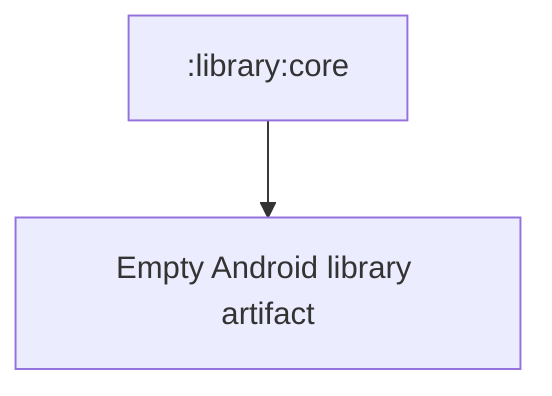

# `:library:core` Logic Graph

## Purpose

Reserves the parent core artifact in the active Gradle graph. It currently contains no production source and does not aggregate its child modules.

## Owns

- An Android library artifact and its consumer ProGuard file.

## Does not own

- Shared contracts and utilities, which belong to [`:library:core:common`](common/README.md).
- Persistence, networking, UI, or theme code, which belong to the dedicated core child modules.

## Depends on

No internal Gradle modules.

## Used by

No active internal module declares a dependency on `:library:core`.

## Flow chart

## Public contracts

No Kotlin or resource contracts are currently exposed.

## Internal implementations

There is no production implementation in this module.

## Current risks

The active but empty project can be mistaken for an umbrella dependency even though it does not expose the core child modules.
