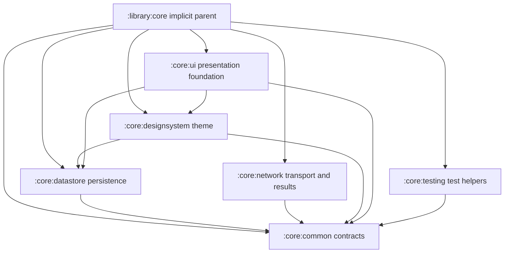

# `:library:core` Logic Graph

## Purpose

Acts as the implicit Gradle parent for the core modules. It is an organizational path, not a
runtime artifact or dependency aggregator.

## Owns

- Grouping for common contracts, persistence, networking, testing, design-system, and UI modules.

## Does not own

- Shared contracts and utilities, which belong to [`:library:core:common`](common/README.md).
- Persistence, networking, UI, or theme code, which belong to the dedicated core child modules.

## Depends on

No internal Gradle modules.

## Used by

No active internal module declares a dependency on `:library:core`.

## Flow chart

## Architectural decisions

- There is no umbrella `:library:core` artifact. This avoids another transitive API surface and
  keeps production consumers explicit about the foundations they need.
- `common` is the lowest production contract module. Stateful and SDK-backed implementations point
  toward it, never the reverse.
- Testing helpers remain in a separate module whose production source set is consumed only through
  other modules' `testImplementation` configurations.

## Public contracts

The parent exposes no Kotlin, resource, or Gradle dependency contract.

## Internal implementations

There is no production implementation in this module.

## Current risks

The implicit parent appears in Gradle project paths and can be mistaken for an umbrella dependency
even though it has no build file and exposes no child modules.
