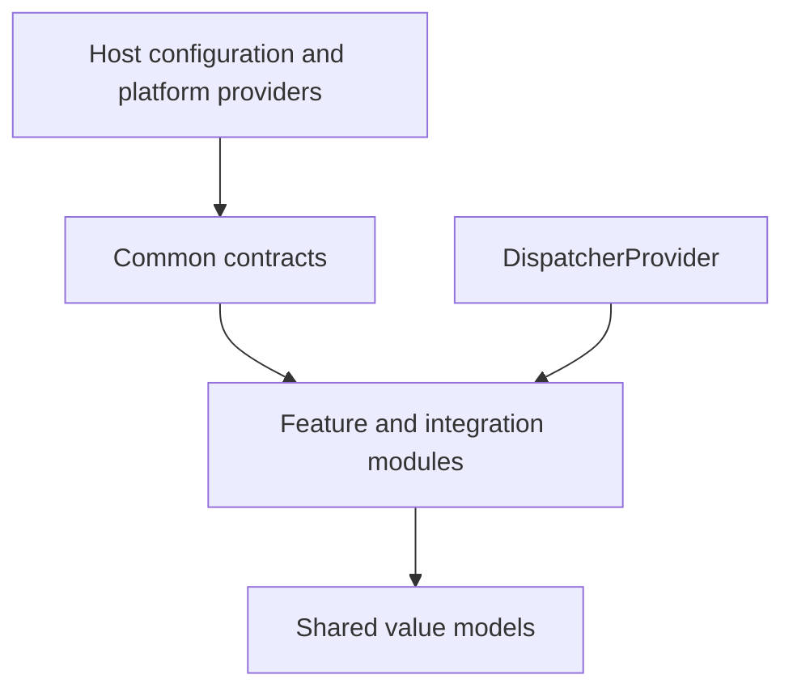

# `:library:core:common` Logic Graph

## Purpose

Holds low-level contracts, domain result types, host configuration, dispatchers, constants, and
Android utility abstractions shared across the toolkit.

## Owns

- Analytics and billing value models, and the application-facing theme preference model.
- `FirebaseController`, `BillingCore`, dispatcher, build-info, app-info, permissions, and ad-SDK
  contracts.
- Host DI configuration (`AppToolkitHostBuildConfig`, qualifiers, and constants).
- Small platform and Kotlin extensions used across modules.

## Does not own

- DataStore implementations, owned by [`:library:core:datastore`](../datastore/README.md).
- HTTP clients and network error mapping, owned by [`:library:core:network`](../network/README.md).
- Compose state and components, owned by [`:library:core:ui`](../ui/README.md).
- Firebase and Billing SDK implementations, owned by their integration modules.

## Depends on

No internal Gradle modules. This is the bottom shared runtime dependency for most toolkit modules.

## Used by

- `:sample` and `:library:apptoolkit` for host and façade contracts.
- `:library:core:datastore`, `:library:core:network`, `:library:core:ui`, and
  `:library:core:designsystem`.
- `:library:feature:about`, `:library:feature:help`, `:library:feature:issuereporter`,
  `:library:feature:onboarding`, `:library:feature:permissions`, `:library:feature:settings`, and
  `:library:feature:support`.
- `:library:integration:ads`, `:library:integration:billing`, `:library:integration:consent`,
  `:library:integration:firebase`, `:library:integration:review`, and `:library:integration:update`.

`:library:navigation` and the empty `:library:core` project do not depend on this module.

## Flow chart

## Public contracts

- `FirebaseController`, `BillingCore`, `DispatcherProvider`, and provider/helper interfaces.
- `AppToolkitHostBuildConfig`, DI qualifiers, common result/value models, and stable constants.
- `ThemePreferencesState`, the immutable application-facing representation shared by persistence
  and theme UI without a synthetic domain package.

## Internal implementations

- `StandardDispatchers`, small Android adapters, extensions, and crash guards.

## Current risks

The module has a broad surface spanning domain values, Android helpers, DI metadata, ads, billing,
and Firebase contracts. That breadth makes it easy for unrelated concerns to accumulate in the
lowest-level dependency.

## Migration notes

The commented DataStore dependency in the Gradle file records that `common -> datastore` was removed
to break a circular dependency. Keep persistence implementations above the contracts defined here.

### Host AdMob ID and UMP crash guard

The toolkit once shipped a demo `R.string.ad_mob_app_id`. A host using a differently named resource
did not override it, so consent and Mobile Ads initialization could silently target the demo
publisher account. The current contract deliberately prevents that regression:

- `com.google.android.gms.ads.APPLICATION_ID` in the host application's manifest is the single
  source of truth. The referenced resource may have any name.
- `ManifestAdMobAppIdProvider` reads application metadata through `PackageManager`, accepts only
  `ca-app-pub-[0-9]{16}~[0-9]{10}`, and returns `null` for missing or malformed values.
- There must be no library fallback AdMob application ID. The sample/demo ID belongs only to the
  sample application.
- Hosts should let the `:library:integration:ads` `AdsCoreManager` initialize Mobile Ads; separate initialization with another ID
  can recreate the mismatch.

UMP 4.0.0 can also throw `NoSuchElementException` from `Scanner.next()` on its executor when a
metrics error response has an empty body. `ConsentSdkCrashGuard` is installed by `BaseCoreManager`
immediately after Firebase initialization so it wraps the Crashlytics handler. It suppresses only a
non-main-thread `NoSuchElementException` whose stack contains both `java.util.Scanner` and
`com.google.android.gms.internal.consent_sdk`; every other throwable is delegated unchanged. The
suppressed telemetry failure is recorded through `FirebaseController.recordNonFatal`.

Hosts may opt out by overriding `installsConsentSdkCrashGuard` with `false`. Do not broaden the
guard predicate, and do not remove the guard until the affected UMP artifact behavior is verified as
fixed. `AdMobAppIdProviderTest` and `ConsentSdkCrashGuardTest` protect these contracts.
