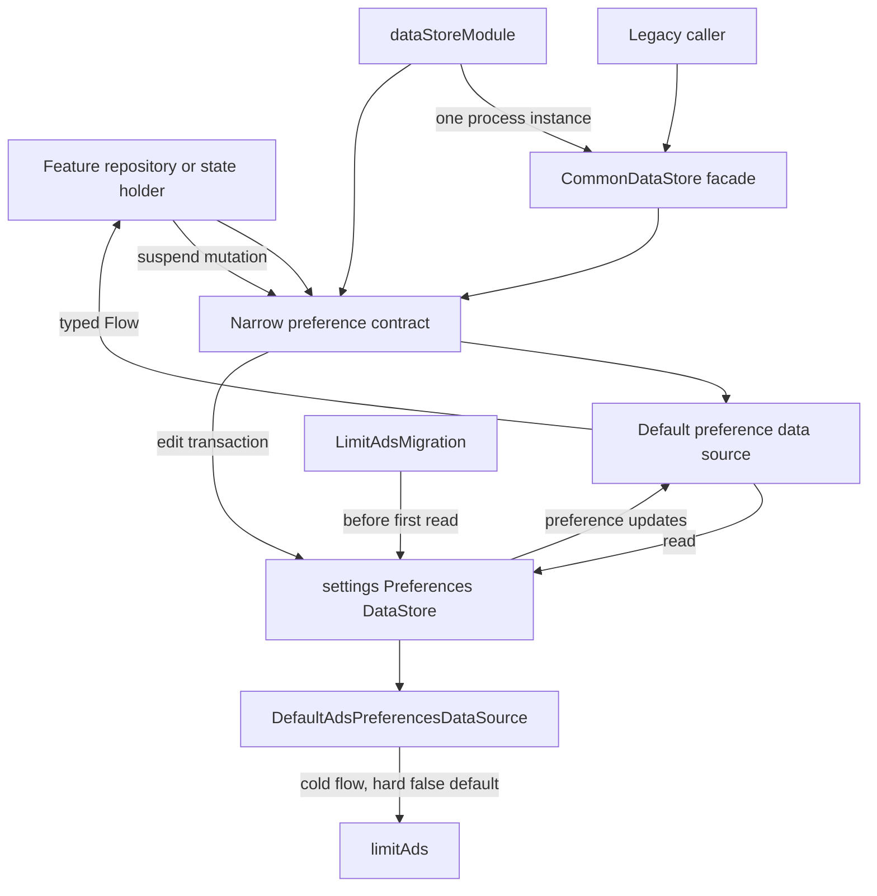

# `:library:core:datastore` Logic Graph

## Purpose

Provides the toolkit's shared Preferences DataStore implementation and preference-source contracts
used by onboarding, consent, ads, diagnostics, review, and theming.

## Owns

- The single `settings` Preferences DataStore instance, handed out by `Context.commonDataStore`.
- Cohesive preference data sources over that instance: theme, display, onboarding, consent and
  diagnostics, ads, review, changelog, app state, and favorites.
- `CommonDataStore`, which owns one instance of each source, exposes them, and keeps the flat
  pre-split API delegating to them.
- Persisted theme, review, ads, and consent-related values.
- The Koin DataStore module, which is the single place `CommonDataStore` is registered;
  `appToolkitFoundationModules` includes it rather than defining its own copy.

## Does not own

- Feature business decisions about consent, reviews, onboarding, or diagnostics.
- Mobile Ads SDK initialization and app-open ad lifecycle, owned by
  [`:library:integration:ads`](../../integration/ads/README.md).
- Compose theme rendering, owned by `:library:core:designsystem` and `:library:core:ui`.

## Depends on

- [`:library:core:common`](../common/README.md) for shared contracts, preference constants, and
  common models.

## Used by

- `:library:apptoolkit` for host DI assembly.
- `:library:core:designsystem` for persisted theme state, and `:library:core:ui` for the
  preference-driven modifiers and ad slots.
- `:library:feature:about`, `:library:feature:help`, `:library:feature:onboarding`, and
  `:library:feature:settings`.
- `:library:integration:ads`, `:library:integration:consent`, and `:library:integration:review`.

## Flow chart

## Architectural decisions

- Cohesive source interfaces split ownership without moving installed data: all keys deliberately
  remain in one `settings` file.
- Repositories and state holders depend on the narrow source or repository they need. The broad
  `CommonDataStore` facade remains only for source compatibility with older callers.
- Reads are observable `Flow`s and mutations are suspend functions; the stored preferences are the
  source of truth except for explicitly documented UI mirrors.
- `limitAds` is the only stored ads preference: a user opt-in with a hard `false` default and no
  build input. It is deliberately not named after either behaviour it produces, because a release
  build reduces ads and a debug build disables them — see
  [`:library:integration:ads`](../../integration/ads/README.md). This module stores the choice and
  interprets it not at all; `AdsDisplayPolicy` in `:library:core:common` is where it acquires
  meaning.
- Preference migrations are `DataMigration`s on the `settings` store rather than work a data source
  does when constructed, so they finish before the first read is served and no consumer observes
  pre-migration values. `LimitAdsMigration` is the first of them.

## Public contracts

- The preference data-source interfaces, their `Default*` implementations, `CommonDataStore`, and
  `dataStoreModule`.
- New code should depend on the narrow contract it needs (`ThemePreferencesDataSource`,
  `ReviewPreferencesDataSource`, …), all of which `dataStoreModule` registers. `CommonDataStore`
  remains for callers written against the earlier single-class API.
- `themePreferencesState()` combines stored theme values into the application-facing
  `ThemePreferencesState`; Compose collection of that flow belongs to `:library:core:designsystem`.

## Internal implementations

- DataStore key access and serialization-free preference mapping.

## Current risks

Every group shares one `settings` preferences file, so key names and default values stay
compatibility-sensitive across modules even though the API is now split. Splitting the file itself
would need a `DataMigration` for installed apps and has not been done.

`DefaultAdsPreferencesDataSource` starts an eager collector, so exactly one instance may exist per
process. Reach it through the graph rather than constructing it.

## Migration notes

### `ads = false` became `limitAds = true`

The `ads` preference is gone: nothing reads it, the SDK initializes unconditionally, and ad slots
render for everyone. Left alone, an install that had switched ads off would simply start seeing
every ad again. `LimitAdsMigration` moves the intent to the preference that still exists —
`limitAds` becomes `true`, which reads correctly under both builds: a release build stops showing
those installs app-open ads, and a debug build shows them no ads at all, which is what they
originally asked for.

The stale key is dropped whichever value it held, and because nothing writes it any more, its
absence is what makes the migration run once. No marker preference is needed.

### Ads initialization must share the UI preference source

An earlier initialization path sampled the ads preference with a debug-dependent default while the
Compose ad surfaces used `true`. In a debug build with no stored preference, `AdsCoreManager`
skipped
`MobileAds.initialize` while native/banner views attempted SDK requests. Those SDK entry points can
throw synchronously, including from composition. A removed host-side unconditional initialization
had previously masked the disagreement.

Preserve these invariants:

- The preference that caused it no longer exists. `AdsCoreManager` initializes the SDK
  unconditionally and ad UI renders unconditionally, so there is no default for the two to disagree
  about.
- The integration-owned `AdsCoreManager` observes the flow instead of sampling it once, so enabling ads at runtime starts
  initialization without a process restart.
- Initialization is idempotent and mutex-protected, uses the validated host-manifest AdMob app ID,
  and is skipped when no valid ID exists.
- `AdsSdkState.isReady` is published after initialization so UI can delay requests until the SDK is
  usable.
- The integration-owned `AdsSdkInitializer` remains the test seam around the SDK's non-mock-friendly
  initialization API.

The JUnit 5 `AdsCoreManagerInitializationTest` in `:library:integration:ads` is the executable
regression suite for these rules.
Do not rely on the legacy JUnit 4 `TestAdsCoreManager`: the module uses the JUnit Platform without a
Vintage engine, so that class compiles but is not executed.
