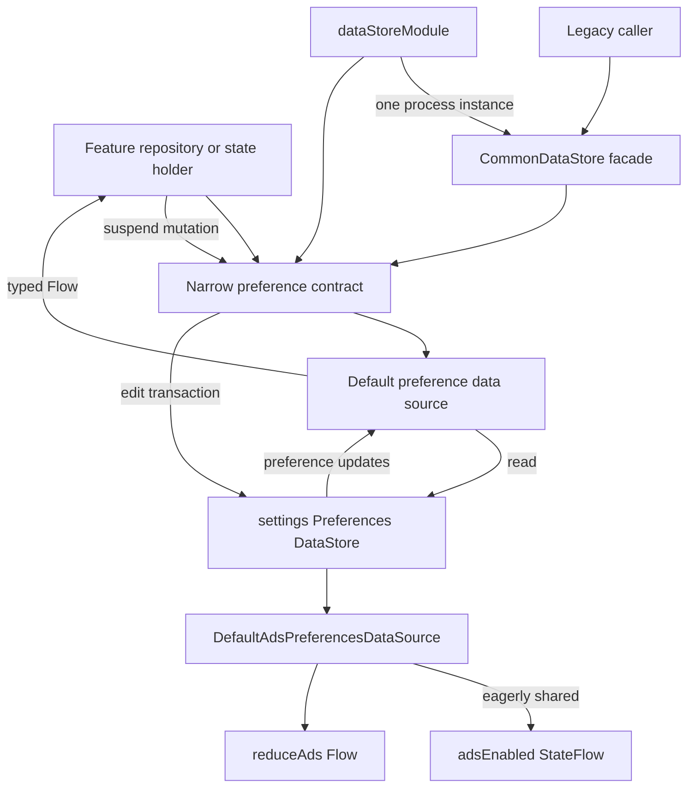

# `:library:core:datastore` Logic Graph

## Purpose

Provides the toolkit's shared Preferences DataStore implementation and preference-source contracts
used by onboarding, consent, ads, diagnostics, review, and theming.

## Owns

- The single `settings` Preferences DataStore instance, handed out by `Context.commonDataStore`.
- Cohesive preference data sources over that instance: theme, display, onboarding, consent and
  diagnostics, ads, review, changelog, app state, and favorites.
- `CommonDataStore`, which owns one instance of each source, exposes them, and keeps the flat
  pre-split API delegating to them.
- Persisted theme, review, display-ads, reduce-ads, and consent-related values.
- The Koin DataStore module, which is the single place `CommonDataStore` is registered;
  `appToolkitFoundationModules` includes it rather than defining its own copy.

## Does not own

- Feature business decisions about consent, reviews, onboarding, or diagnostics.
- Mobile Ads SDK initialization and app-open ad lifecycle, owned by
  [`:library:integration:ads`](../../integration/ads/README.md).
- Compose theme rendering, owned by `:library:core:designsystem` and `:library:core:ui`.

## Depends on

- [`:library:core:common`](../common/README.md) for shared contracts, preference constants, and
  common models.

## Used by

- `:library:apptoolkit` for host DI assembly.
- `:library:core:designsystem` for persisted theme state, and `:library:core:ui` for the
  preference-driven modifiers and ad slots.
- `:library:feature:about`, `:library:feature:help`, `:library:feature:onboarding`, and
  `:library:feature:settings`.
- `:library:integration:ads`, `:library:integration:consent`, and `:library:integration:review`.

## Flow chart

## Architectural decisions

- Cohesive source interfaces split ownership without moving installed data: all keys deliberately
  remain in one `settings` file.
- Repositories and state holders depend on the narrow source or repository they need. The broad
  `CommonDataStore` facade remains only for source compatibility with older callers.
- Reads are observable `Flow`s and mutations are suspend functions; the stored preferences are the
  source of truth except for explicitly documented UI mirrors.
- Ads enablement is eagerly shared by one process-scoped instance because initialization and every
  ad surface must observe the same default and subsequent changes.
- Reduce ads defaults to `false` and suppresses only App Open ads; it does not alter SDK
  initialization or banner/native ad enablement.

## Public contracts

- The preference data-source interfaces, their `Default*` implementations, `CommonDataStore`, and
  `dataStoreModule`.
- New code should depend on the narrow contract it needs (`ThemePreferencesDataSource`,
  `ReviewPreferencesDataSource`, …), all of which `dataStoreModule` registers. `CommonDataStore`
  remains for callers written against the earlier single-class API.
- `themePreferencesState()` combines stored theme values into the application-facing
  `ThemePreferencesState`; Compose collection of that flow belongs to `:library:core:designsystem`.

## Internal implementations

- DataStore key access and serialization-free preference mapping.

## Current risks

Every group shares one `settings` preferences file, so key names and default values stay
compatibility-sensitive across modules even though the API is now split. Splitting the file itself
would need a `DataMigration` for installed apps and has not been done.

`DefaultAdsPreferencesDataSource` starts an eager collector, so exactly one instance may exist per
process. Reach it through the graph rather than constructing it.

## Migration notes

### Ads initialization must share the UI preference source

An earlier initialization path sampled the ads preference with a debug-dependent default while the
Compose ad surfaces used `true`. In a debug build with no stored preference, `AdsCoreManager`
skipped
`MobileAds.initialize` while native/banner views attempted SDK requests. Those SDK entry points can
throw synchronously, including from composition. A removed host-side unconditional initialization
had previously masked the disagreement.

Preserve these invariants:

- `CommonDataStore.adsEnabledFlow`, including its host-configured `defaultAdsEnabled`, is the single
  source of truth for both `AdsCoreManager` and ad UI. Callers must not supply local defaults.
- The integration-owned `AdsCoreManager` observes the flow instead of sampling it once, so enabling ads at runtime starts
  initialization without a process restart.
- Initialization is idempotent and mutex-protected, uses the validated host-manifest AdMob app ID,
  and is skipped when no valid ID exists.
- `AdsSdkState.isReady` is published after initialization so UI can delay requests until the SDK is
  usable.
- The integration-owned `AdsSdkInitializer` remains the test seam around the SDK's non-mock-friendly
  initialization API.

The JUnit 5 `AdsCoreManagerInitializationTest` in `:library:integration:ads` is the executable
regression suite for these rules.
Do not rely on the legacy JUnit 4 `TestAdsCoreManager`: the module uses the JUnit Platform without a
Vintage engine, so that class compiles but is not executed.
