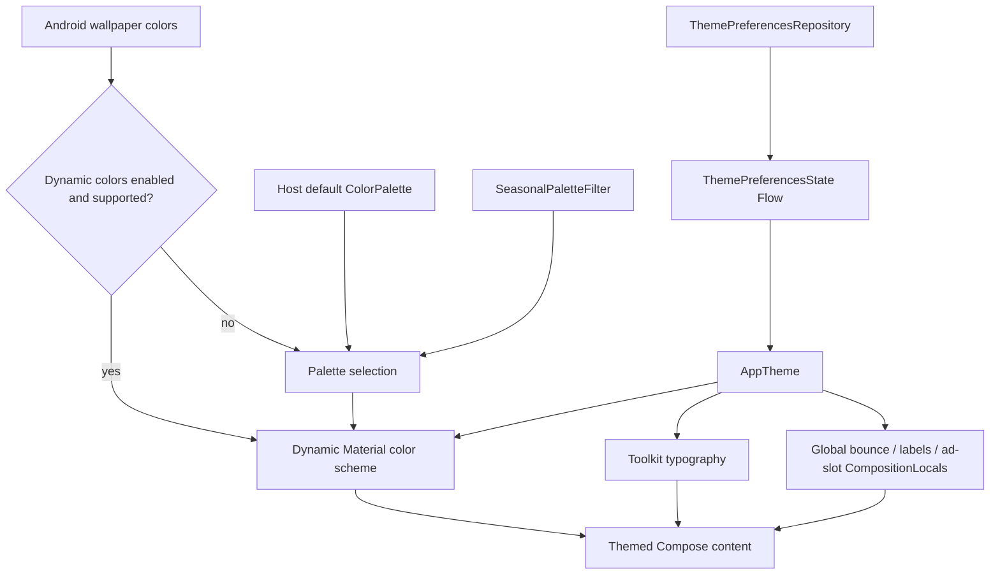

# `:library:core:designsystem` Logic Graph

## Purpose

Defines the AppToolkit Compose theme, typography, color palettes, dynamic wallpaper colors,
theme-selection visuals, and the shared icon slot used by navigation items and buttons.

## Owns

- `AppTheme`, theme configuration, typography, and palette selection.
- Static, seasonal, monochrome, rose, and Material You color definitions.
- `ColorPalette`, `ThemeSettingOption`, and wallpaper swatch models.
- Theme option/swatch composables.
- `ToolkitIcon` and its renderers, the icon slot shared by navigation items and buttons.

## Does not own

- General reusable widgets and screen state, owned by [`:library:core:ui`](../ui/README.md).
- Persisted preference infrastructure, owned by [`:library:core:datastore`](../datastore/README.md).
- Settings navigation and ViewModels, owned by `:library:feature:settings`.

## Depends on

- [`:library:core:common`](../common/README.md) for the application-facing theme preference model
  and shared helpers.
- [`:library:core:datastore`](../datastore/README.md) to observe persisted theme settings.

## Used by

- `:sample` for application theming.
- `:library:apptoolkit` as part of the public toolkit API.
- `:library:core:ui` for themed reusable components.

## Flow chart

## Architectural decisions

- `AppTheme` is the single Compose collection boundary for global appearance preferences, avoiding
  independent DataStore collectors in every reusable component.
- Dynamic wallpaper colors are presentation inputs, not persisted palette data; unsupported or
  disabled devices fall back to the selected static/seasonal palette.
- Bounce behavior is owned here through a CompositionLocal and modifier so `core:ui` can consume it
  without creating a design-system-to-UI dependency cycle.
- The icon slot is owned here for the same reason: `:library:navigation` and `:library:core:ui` both
  render icons, and this is the lowest module both already depend on.

## Public contracts

- `AppTheme`, `AppThemeConfig`, `ColorPalette`, palette providers/values, theme models, and
  selection composables.
- `ToolkitIcon`, `ToolkitIconReplayMode`, `resolveToolkitIcon`, `ToolkitIconContent`, and
  `AnimatedToolkitIcon`. See [the icon guide](../../../docs/notes/icons.md).

## Internal implementations

- `AppTheme` observes global bounce-animation, bottom-bar-label, and ad-slot preferences once at the
  root and provides them to reusable UI without per-component DataStore collectors.
- Compose collection of `themePreferencesState()` at the design-system boundary.
- `LocalBouncyAnimationsEnabled`, the design-system-owned UI contract used by interactive core UI
  components without introducing a dependency cycle back from the design system to core UI.
- `bounceClick`, the shared press-feedback modifier consumed by core and navigation UI.

- Concrete palette color tables, seasonal filtering, typography definitions, and dynamic-color
  resolution.

## Current risks

The module still depends directly on the preference contracts needed by `AppTheme`. The persisted
model and non-Compose flow combination remain outside this module so presentation-specific
collection does not leak back into `:library:core:datastore`.
