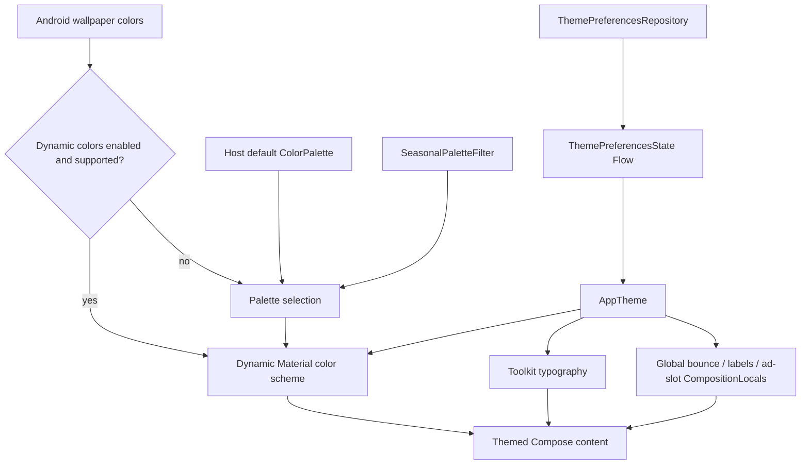

# `:library:core:designsystem` Logic Graph

## Purpose

Defines the AppToolkit Compose theme, typography, color palettes, dynamic wallpaper colors,
theme-selection visuals, and the shared icon slot used by navigation items and buttons.

## Owns

- `AppTheme`, theme configuration, typography, and palette selection.
- Static, seasonal, monochrome, rose, and Material You color definitions.
- `ColorPalette`, `ThemeSettingOption`, and wallpaper swatch models.
- Theme option/swatch composables.
- `ToolkitIcon` and its renderers, the icon slot shared by navigation items and buttons.
- Reusable bundled AVD resources for Check, Clock, Grid, Settings, and Share.

## Does not own

- General reusable widgets and screen state, owned by [`:library:core:ui`](../ui/README.md).
- Persisted preference infrastructure, owned by [`:library:core:datastore`](../datastore/README.md).
- Settings navigation and ViewModels, owned by `:library:feature:settings`.

## Depends on

- [`:library:core:common`](../common/README.md) for the application-facing theme preference model
  and shared helpers.
- [`:library:core:datastore`](../datastore/README.md) to observe persisted theme settings.

## Used by

- `:sample` for application theming.
- `:library:apptoolkit` as part of the public toolkit API.
- `:library:core:ui` for themed reusable components.

## Flow chart



## Architectural decisions

- `AppTheme` is the single Compose collection boundary for global appearance preferences, avoiding
  independent DataStore collectors in every reusable component.
- Dynamic wallpaper colors are presentation inputs, not persisted palette data; unsupported or
  disabled devices fall back to the selected static/seasonal palette.
- Bounce behavior is owned here through a CompositionLocal and modifier so `core:ui` can consume it
  without creating a design-system-to-UI dependency cycle.
- The icon slot is owned here for the same reason: `:library:navigation` and `:library:core:ui` both
  render icons, and this is the lowest module both already depend on.
- Bundled Lottie icon loading and finite playback are presentation implementation details here.
  The module uses the existing Lottie Compose dependency internally; public icon models expose
  resource IDs and replay options, not Lottie SDK types. Compositions survive click replays and
  progress is consumed while drawing to avoid recomposing host surfaces every frame.

## Public contracts

- `AppTheme`, `AppThemeConfig`, `ColorPalette`, palette providers/values, theme models, and
  selection composables.
- `ToolkitIcon`, `ToolkitIconReplayMode`, `resolveToolkitIcon`, `ToolkitIconContent`, and
  `AnimatedToolkitIcon`. See [the Toolkit Icon API](#toolkit-icon-api) below.

## Toolkit Icon API

`ToolkitIcon` is the icon slot used by every toolkit component that draws an icon: navigation drawer
items, bottom bar and rail items, and `GeneralButton`. It lives in
`:library:core:designsystem`, package
`com.mihaicristiancondrea.android.libs.apptoolkit.core.designsystem.ui.icons`.

### The five sources

| Source                              | Declares                                                   | Animates                                |
|-------------------------------------|------------------------------------------------------------|-----------------------------------------|
| `ToolkitIcon.Vector(imageVector)`   | A Compose `ImageVector`, for example `Icons.Rounded.Share` | No                                      |
| `ToolkitIcon.Resource(resId)`       | A drawable or vector XML resource, drawn through a painter | No                                      |
| `ToolkitIcon.Bitmap(imageBitmap)`   | A runtime Compose `ImageBitmap`                            | No                                      |
| `ToolkitIcon.AnimatedVector(resId)` | An `animated-vector` resource                              | Yes, on click and on selection          |
| `ToolkitIcon.Lottie(resId)`         | Lottie JSON in `res/raw`                                   | Yes, once per click or selection change |

Both animated sources also accept `loop = true`, and a `loopTrigger` that starts the loop either on
composition or on the first interaction; see [Looping an animation](#looping-an-animation).

`ToolkitIcon.of(...)` and `ToolkitIcon.animated(...)` are shorthand factories for the same
static/AVD types. `ToolkitIcon.of(imageBitmap)` creates the bitmap source and preserves its colors by
default.

`AnimatedVector` requires a real `animated-vector` drawable, the kind
`androidx.compose.animation.graphics` can read: one `vector` plus the `target` animators that move
it from the first frame to the last one. A plain `vector` resource passed as `AnimatedVector` fails to
inflate at runtime. Declare it as `Resource` instead.

Remote Lottie URLs and asset paths are not accepted by this icon API. Arbitrary `Painter` instances,
such as a Coil painter, are also not stored in `ToolkitIcon`. Runtime raster artwork belongs in
`ToolkitIcon.Bitmap` as an `ImageBitmap`.

### Runtime bitmap icons

Use `ToolkitIcon.Bitmap` when the artwork exists only at runtime rather than as a compile-time
resource. This covers downloaded or generated imagery and application icons resolved from another
package after the host converts them to `ImageBitmap`.

```kotlin
GeneralButton(
    onClick = ::openApp,
    label = stringResource(id = R.string.open),
    icon = ToolkitIcon.Bitmap(imageBitmap = appIconBitmap),
)
```

Bitmap artwork preserves its original colors by default, which is the expected behavior for app
icons and other branded imagery. Set `tintable = true` only for monochrome bitmap artwork that should
follow the component's content color.

`ToolkitIcon` deliberately does not store Android `Drawable` objects. `Drawable` is mutable and does
not fit the immutable icon model shared by the toolkit. Resolve or rasterize a runtime drawable once
at the application boundary, remember the resulting `ImageBitmap`, then pass that bitmap through the
same icon slot as every other source.

### Components with a selected state

Navigation items own two slots, `icon` for the unselected state and `selectedIcon` for the selected
one. Supply both slots explicitly, or use `animatedIcon` to share one animation across both states.
Any source is allowed in either slot, which gives four combinations:

| `icon`   | `selectedIcon`             | Result                                                                                                                          |
|----------|----------------------------|---------------------------------------------------------------------------------------------------------------------------------|
| static   | static                     | Plain swap when selection changes. Nothing animates.                                                                            |
| static   | animated                   | The static icon is drawn at rest. The first click swaps in the animated one and plays it, and every later click plays it again. |
| animated | animated (same or another) | The drawable rests on its first frame while unselected and on its last frame while selected, and replays on every click.        |
| animated | static                     | The animated icon plays while the item is unselected; the static one takes over once it is selected.                            |

The static plus animated combination is the one to use for an action such as Share, which is clicked
repeatedly and never becomes a selected destination. Draw the first frame of the animated vector
like the static icon, otherwise the swap on the first click is visible. When the first frame already
matches, using the `animatedIcon` constructor is simpler and behaves the same.

### Components without a selected state

Buttons take a single `icon`. An animated icon plays every time the button is clicked; a static one
just draws. Nothing else about the button changes.

```kotlin
GeneralButton(
    onClick = ::share,
    label = stringResource(id = R.string.share),
    icon = ToolkitIcon.AnimatedVector(R.drawable.anim_share),
)
```

### Replaying an animation

A click that happens while the drawable already rests on its last frame is a replay, and
`ToolkitIconReplayMode` decides what it looks like:

- `Restart`, the default, plays the animation forward from its first frame again. It suits the usual
  icon whose last frame is drawn like its first one, so the reset is invisible and every click looks
  the same.
- `Reverse` plays the animation backwards, from the last frame to the first one. Use it for a
  drawable that morphs between two distinct shapes and should visibly travel back, such as a
  play/pause or a menu/close toggle.

```kotlin
ToolkitIcon.AnimatedVector(
    resId = R.drawable.anim_menu,
    replayMode = ToolkitIconReplayMode.Reverse,
)
```

`atEnd` sets the frame the drawable rests on before anything happens, and is `false`, the first
frame, by default.

### Looping an animation

`loop` makes an animation run cycle after cycle for as long as it is composed, instead of once per
interaction. It is `false` by default, so every existing icon keeps its finite, click-driven
playback, and it is accepted by both animated sources. `loopTrigger` decides whether the loop starts
on its own or on the first interaction.

Looping is independent from the replay mode, which keeps describing the shape of one cycle:

- `Restart` + `loop` repeats the animation forward, returning to the first frame between cycles.
- `Reverse` + `loop` travels forward and back, so the drawable ping-pongs between its two frames.

```kotlin
ToolkitIcon.AnimatedVector(R.drawable.anim_graphic_eq, loop = true)

ToolkitIcon.Lottie(
    resId = R.raw.sync_icon,
    replayMode = ToolkitIconReplayMode.Reverse,
    loop = true,
)
```

A running loop owns its playback, so clicks and selection no longer replay it and `atEnd` is
ignored. One AVD cycle lasts the drawable's own `totalDuration`; one Lottie cycle lasts the
composition's duration.

`loopTrigger` decides when the loop starts:

- `Immediately`, the default, plays as soon as the icon is composed. Use it for an icon that reports
  something the app is already doing, such as a sync or a recording indicator.
- `OnInteraction` rests on the frame `atEnd` picks until the component is clicked or becomes
  selected, and loops from then on. Until that first interaction the icon behaves like every other
  animated one, so it stays quiet in a list where a screenful of them would otherwise all play at
  once.

```kotlin
ToolkitIcon.AnimatedVector(
    resId = R.drawable.anim_graphic_eq,
    loop = true,
    loopTrigger = ToolkitIconLoopTrigger.OnInteraction,
)
```

A reversing loop that starts on an interaction travels on from the frame the icon was resting on
rather than snapping to the other one.

Reserve looping for icons that genuinely express ongoing activity: a permanently animating icon
costs a frame callback for its whole lifetime and competes with the content around it for attention.
`OnInteraction` is the cheaper default for a gallery or a list, where the animation illustrates what
the person just did.

### Rendering an icon outside a toolkit component

Two composables are public:

- `ToolkitIconContent(icon, contentDescription, modifier, atEnd, interacted, tint)` draws exactly
  one icon and owns no state. `atEnd` picks the frame of an animated vector, and changing it
  animates between the two frames. `interacted` only matters for an icon looping `OnInteraction`,
  which rests until it is `true`.
- `AnimatedToolkitIcon(icon, clickCount, contentDescription, modifier, selectedIcon, selected, tint)`
  is the stateful one the toolkit components use. The owner keeps a click counter and increments it
  on every click; each increment replays the animation. Owners that never animate pass `0`.

`resolveToolkitIcon(icon, selectedIcon, selected, interacted)` returns the icon a component should
be drawing, and is useful when a host renders its own navigation surface from toolkit item models.
`resolveToolkitIconLoop(icon, interacted)` answers whether that icon has to be looping right now,
which is the same rule the renderers apply.

### Accessibility

The content description belongs to the component, not to the icon. Navigation items reuse their
title, and buttons accept an optional `contentDescription`. Provide a localized description for an
icon-only action unless its meaning is supplied by surrounding semantics.

### Lottie icons and performance

```kotlin
ToolkitIcon.Lottie(R.raw.add_icon, tintable = true)
ToolkitIcon.Lottie(R.raw.toggle_icon, replayMode = ToolkitIconReplayMode.Reverse)
```

Use bundled JSON from `res/raw`. Lottie compositions load asynchronously and remain remembered
across clicks; playback does not reparse the JSON. The progress provider is read while drawing,
so animation frames do not recompose the parent button or navigation surface. Animations run
once per interaction, cancel when removed from composition, and use Compose duration scaling.
Rapid clicks restart from zero by default. Reverse is opt-in. Icons do not loop while idle unless
they opt in with `loop = true`, described in [Looping an animation](#looping-an-animation), where
`loopTrigger` also decides whether that loop waits for the first interaction.

Authored colors are preserved by default. Set `tintable = true` for monochrome artwork that should
follow the component's content color, including its disabled state. `Color.Unspecified` preserves
artwork colors even when tintable. Size defaults to 24 dp and caller constraints take precedence.
Loading or invalid JSON renders an empty icon slot without starting an animation; provide valid,
small vector-only artwork and a meaningful component label. Avoid embedded images, expensive
masks, and large compositions in lists. No network requests are made by this icon API.

The FAB wrappers also accept `ToolkitIcon`: `AnimatedFloatingActionButton`,
`SmallFloatingActionButton`, and `AnimatedExtendedFloatingActionButton`. Existing ImageVector
and custom-content overloads remain available. The sample FAB showcase uses a bundled Lottie
plus icon to demonstrate replay. No repository, domain model, or persisted preference owns
playback; it remains local presentation state in `core:designsystem`.

## Internal implementations

- `AppTheme` observes global bounce-animation, bottom-bar-label, and ad-slot preferences once at the
  root and provides them to reusable UI without per-component DataStore collectors.
- Compose collection of `themePreferencesState()` at the design-system boundary.
- `LocalBouncyAnimationsEnabled`, the design-system-owned UI contract used by interactive core UI
  components without introducing a dependency cycle back from the design system to core UI.
- `bounceClick`, the shared press-feedback modifier consumed by core and navigation UI.
- Concrete palette color tables, seasonal filtering, typography definitions, and dynamic-color
  resolution.

## Current risks

The module still depends directly on the preference contracts needed by `AppTheme`. The persisted
model and non-Compose flow combination remain outside this module so presentation-specific
collection does not leak back into `:library:core:datastore`.

## GeneralButton (3.0)

Import `GeneralButton`, `GeneralButtonStyle`, and `ButtonIconPosition` from
`com.mihaicristiancondrea.android.libs.apptoolkit.core.ui.views.buttons`. The component lives in
`core:ui`, which owns feedback and analytics; this module owns its theme and ToolkitIcon rendering.

One button API handles a nonblank label, an icon, or both. A null, empty, or whitespace-only label
selects the icon-only form. Missing content fails fast. `contentDescription` is optional; a null value
leaves the icon without a spoken description, so callers own any surrounding accessibility semantics.
Labelled icons are decorative; the label names the action by default.
An explicit description replaces the visible label's accessibility text without announcing both.

| Style | Label / icon + label | Icon only |
|---|---|---|
| `Filled` (default) | Material Button | FilledIconButton |
| `Tonal` | FilledTonalButton | FilledTonalIconButton |
| `Outlined` | OutlinedButton | OutlinedIconButton |
| `Elevated` | ElevatedButton | Compact 40 dp ElevatedButton with zero content padding |
| `Text` | TextButton | IconButton |

The elevated icon form retains Material elevation, disabled behavior, shape, and minimum interactive
target; it does not fall back to a filled style. Caller size constraints take precedence.
`iconPosition = ButtonIconPosition.End` places the icon after the label in logical reading order;
`Start` is the default and both follow RTL. `iconSize` applies to either form.

`containerColor` and `contentColor` are optional enabled-state overrides shared by both forms;
null retains style defaults. Disabled colors remain Material defaults. `iconTint` overrides icon
color through the shared renderer; null follows the button content color. Bitmap and Lottie artwork
retain authored colors unless `tintable = true`; `Color.Unspecified` preserves artwork even when
it is tintable. Vectors, resources, bitmaps, AVD and bundled Lottie all use the same `ToolkitIcon`
slot and existing `Restart` / `Reverse` replay contract described above, including its optional
`loop` for animated sources.

Every enabled click replays the icon, performs `ButtonFeedback`, logs the optional `ga4Event`
through `firebaseController`, then invokes `onClick`. Disabled buttons do none of these.
Do not add `bounceClick()`, manual sounds, haptics, or duplicate analytics at call sites.

```kotlin
GeneralButton(onClick = ::save, label = stringResource(R.string.save))
GeneralButton(
    onClick = ::showMenu,
    style = GeneralButtonStyle.Text,
    icon = ToolkitIcon.Vector(Icons.Rounded.MoreVert),
    contentDescription = stringResource(R.string.more_options),
)
GeneralButton(
    onClick = ::continueFlow,
    style = GeneralButtonStyle.Elevated,
    label = stringResource(R.string.continue_label),
    icon = ToolkitIcon.Vector(Icons.AutoMirrored.Rounded.ArrowForward),
    iconPosition = ButtonIconPosition.End,
)
GeneralButton(
    onClick = ::openApp,
    label = stringResource(R.string.open),
    icon = ToolkitIcon.Bitmap(imageBitmap = appIconBitmap),
)
```

### Breaking migration

`GeneralTextButton`, `GeneralTonalButton`, and `GeneralOutlinedButton` have been removed, with no
deprecated aliases. Replace them with `GeneralButton` and the corresponding `Text`, `Tonal`, or
`Outlined` style. Rename `iconContentDescription` to `contentDescription`. Replace `colors =
ButtonDefaults.buttonColors(...)` with `containerColor` / `contentColor` overrides. `onClick` is now
the first parameter; prefer named arguments when migrating positional calls.

`AnimatedIconButtonDirection` delegates its action to GeneralButton and only owns visibility
transitions. FABs remain specialized floating action components.

## Bundled animated icons

Reusable AVDs belong in this module's `res/drawable`, alongside the shared icon renderer, rather
than navigation. Import this module's `R` when selecting `anim_check`, `anim_clock`, `anim_grid`,
`anim_settings`, or `anim_share`. These animations are still being evaluated in the sample's
Components animation playground, whose controls are the three decisions an animated icon makes: a
replay menu (Restart plays forward each time, Reverse alternates direction), a Loop checkbox, and,
once looping is on, a menu choosing whether the loop starts right away or on the first tap. Changing
any of them resets the previews. Check rests on its completed frame so the icon-only controls remain
visible; its first Reverse tap erases the check. Playback stays finite and tap-driven until a loop
is both switched on and started.

Each animation contains its private vector, target animators, and interpolators through inline
`aapt:attr` resources. Keep a separate resource only when it is actually reused. `ic_settings` and
`ic_share` remain available because the sample drawer also uses those static assets. The unused
Success animation and its private resources were removed. The imported dummy color was removed;
monochrome artwork receives the current component tint through ToolkitIcon rather than defining
another theme color.

### One animation for a navigation item

`BottomBarItem` and `NavigationDrawerItem` accept a dedicated `animatedIcon` constructor. It needs
no `icon` or `selectedIcon` arguments and accepts only `ToolkitIcon.Animated` (AVD or Lottie).
Internally both non-null icon states reference that same value, so existing custom navigation
renderers can continue consuming `item.icon` and `item.selectedIcon`. Selection changes animate
between the first and last frames; repeated clicks follow the chosen replay mode.

```kotlin
BottomBarItem(
    route = ToolkitTilesRoute,
    title = R.string.tiles_title,
    animatedIcon = ToolkitIcon.AnimatedVector(
        resId = DesignSystemR.drawable.anim_grid,
        replayMode = ToolkitIconReplayMode.Reverse,
    ),
)
```

Use the `icon` / `selectedIcon` constructor when the two states need distinct artwork; both
arguments are required. Pass the same static icon twice when it should not change on selection.
Moved resources must now be imported from `core.designsystem.R`, not `navigation.R`.
