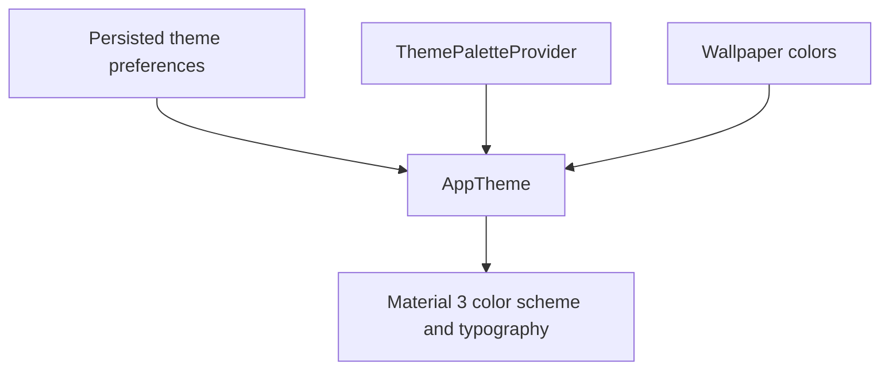

# `:library:core:designsystem` Logic Graph

## Purpose

Defines the AppToolkit Compose theme, typography, color palettes, dynamic wallpaper colors, and
theme-selection visuals.

## Owns

- `AppTheme`, theme configuration, typography, and palette selection.
- Static, seasonal, monochrome, rose, and Material You color definitions.
- `ColorPalette`, `ThemeSettingOption`, and wallpaper swatch models.
- Theme option/swatch composables.

## Does not own

- General reusable widgets and screen state, owned by [`:library:core:ui`](../ui/README.md).
- Persisted preference infrastructure, owned by [`:library:core:datastore`](../datastore/README.md).
- Settings navigation and ViewModels, owned by `:library:feature:settings`.

## Depends on

- [`:library:core:common`](../common/README.md) for theme preference state and shared helpers.
- [`:library:core:datastore`](../datastore/README.md) to observe persisted theme settings.

## Used by

- `:sample` for application theming.
- `:library:apptoolkit` as part of the public toolkit façade.
- `:library:core:ui` for themed reusable components.

## Flow chart

## Public contracts

- `AppTheme`, `AppThemeConfig`, `ColorPalette`, palette providers/values, theme models, and
  selection composables.

## Internal implementations

- Concrete palette color tables, seasonal filtering, typography definitions, and dynamic-color
  resolution.

## Current risks

The module depends directly on persistence and includes feature-namespaced theme models/UI, which
makes the design system less reusable independently of AppToolkit settings.
