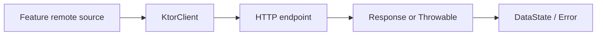

# `:library:core:network` Logic Graph

## Purpose

Supplies the shared Ktor HTTP client and normalized network result/error types used by remote-backed
features.

## Owns

- Ktor client construction and JSON/content-negotiation configuration.
- `DataState`, `Error`, and `Errors` network/domain result contracts.
- Throwable and error-to-UI-text mapping extensions.

## Does not own

- Feature endpoints, DTOs, mappers, or repositories; those remain in the feature modules.
- Host-specific error types, which remain in `:sample`.

## Depends on

- [`:library:core:common`](../common/README.md) for shared result utilities and UI-text
  abstractions.

## Used by

- `:library:apptoolkit` for DI composition.
- `:library:feature:about`, `:library:feature:help`, `:library:feature:issuereporter`,
  `:library:feature:onboarding`, `:library:feature:permissions`, `:library:feature:settings`, and
  `:library:feature:support`.
- `:library:integration:ads` and `:library:integration:consent`.

## Flow chart

## Public contracts

- `KtorClient`, `DataState`, `Error`, `Errors`, and mapping extensions.

## Internal implementations

- Ktor engine/configuration details and localized error-resource mapping.

## Current risks

Network result models live under a domain package while the same module also owns the concrete HTTP
client, coupling abstraction and transport implementation.
