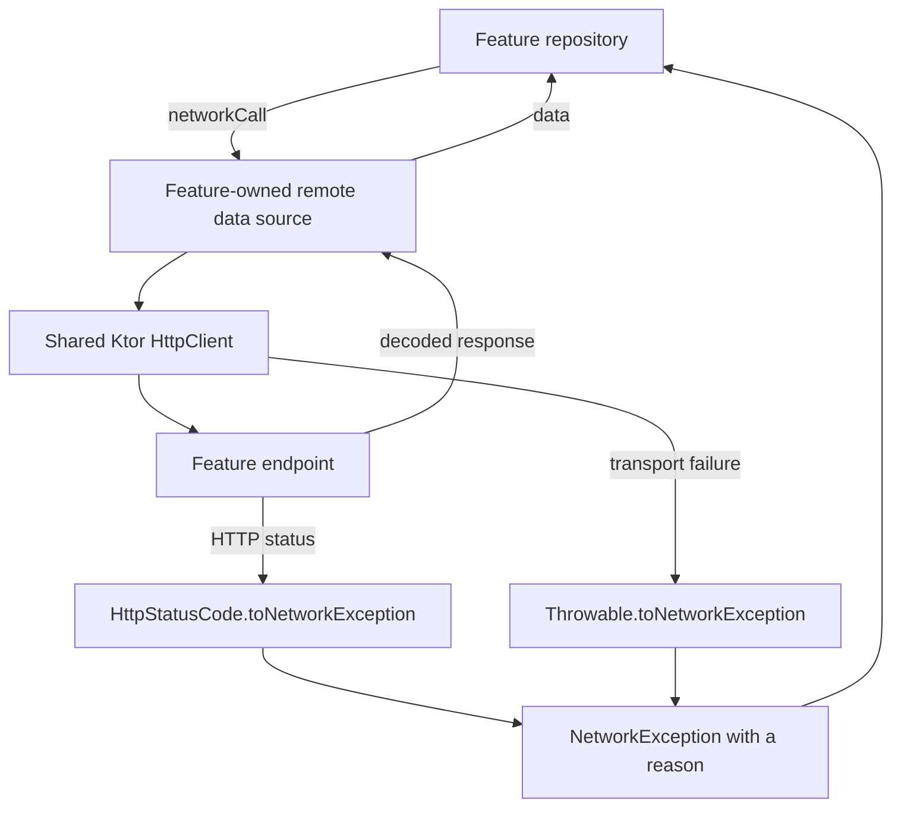

# `:library:core:network` Logic Graph

## Purpose

Supplies the shared Ktor HTTP client and the translation of its failures into `NetworkException`.

## Owns

- Ktor client construction and JSON/content-negotiation configuration (`KtorClient`).
- Translating the client's failures into `NetworkException` (from `:library:core:common`):
  `networkCall { }`, `Throwable.toNetworkException()` and `HttpStatusCode.toNetworkException()`.

## Does not own

- Feature endpoints, DTOs, mappers, or repositories; those remain in the feature modules.
- The text a screen shows for a failure, mapped by `core.ui.screen.toUiText` in
  [`:library:core:ui`](../ui/README.md).
- `NetworkException` itself, which `:library:core:common` owns so a repository can throw it
  without depending on Ktor.

## Depends on

- [`:library:core:common`](../common/README.md) for `NetworkException`.

## Used by

- `:library:apptoolkit` for DI composition.
- Every feature with a remote source: `:library:feature:changelog`, `:library:feature:faq`,
  `:library:feature:issuereporter`, and the sample's apps catalogue.

## Flow chart

```mermaid
flowchart TD
    Repository[Feature repository] -->|networkCall| Remote[Feature-owned remote data source]
    Remote --> Client[Shared Ktor HttpClient]
    Client --> Endpoint[Feature endpoint]
    Endpoint -->|decoded response| Remote
    Endpoint -->|HTTP status| Status[HttpStatusCode.toNetworkException]
    Client -->|transport failure| Throwable[Throwable.toNetworkException]
    Status --> Exception[NetworkException with a reason]
    Throwable --> Exception
    Remote -->|data| Repository
    Exception --> Repository
```

## Architectural decisions

- A repository returns its data or throws. Remote calls run in `networkCall { }`, so a failure
  reaches the caller as a `NetworkException` whose `reason` says what went wrong and whose `cause`
  is the client's exception. Cancellation passes through untouched.
- Ktor suspends, so neither the client nor `networkCall` switches dispatchers; a repository that
  only calls the network needs no `DispatcherProvider`.
- Client construction and the failure vocabulary are shared; URLs, DTOs, decoding choices, and
  fallback policy stay with each feature's remote source and repository.
- This module has no resources: failure text belongs to the UI layer.

## Public contracts

- `KtorClient`, `networkCall`, `Throwable.toNetworkException()` and
  `HttpStatusCode.toNetworkException()`.

## Internal implementations

- Ktor engine and logging configuration.
