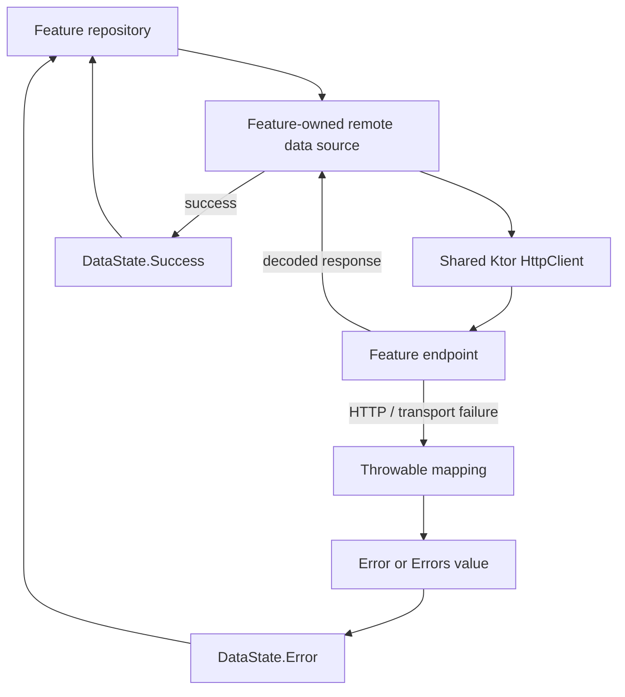

# `:library:core:network` Logic Graph

## Purpose

Supplies the shared Ktor HTTP client and normalized network result/error types used by remote-backed
features.

## Owns

- Ktor client construction and JSON/content-negotiation configuration.
- Translating the client's failures into `NetworkException` (from `:library:core:common`):
  `networkCall { }`, `Throwable.toNetworkException()` and `HttpStatusCode.toNetworkException()`.
- The legacy `DataState`, `Error`, and `Errors` result contracts, with their Throwable and
  UI-text mapping, until every repository has moved to throwing.

## Does not own

- Feature endpoints, DTOs, mappers, or repositories; those remain in the feature modules.
- Host-specific error types, which remain in `:sample`.

## Depends on

- [`:library:core:common`](../common/README.md) for shared result utilities and UI-text
  abstractions.

## Used by

- `:library:apptoolkit` for DI composition.
- `:library:feature:about`, `:library:feature:faq`, `:library:feature:issuereporter`,
  `:library:feature:onboarding`, `:library:feature:permissions`, `:library:feature:settings`,
  `:library:feature:startup`, and `:library:feature:support`.
- `:library:integration:ads` and `:library:integration:consent`.

## Flow chart

```mermaid
flowchart TD
    Repository[Feature repository] --> Remote[Feature-owned remote data source]
    Remote --> Client[Shared Ktor HttpClient]
    Client --> Endpoint[Feature endpoint]
    Endpoint -->|decoded response| Remote
    Endpoint -->|HTTP / transport failure| Throwable[Throwable mapping]
    Throwable --> Error[Error or Errors value]
    Remote -->|success| State[DataState.Success]
    Error --> StateError[DataState.Error]
    State --> Repository
    StateError --> Repository
```

## Architectural decisions

- A repository returns its data or throws. Remote calls run in `networkCall { }`, so a failure
  reaches the caller as a `NetworkException` whose `reason` says what went wrong and whose `cause`
  is the client's exception. The text a screen shows for it is mapped in `:library:core:ui`
  (`core.ui.screen.toUiText`), not here.
- `toError()` recognizes `NetworkException` and `StorageException`, so a repository that already
  throws them still works with code that reads `Errors`.
- Client construction and cross-feature error vocabulary are shared; URLs, DTOs, decoding choices,
  and fallback policy stay with each feature's remote source and repository.
- `DataState` can carry stale data in loading/error states, allowing a repository to expose cached
  content without pretending the refresh succeeded.
- Errors are normalized before presentation mapping, while localized `UiTextHelper` conversion
  remains an edge concern.

## Public contracts

- `KtorClient`, `networkCall`, `toNetworkException`, and the legacy `DataState`, `Error`, `Errors`
  and their mapping extensions.

## Internal implementations

- Ktor engine/configuration details and localized error-resource mapping.

## Current risks

Network result models live under a domain package while the same module also owns the concrete HTTP
client, coupling abstraction and transport implementation. `Errors` also names storage failures and
feature-specific failures (FAQ, consent, billing, review), which a network module should not know.
Both go away with `DataState` once the last repository throws instead.
