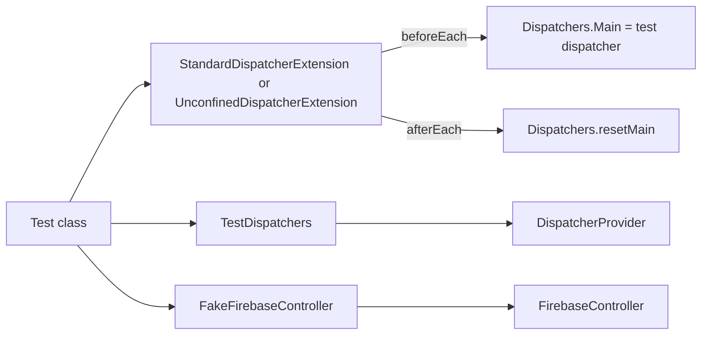

# `:library:core:testing` Logic Graph

## Purpose

Provides reusable JVM test fixtures for toolkit and sample modules without placing test-only APIs
on production runtime classpaths.

## Owns

- `TestDispatchers`, which maps every `DispatcherProvider` lane to one test dispatcher.
- JUnit 5 extensions for installing standard or unconfined test dispatchers as `Dispatchers.Main`.
- `FakeFirebaseController`, a no-op implementation for tests that exercise logged ViewModels.

## Does not own

- Test execution configuration and dependency bundles, owned by the `unit-test` convention plugin.
- Feature-specific fakes, fixtures, and assertions, which stay in the module that uses them.
- Production dispatcher or Firebase implementations.

## Depends on

- [`:library:core:common`](../common/README.md) for `DispatcherProvider` and
  `FirebaseController`.
- Coroutine-test and JUnit 5 APIs, exposed because consumers compile against these fixtures.

## Used by

Production modules add this module through `testImplementation`; it is intentionally absent from
`:library:apptoolkit`'s runtime facade.

## Flow chart

## Architectural decisions

- Fixtures live in `src/main` because another module cannot consume this module's `src/test`; the
  dependency configuration, not the source-set name, keeps them test-only for callers.
- Standard and unconfined dispatcher extensions are separate to make eager execution an explicit
  per-test choice.
- One dispatcher backs all `DispatcherProvider` properties so virtual-time advancement is
  deterministic across main, IO, and default work.

## Public contracts

- `TestDispatchers`, `StandardDispatcherExtension`, `UnconfinedDispatcherExtension`, and
  `FakeFirebaseController`.

## Internal implementations

- JUnit lifecycle callbacks that install and reset the main dispatcher.

## Current risks

Forgetting to register an extension leaves code using `Dispatchers.Main` outside the test scheduler.
The extensions reset global state after every test, so custom lifecycle changes must preserve that
cleanup.
