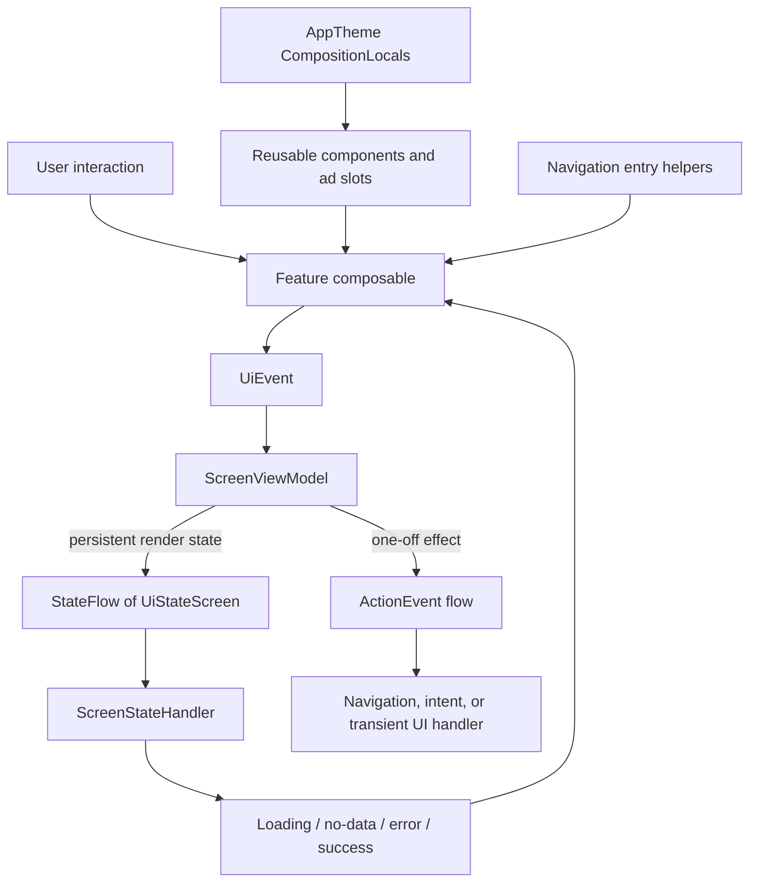

# `:library:core:ui` Logic Graph

## Purpose

Provides the reusable Compose presentation foundation: screen/ViewModel contracts, Navigation 3
entry helpers, state handling, analytics hooks, and shared components.

## Owns

- `ScreenViewModel`, `LoggedScreenViewModel`, event/action bases, and `UiStateScreen` handling.
- Navigation entry builders and UI state built on stable keys owned by `:library:navigation`.
- Reusable buttons, fields, preferences, layouts, grids, dialogs, snackbars, ads slots, effects, and
  adaptive-window helpers.
- `GeneralTextField` and the Markdown authoring behind it: the length-preserving highlighter, the
  formatting bar, and the source edits it applies.
- Render models such as `AppVersionInfo` and `AdsConfig`.
- The shared theme-mode preview composables used by both the onboarding and settings theme UI.
- The single adaptive `GeneralButton` and FAB icon slots accept `ToolkitIcon`, including bundled Lottie icons.
  FAB ImageVector/custom-content overloads remain compatible; rendering and playback are delegated
  to `core:designsystem`, while buttons retain feedback and analytics ownership.

## Does not own

- Business rules, repositories, DTOs, persistence, or HTTP behavior.
- Color palette and root theme construction, owned by [
  `:library:core:designsystem`](../designsystem/README.md).
- Feature screens.

## Depends on

- [`:library:core:common`](../common/README.md) for common models, Firebase contracts, and platform
  helpers.
- [`:library:core:datastore`](../datastore/README.md) for remaining persistence-backed UI adapters;
  reusable modifiers and ad slots consume design-system-provided values rather than DataStore.
- [`:library:core:designsystem`](../designsystem/README.md) for theme primitives and the
  `ToolkitIcon` slot the buttons render.
- [`:library:navigation`](../../navigation/README.md) for shared navigation models and transitions.

## Used by

- `:sample` and `:library:apptoolkit`.
- `:library:feature:about`, `:library:feature:help`, `:library:feature:issuereporter`,
  `:library:feature:onboarding`, `:library:feature:permissions`, `:library:feature:settings`, and
  `:library:feature:support`.
- `:library:integration:ads` for its settings screen and ad presentation.

## Flow chart

## Architectural decisions

- Screen state and one-off actions use separate streams so recomposition cannot repeat navigation
  or transient effects.
- `ScreenViewModel` owns unidirectional event-to-state processing; feature composables render data
  and forward user intent rather than reaching repositories.
- `ScreenStateHandler` centralizes loading/no-data/error/success rendering, while feature content
  remains responsible for its successful state.
- Global UI preferences arrive through the design-system root. Reusable components must not start
  their own persistence collectors unless a documented adapter still requires it.

## Compatibility adapters

The existing startupDestinationFlow extension delegates to core DataStore's generic startupValueFlow.
The existing getVersionInfo extension delegates to core common's getVersionMetadata and returns the
unchanged AppVersionInfo class. Their original packages, function signatures, and JVM file names
remain available; data-layer callers should use the lower-level APIs.

## Public contracts

- `GeneralButton` is the action-button entry point for all five styles and labelled/icon-only content.
  See the [3.0 button contract and migration](../designsystem/README.md#generalbutton-30).
- `GeneralTextField` is the text-input entry point; see [GeneralTextField](#generaltextfield).
- `GroupedGrid` is the grouped category/action block: `GroupedGridItem` cells, `GroupedGridDefaults`
  for radii, spacing, colors and the badge shape, and `GroupedGridMeasurements` for the size class.
  The corner and ad-placement rules are `groupedGridRows`, which is unit tested; the composable
  renders the plan it returns. Its ad row goes through `NativeAdSlot` like every other ad surface,
  so a host that passes no `adUnitId` pulls in no ad behaviour at all. The size class also chooses
  the ad's `NativeAdPresentation.GridRow` metrics, so the sponsored row matches the cells rather
  than the other ad surfaces.

- All new ViewModels must extend `ScreenViewModel`, or `LoggedScreenViewModel` when Firebase
  breadcrumbs/error reporting are required.
- ViewModels receive events through `onEvent`, expose immutable `UiStateScreen<T>`, and emit one-off
  actions separately.
- Initialization is represented by an event sent from `init`; long-running work is owned and
  cancelled by the ViewModel. Flow pipelines use `catch` and dispatcher selection rather than
  `runCatching` in ViewModels.
- Shared navigation types, state/render models, reusable composables, lifecycle effects, and
  analytics APIs are intentional cross-module contracts.
- Every button takes its icon as a single `ToolkitIcon`, so a button can carry a Compose icon, a
  drawable resource, or an animated vector that plays on each click. See
  [the design system README](../designsystem/README.md#toolkit-icon-api).

## GeneralTextField

One field component, `views/fields/GeneralTextField.kt`, with the same shape as `GeneralButton`: the
defaults render exactly the Material filled field, and every variation is a parameter rather than
another component. Two overloads, `String` and `TextFieldValue`; take the second when the caret is
part of the state a screen owns.

`GeneralTextFieldStyle` picks the treatment:

| Style | Renders |
|---|---|
| `Filled` (default) | The Material `TextField` |
| `Outlined` | The Material `OutlinedTextField` |
| `Grouped` | A filled field with no indicator line, cut to `position` in a grouped block |
| `Search` | The Material search input, pill-shaped, leading with a search icon |
| `SearchOutlined` | The outlined field, fully rounded, leading with a search icon |

`Grouped` is the form treatment: a column of fields two dp apart reads as one card, so the indicator
line is dropped (it would cut the block into strips) and `position` plus `groupedOuterRadius` cut the
corners. Such a field usually carries no `label` either, because a floating label reserves height
whether or not it is showing; `placeholder` and a described `leadingIcon` name it instead.

`Search` is the odd one out, and deliberately so: it is `SearchBarDefaults.InputField` rather than a
rounded text field, for a box that filters the content behind it as it is typed — a top app bar that
swaps its title for a search field, say. It is used on its own rather than inside a `SearchBar`
because the collapsed bar intercepts the soft keyboard and only accepts typing once it expands into
a surface that reserves 240dp for results this kind of field does not have. The parameters that
describe a form field — `label`, `supportingText`, `errorText`, `minLines`, `markdown`, `position` —
do not apply to it, and the `TextFieldValue` overload rejects it outright, because the Material input
owns its text state and has no caret to hand over. `onSearch` reports the keyboard's search action;
focus is dropped first either way.

`SearchOutlined` is the search box drawn as an ordinary outlined field instead, fully rounded. Take
it where a filled pill would disappear into the surface behind it, or where the rest of the screen is
outlined; every parameter applies to it, and the `TextFieldValue` overload accepts it.

`trailingContent` replaces the whole trailing slot with a row, for the field that ends in more than
one action — a search box carrying a filter and a clear button. `errorText` marks the error state and replaces `supportingText` in one parameter, so a message and
the state it describes cannot drift apart. `trailingIcon` with `onTrailingIconClick` becomes a
`GeneralButton`, so a clear or reveal action keeps the toolkit's feedback. `ga4Event` is logged when
the field gains focus — a field is not a button, and a per-keystroke event is not an interaction.

`GeneralTextFieldMarkdown` turns the field into a Markdown editor:

- `Highlight` styles the syntax as it is typed. The transformation is length-preserving, so offsets
  stay identity-mapped and the markers stay visible, selectable and editable. A Markdown *renderer*
  cannot do this job, because the field is an editor.
- `Editor` adds the formatting bar underneath — bold, italic, inline code, code fences, bulleted and
  numbered lists, quotes and links — which edits the Markdown source and places the caret between the
  markers it inserts. The bar is cut and filled to match the style above it, so field and bar read as
  one block; a grouped field hands the lower half of its `position` to the bar.

Either mode replaces `visualTransformation`, since the field draws the source itself.
`onMarkdownFormat` reports which action was used, as a `MarkdownFormatAction` whose `analyticsName`
is a stable identity for hosts that log them. `MarkdownFormatting`, the source edits behind the bar,
is plain string transformation and unit tested without a Compose runtime.

## Internal implementations

- Component rendering, animation, native-ad hosting, snackbar orchestration, and default
  state-handler behavior.

## Current risks

Feature-specific theme, onboarding-preview, and display-dialog code lives in this generic core
module. The native-ad UI also exposes an advertising concern from the shared UI foundation.

`views/ads` holds only primitives now: the slot, the renderer, the palette, the presentations, and
the two generic containers a host can place anywhere. Single-screen cards moved to the features that
draw them, and the sample's to the sample. Do not add a one-screen wrapper back here: write it next
to its screen, or add a `NativeAdPresentation` if the shape itself is new. The primitives themselves
belong in `:library:integration:ads`; the reason they have not moved is recorded in
[that module's README](../../integration/ads/README.md#current-risks).

## Migration notes

### Ad surfaces must fail closed and remain host-styleable

Native and banner ad requests previously assumed the Mobile Ads SDK had already initialized. When
the preference/UI path disagreed with initialization, SDK calls could throw synchronously from a
Compose effect and kill the host process, reported as
`IllegalStateException: MobileAds.initialize must be called before using the Google Mobile Ads SDK`
with `NativeAdLoader.load` under `DisposableEffectImpl.onRemembered`. Preserve the current behavior:

- `rememberAdsEnabled` observes the same `CommonDataStore.adsEnabledFlow` used by
  `AdsCoreManager`; it must not choose its own default.
- Ad slots take their unit id from a host-bound `AdsConfig` resolved by Koin qualifier, and
  `NoDataScreen` injects `NO_DATA_NATIVE_AD` without a fallback, a host that has not bound it
  crashes on the empty state rather than rendering without an ad. The host checklist lives in
  [`:library:integration:ads`](../../integration/ads/README.md).
- `rememberNativeAd` and `AdBanner` wait for `AdsSdkState`, retry when readiness changes, and treat
  a
  synchronous SDK exception as a failed/empty ad slot rather than a fatal UI error.
- Loaded native ads are destroyed when their unit ID changes, when ads are disabled, or when the
  composable leaves composition.
- `NativeAdSlot.containerColor` is a call-site override. Its default remains an unstyled Material
  card, while exceptional toolkit screens and consumer apps may match their own surfaces without
  changing every native ad.
- The shared native-ad CTA view wraps its label and padding; do not restore a toolkit-wide custom
  minimum height merely to align one screen.
- Featured/no-data presentations retain the sponsored-label container, a clipped 16:9 media frame,
  and an end-aligned CTA. Grid presentations keep their content centered.
- `NativeAdPresentation.GridRow` is the one presentation whose metrics the caller supplies, because
  it has to match the grid it is interleaved with. It keeps the disclosure chip inline with the body
  so the row stays as short as a cell; do not restore a stacked label there. Its badge silhouette
  comes from `rememberNativeAdBadgeShape`, and is deliberately excluded from the presentation's
  equality: the renderer keys its view tree on the presentation, so comparing the badge by identity
  would tear down and restart the ad request whenever a caller rebuilt the shape. The badge is
  repainted in the palette pass instead. The ad icon is inset rather than clipped, which is what
  lets the badge carry a silhouette no view outline could express.

These are compatibility safeguards for host applications, not incidental styling details.
