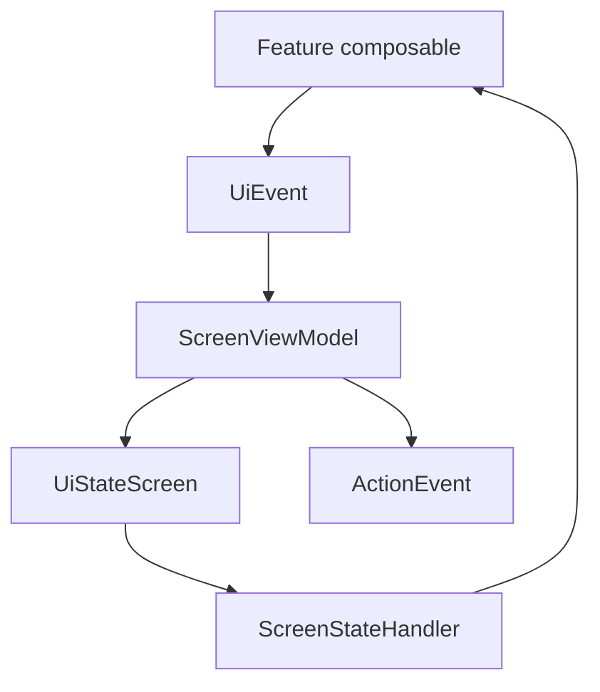

# `:library:core:ui` Logic Graph

## Purpose

Provides the reusable Compose presentation foundation: screen/ViewModel contracts, Navigation 3
entry helpers, state handling, analytics hooks, and shared components.

## Owns

- `ScreenViewModel`, `LoggedScreenViewModel`, event/action bases, and `UiStateScreen` handling.
- Stable navigation keys, entry builders, navigation state, and animations.
- Reusable buttons, fields, preferences, layouts, dialogs, snackbars, ads slots, effects, and
  adaptive-window helpers.
- Render models such as `AppVersionInfo`, `AdsConfig`, and navigation drawer items.

## Does not own

- Business rules, repositories, DTOs, persistence, or HTTP behavior.
- Color palette and root theme construction, owned by [
  `:library:core:designsystem`](../designsystem/README.md).
- Feature screens, except that some feature-specific theme/onboarding/display UI currently remains
  here.

## Depends on

- [`:library:core:common`](../common/README.md) for common models, Firebase contracts, and platform
  helpers.
- [`:library:core:designsystem`](../designsystem/README.md) for theme primitives.
- [`:library:navigation`](../../navigation/README.md) for shared navigation models and transitions.

## Used by

- `:sample` and `:library:apptoolkit`.
- `:library:feature:about`, `:library:feature:help`, `:library:feature:issuereporter`,
  `:library:feature:onboarding`, `:library:feature:permissions`, `:library:feature:settings`, and
  `:library:feature:support`.
- `:library:integration:ads` for its settings screen and ad presentation.

## Flow chart

## Public contracts

- All new ViewModels must extend `ScreenViewModel`, or `LoggedScreenViewModel` when Firebase
  breadcrumbs/error reporting are required.
- ViewModels receive events through `onEvent`, expose immutable `UiStateScreen<T>`, and emit one-off
  actions separately.
- Initialization is represented by an event sent from `init`; long-running work is owned and
  cancelled by the ViewModel. Flow pipelines use `catch` and dispatcher selection rather than
  `runCatching` in ViewModels.
- Shared navigation types, state/render models, reusable composables, lifecycle effects, and
  analytics APIs are intentional cross-module contracts.

## Internal implementations

- Component rendering, animation, native-ad hosting, snackbar orchestration, and default
  state-handler behavior.

## Current risks

Feature-specific theme, onboarding-preview, and display-dialog code lives in this generic core
module. The native-ad UI also exposes an advertising concern from the shared UI foundation.

## Migration notes

### Ad surfaces must fail closed and remain host-styleable

Native and banner ad requests previously assumed the Mobile Ads SDK had already initialized. When
the preference/UI path disagreed with initialization, SDK calls could throw synchronously from a
Compose effect and kill the host process — reported as
`IllegalStateException: MobileAds.initialize must be called before using the Google Mobile Ads SDK`
with `NativeAdLoader.load` under `DisposableEffectImpl.onRemembered`. Preserve the current behavior:

- `rememberAdsEnabled` observes the same `CommonDataStore.adsEnabledFlow` used by
  `AdsCoreManager`; it must not choose its own default.
- `rememberNativeAd` and `AdBanner` wait for `AdsSdkState`, retry when readiness changes, and treat
  a
  synchronous SDK exception as a failed/empty ad slot rather than a fatal UI error.
- Loaded native ads are destroyed when their unit ID changes, when ads are disabled, or when the
  composable leaves composition.
- `NativeAdSlot.containerColor` is a call-site override. Its default remains an unstyled Material
  card, while exceptional toolkit screens and consumer apps may match their own surfaces without
  changing every native ad.
- The shared native-ad CTA view wraps its label and padding; do not restore a toolkit-wide custom
  minimum height merely to align one screen.
- Featured/no-data presentations retain the sponsored-label container, a clipped 16:9 media frame,
  and an end-aligned CTA. Grid presentations keep their content centered.

These are compatibility safeguards for host applications, not incidental styling details.
