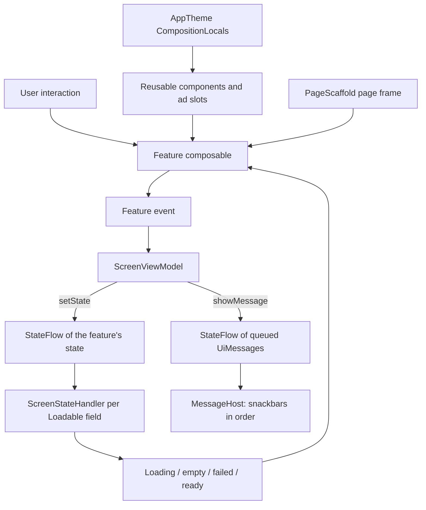

# `:library:core:ui` Logic Graph

## Purpose

Provides the reusable Compose presentation foundation: screen/ViewModel contracts, the shell's
page frame, state handling, analytics hooks, and shared components.

## Owns

- The screen contracts, in `screen`: `ScreenViewModel`, `LoggedScreenViewModel`, `Loadable`,
  `TrackedStatus`, `UiMessage`, `ScreenStateHandler`, `TrackScreenState` and `MessageHost`. See
  [Screen state](#screen-state).
- The shell's page frame, in `views/shell`: `PageScaffold`, `ShellTopAppBar` and
  `rememberTopBarScrollBehavior`, the app bar's search field, `LocalContentPadding` and
  `contentPadding`, `ContentWidthBox`, the pane placeholders, and the page's snackbar host
  (`LocalPageSnackbarHostState`, `rememberPageSnackbarHostState`). See [Page frame](#page-frame).
- The settings models, in `models/settings`: `SettingsConfig`, `SettingsCategory` and
  `SettingsPreference`, whose rows carry a `destination` key and an optional app `action`. They
  live here, not in the settings feature, so the features that describe settings (permissions, the
  app's provider) need no dependency on that feature.
- Cross-feature contracts, such as `IssueReporterSheet` in `views/sheets`: one feature binds it in
  Koin and another resolves it, so neither depends on the other.
- The floating action button column, in `views/buttons/fab`: `ToolkitFabColumn` and
  `ToolkitFloatingActionButton` draw the `ToolkitFab`s of `:library:core:designsystem`, and
  `ScaffoldFabs` with `FabHost` and `LocalFabHost` let a screen put its own buttons in the
  scaffold around it. See [Floating action buttons](#floating-action-buttons).
- The theme choices, in `views/theme`: `ThemeModePicker` (light, dark and follow system cards) and
  `ThemePalettePicker` (wallpaper color variants and static palettes on two tabs, or the static
  palettes alone without wallpaper colors), with `ThemePalettePager` and the mode previews under
  them. The theme settings page and the onboarding theme page both use them, so the two cannot
  drift apart; neither feature may depend on the other.
- `ChoicePreferenceItem`, the settings row that shows the chosen option and opens a radio-list
  dialog to change it. Its `icon` is optional; the Toolkit's settings rows go without one, while
  their dialogs keep an icon on top through `dialogIcon`.
- Reusable buttons, fields, preferences, layouts, grids, dialogs, snackbars, ads slots, effects, and
  adaptive-window helpers.
- `MainTopAppBar`, the host main-screen app bar, its optional centre-aligned title, and its
  host-supplied Support overflow action.
- `SearchTopAppBar`, the same bar with a search field in place of its title, and `SearchFilterAction`,
  the filter toggle that sits inside that field.
- `GeneralTextField` and the Markdown authoring behind it: the length-preserving highlighter, the
  formatting bar, and the source edits it applies.
- Render models such as `AppVersionInfo` and `AdsConfig`.
- The shared theme-mode preview composables used by both the onboarding and settings theme UI.
- The single adaptive `GeneralButton` and FAB icon slots accept `ToolkitIcon`, including bundled Lottie icons.
  FAB ImageVector/custom-content overloads remain compatible; rendering and playback are delegated
  to `core:designsystem`, while buttons retain feedback and analytics ownership.

## Does not own

- Business rules, repositories, DTOs, persistence, or HTTP behavior.
- Color palette and root theme construction, owned by [
  `:library:core:designsystem`](../designsystem/README.md).
- Feature screens.

## Depends on

- [`:library:core:common`](../common/README.md) for common models, Firebase contracts, and platform
  helpers.
- [`:library:core:datastore`](../datastore/README.md) for remaining persistence-backed UI adapters;
  reusable modifiers and ad slots consume design-system-provided values rather than DataStore.
- [`:library:core:designsystem`](../designsystem/README.md) for theme primitives and the
  `ToolkitIcon` slot the buttons render.
- [`:library:navigation`](../../navigation/README.md) for the navigator, the page key and pane
  role, and the layout the page frame reads.

## Used by

- `:sample` and `:library:apptoolkit`.
- Every `:library:feature` module.
- `:library:integration:ads` for its settings screen and ad presentation.

## Flow chart


```mermaid
flowchart TD
    User[User interaction] --> Screen[Feature composable]
    Screen --> Event[Feature event]
    Event --> VM[ScreenViewModel]
    VM -->|setState| State[StateFlow of the feature's state]
    VM -->|showMessage| Messages[StateFlow of queued UiMessages]
    State --> Handler[ScreenStateHandler per Loadable field]
    Handler --> Loading[Loading / empty / failed / ready]
    Loading --> Screen
    Messages --> Host[MessageHost: snackbars in order]
    Theme[AppTheme CompositionLocals] --> Components[Reusable components and ad slots]
    Components --> Screen
    Frame[PageScaffold page frame] --> Screen
```

## Architectural decisions

- `ScreenViewModel` owns unidirectional event-to-state processing; feature composables render data
  and forward user intent rather than reaching repositories.
- A screen's state is the feature's own type. The Toolkit puts the status on each piece of content
  that loads (`Loadable`), not on the whole screen, so a screen that loads several things gives each
  its own status and a screen that starts with its content has none. A screen whose cases differ
  declares a sealed type of its own.
- Messages are queued state, not one-off events, so a configuration change cannot lose one, and
  every screen shows them the same way through `MessageHost`.
- `ScreenStateHandler` gives every case but the content a design-system default, so a failure
  always shows something.
- Global UI preferences arrive through the design-system root. Reusable components must not start
  their own persistence collectors unless a documented adapter still requires it.

## Compatibility adapters

The existing getVersionInfo extension delegates to core common's getVersionMetadata and returns the
unchanged AppVersionInfo class. Its original package, function signature, and JVM file name remain
available; data-layer callers should use the lower-level API.

## Public contracts

- `GeneralButton` is the action-button entry point for all five styles and labelled/icon-only content.
  See the [3.0 button contract and migration](../designsystem/README.md#generalbutton-30).
- `GeneralTextField` is the text-input entry point; see [GeneralTextField](#generaltextfield).
- `MainTopAppBar` and `SearchTopAppBar` are the two host app bars; see
  [Top app bars](#top-app-bars). Pages of the shell get `ShellTopAppBar` from the page frame
  instead.
- `PageScaffold`, `ShellTopAppBar`, `LocalContentPadding` and `contentPadding`, `ContentWidthBox`,
  `PanePlaceholder`, `ListPlaceholder`, `LocalPageSnackbarHostState` and
  `rememberPageSnackbarHostState`; see [Page frame](#page-frame).
- `SettingsConfig`, `SettingsCategory` and `SettingsPreference`. A row opens its `destination` key
  unless its `action` returns `true`.
- `SettingsSearchEntry` and `SettingsSearchProvider`, the settings search's contract: each settings
  page's module binds a provider in Koin listing its rows (title, the page they live on, the key
  they open), and the settings list collects them all with `getAll`, depending on none of the
  pages. A provider's one input is a `SettingsSearchContext`, the app's `ShellGraph` and
  `ShellCapabilities`, to leave out rows the app does not show under the same rules as the page.
  `settingsSearchProvider(section, destination) { preference(...) }` builds one through
  `SettingsSearchScope`, which reads `capabilities` and `graph`, with the page's section and
  destination given once, and `unregisteredDestinations(context)` lets a test catch rows whose page
  the graph does not register.
  See [Settings search](../../feature/settings/README.md#settings-search).
- `IssueReporterSheet`, a `fun interface` whose `Show(onDismissRequest)` draws the issue reporter.
  Resolve it with `getKoin().getOrNull()`: it is absent when the issue reporter is not installed.
- `AnimatedIconButtonDirection` slides, fades and scales in and out from its edge, and crossfades
  its glyph when `icon` changes, so one button can turn from a menu button into a back arrow.
- `GroupedGrid` is the grouped category/action block: `GroupedGridItem` cells, `GroupedGridDefaults`
  for radii, spacing, colors and the badge shape, and `GroupedGridMeasurements` for the size class.
  The corner and ad-placement rules are `groupedGridRows`, which is unit tested; the composable
  renders the plan it returns. Its ad row goes through `NativeAdSlot` like every other ad surface,
  so a host that passes no `adUnitId` pulls in no ad behaviour at all. The size class also chooses
  the ad's `NativeAdPresentation.GridRow` metrics, so the sponsored row matches the cells rather
  than the other ad surfaces.
- `NativeAdCache` and `rememberNativeAdCache` keep native ads alive while their slots scroll in
  and out of a lazy layout. `NativeAdSlot`, `rememberNativeAd`, and `rememberNativeAdState` take a
  `cache` and a `cacheKey`; without both they keep the uncached behaviour of destroying the ad on
  disposal. See [Ads inside a lazy list or grid](../../integration/ads/README.md#ads-inside-a-lazy-list-or-grid).
- `Modifier.animateVisibility` fades and slides every element in the first time it appears, in a
  cascade. With an `index` each position waits `staggerDelay` more, up to `maxStaggeredItems`, so a
  list keeps arriving from the top. `index` is optional: without it elements that appear together
  cascade in the order they appear, grouped by the app-wide `VisibilityCascade`, which is unit
  tested.
- `HorizontalWavyDivider`, `VerticalWavyDivider`, and `WavyDividerDefaults` draw the design
  system's `il_wavy_line` as a divider. The wave is drawn rather than tiled from the drawable, so it
  scales with the divider's band and fits a whole number of half-waves into any length; the fitting
  is `wavyLineGeometry`, which is unit tested.


- New ViewModels extend `core.ui.screen.ScreenViewModel`, or `core.ui.screen.LoggedScreenViewModel`
  when Firebase breadcrumbs and error reporting are required.
- ViewModels receive events through `onEvent`, change their state only through `setState`, and
  queue messages with `showMessage`. Operations run through `launchReport` (a suspend call),
  `collectReport` (a flow whose values go into state, for the ViewModel's lifetime),
  `observeReport` (an expensive stream, collected only while the screen collects `state`, as
  `WhileSubscribed(5_000)` does) or `catchReport` (a flow that keeps going), which report failures
  and pass cancellation through. ViewModels take repositories, use cases and
  `TelemetryRepository`, never a `Context`.
- Composables report through `LocalTelemetry` (`core.ui.views.analytics`), never a `TelemetryRepository`
  parameter. `TrackScreenView`, `TrackScreenState` and every component with a `ga4Event` read it
  themselves; a screen that logs its own events reads it once with `LocalTelemetry.current`.
  `ShellHost` provides it. A composition started outside `ShellHost`, such as a sheet in its own
  window, wraps itself in `ProvideTelemetry { }`. Where nothing provides it, as in a preview, it is
  `NoOpTelemetryRepository` and events are dropped.
- Initialization is represented by an event sent from `init`; long-running work is owned and
  cancelled by the ViewModel.
- State/render models, reusable composables, lifecycle effects, and analytics APIs are intentional
  cross-module contracts.
- Every button takes its icon as a single `ToolkitIcon`, so a button can carry a Compose icon, a
  drawable resource, or an animated vector that plays on each click. See
  [the design system README](../designsystem/README.md#toolkit-icon-api).

## GeneralTextField

One field component, `views/fields/GeneralTextField.kt`, with the same shape as `GeneralButton`: the
defaults render exactly the Material filled field, and every variation is a parameter rather than
another component. Two overloads, `String` and `TextFieldValue`; take the second when the caret is
part of the state a screen owns.

`GeneralTextFieldStyle` picks the treatment:

| Style | Renders |
|---|---|
| `Filled` (default) | The Material `TextField` |
| `Outlined` | The Material `OutlinedTextField` |
| `Grouped` | A filled field with no indicator line, cut to `position` in a grouped block |
| `Search` | The Material search input, pill-shaped, leading with a search icon |
| `SearchOutlined` | The outlined field, fully rounded, leading with a search icon |

`Grouped` is the form treatment: a column of fields two dp apart reads as one card, so the indicator
line is dropped (it would cut the block into strips) and `position` plus `groupedOuterRadius` cut the
corners. Such a field usually carries no `label` either, because a floating label reserves height
whether or not it is showing; `placeholder` and a described `leadingIcon` name it instead.

`Search` is the odd one out, and deliberately so: it is `SearchBarDefaults.InputField` rather than a
rounded text field, for a box that filters the content behind it as it is typed, such as a top app bar that
swaps its title for a search field, say. It is used on its own rather than inside a `SearchBar`
because the collapsed bar intercepts the soft keyboard and only accepts typing once it expands into
a surface that reserves 240dp for results this kind of field does not have. The parameters that
describe a form field (label, supportingText, errorText, minLines, markdown, position)
do not apply to it, and the `TextFieldValue` overload rejects it outright, because the Material input
owns its text state and has no caret to hand over. `onSearch` reports the keyboard's search action;
focus is dropped first either way.

`SearchOutlined` is the search box drawn as an ordinary outlined field instead, fully rounded. Take
it where a filled pill would disappear into the surface behind it, or where the rest of the screen is
outlined; every parameter applies to it, and the `TextFieldValue` overload accepts it.

`trailingContent` replaces the whole trailing slot with a row, for the field that ends in more than
one action, such as a search box carrying a filter and a clear button. `errorText` marks the error state and replaces `supportingText` in one parameter, so a message and
the state it describes cannot drift apart. `trailingIcon` with `onTrailingIconClick` becomes a
`GeneralButton`, so a clear or reveal action keeps the toolkit's feedback. `ga4Event` is logged when
the field gains focus, since a field is not a button, and a per-keystroke event is not an interaction.

`GeneralTextFieldMarkdown` turns the field into a Markdown editor:

- `Highlight` styles the syntax as it is typed. The transformation is length-preserving, so offsets
  stay identity-mapped and the markers stay visible, selectable and editable. A Markdown *renderer*
  cannot do this job, because the field is an editor.
- `Editor` adds the formatting bar underneath (bold, italic, inline code, code fences, bulleted and
  numbered lists, quotes and links) which edits the Markdown source and places the caret between the
  markers it inserts. The bar is cut and filled to match the style above it, so field and bar read as
  one block; a grouped field hands the lower half of its `position` to the bar.

Either mode replaces `visualTransformation`, since the field draws the source itself.
`onMarkdownFormat` reports which action was used, as a `MarkdownFormatAction` whose `analyticsName`
is a stable identity for hosts that log them. `MarkdownFormatting`, the source edits behind the bar,
is plain string transformation and unit tested without a Compose runtime.

## Top app bars

Two bars, one shape. Both take the same navigation icon, the same host-supplied Support overflow,
and the same destination `actions` slot; they differ only in what occupies the title.

`MainTopAppBar` holds a title that crossfades when the destination changes. `centerTitle` picks the
Material bar underneath it. Off, the default, keeps the small top app bar the toolkit has always
rendered; on, it becomes a centre-aligned one. It is a parameter rather than a second composable
because nothing else about the bar changes with it.

`SearchTopAppBar` is that bar for a screen that filters what is behind it. While `showSearch` is
true the title crossfades into a `GeneralTextFieldStyle.Search` field; while it is false the bar is
indistinguishable from `MainTopAppBar`. The bar owns only that swap. The query, and whether search
is showing at all, stay with the caller, so one piece of state drives both the bar and the filtering
underneath it, so the bar never holds a query the screen cannot see.

Title and field share one slot pinned to the field's height and crossfade in place. Letting the slot
follow whichever was showing made the title snap up and settle back as the field left, and growing
the field from its centre slid the placeholder across the title; both read as a jump. The title is
centred in that slot rather than handed its full height, which would draw it above the navigation
icon, and it animates between values exactly as `MainTopAppBar`'s does. The state the bar is first
composed in appears without an entrance, so a screen that opens into search shows no title flash,
and the title still appears the first time search is turned off.

Filters are optional and live inside the field, in the `filters` slot to the left of the clear
button, which is where a person looks for the controls that shape the results they are reading.
`SearchFilterAction` is the ready-made toggle for one: tonal while the filter is applied, text while
it is not, so an applied sort reads as applied without a second surface announcing it. A filter that
only applies to some of a screen's content passes `visible`, and the toggle animates itself in and
out. Actions belonging to the bar rather than to the query stay in `actions`.

Both bars default their strings, so a host that has nothing to say about them passes nothing:
`title` falls back to the app name, and the search placeholder and clear-button description to
`core:ui`'s own `search` and `clear_search`.

## Page frame

`views/shell` holds what a page of the shell is drawn in. `ShellHost` in `:library:shell` wraps
every page registered with a title in `PageScaffold`: a `ShellTopAppBar` with a back button that
closes the page through the navigator, and a body under it. Pages that need something under their
app bar, such as tabs, call `PageScaffold` themselves.

- **The style is the page's, the size the window's.** A page declares its `TopBarStyle`; a large
  bar becomes a small one on a window too short for it, and inside a list-detail pane the frame
  draws no bar at all, because the scene draws one across both panes.
  `LocalTopBarStyleOverride` lets the developer options try one style across the app.
- **The bar can hide on scroll.** With `LocalHideTopBarOnScroll`, which the shell sets from its
  settings, the bar slides away as content scrolls down and returns as soon as it scrolls up,
  whatever its style; a large bar collapses first. `HideOnScrollTopBar` lays the bar out less the
  part `TopBarHideState` has slid away, which reaches all of it, from under the status bar too,
  and a scaffold of your own attaches the state's `nestedScrollConnection` after the bar's own
  scroll behaviour.
- **A screen can turn the bar into an article bar.** `PageScaffold` holds an `ArticleTopBarHost`
  that the screen inside declares into with `ScaffoldArticleTopBar` from `:library:navigation`;
  inside a list-detail pane it passes the scene's host through instead. `ShellTopAppBar` takes the
  host as `article`: while one is declared it draws a large style small, shows the article's
  compact title instead of the page's, and draws the reading progress over its bottom edge.
  `TopBarStyle.forArticle(host)` gives the style it draws, for a scaffold of your own. See
  [Article app bar](../../navigation/README.md#article-app-bar).
- **Beside a rail or permanent drawer, the page it opened is a tab.** When `isTopLevelPage` says
  the navigation opened this page, the frame draws a small bar without a back button and, over a
  tinted frame, the tab's content card. Back still closes it.
- **The content colour is set.** The frame provides `onBackground` as `LocalContentColor`, so text
  in a page follows the theme even where no Material `Surface` sets it.
- **Content is edge to edge at the bottom.** The body reaches behind the system navigation bar and,
  on tabs, the bottom bar, banner and player. What covers it arrives as `LocalContentPadding`, so a
  list adds `contentPadding()` to its own padding and scrolls under the bars instead of stopping
  above them.
- **The back button is `AnimatedIconButtonDirection`,** the same button the shell's app bar uses,
  with its slide, press bounce, click sound and haptic.
- **The scaffolds show the snackbars.** `PageScaffold` and the shell's tab scaffold each draw one
  host above their bars, buttons and the system bars, and provide it to the screen inside as
  `LocalScaffoldSnackbars` (a `ScaffoldSnackbars`) and `LocalPageSnackbarHostState`. A screen
  shows a message with `rememberScaffoldSnackbars()`: `post(...)` from a click handler, or
  `show(...)` from a coroutine, with the `ToolkitSnackbarStyle.Normal` or `Error` look, an action
  (`actionLabel`, `onAction`), a close button, an icon, its own `ToolkitSnackbarColors`, or its own
  drawing through `content`. A view model's messages go through `MessageHost(viewModel)`, which
  uses the scaffold's host by default and calls `onAction` when a message's action is performed. It
  draws a host of its own only when given a different one, so a screen never shows two
  (`drawHost` overrides that). An app's own messages,
  such as those of its activity's view model, go to the host it hands `ShellHost(snackbarHostState)`,
  shown by the tabs' scaffold. `DefaultSnackbarHost` draws every snackbar with
  `ToolkitSnackbar`, the default look, unless its visuals carry their own `content`.
- `ContentWidthBox` centres content no wider than the layout policy's maximum width, and
  `PanePlaceholder` and `ListPlaceholder` fill a detail pane nothing is open in.

## Floating action buttons

A screen's floating action buttons are described, and the Toolkit's scaffolds draw them: a column
at the bottom end, the last button in the corner, each with the Toolkit's click sound, haptic,
press bounce and animated icon, scaling in and out on its own.

```kotlin
ScaffoldFabs(
    listOf(
        ToolkitFab(ToolkitIcon.Vector(Icons.Outlined.Search), onClick = ::search, contentDescription = searchLabel, size = FabSize.Small, color = FabColor.Secondary),
        ToolkitFab(ToolkitIcon.Vector(Icons.Outlined.Add), onClick = ::add, label = newLabel),
    ),
)
```

- `ToolkitFab` takes an icon, an action and, for an extended button, a label; a `FabSize` (small,
  regular, medium, large, for plain and extended buttons alike), a `FabColor` (the primary,
  secondary or tertiary container, or a raised surface), and `expanded` and `visible`.
- **From the graph:** `fabs = { listOf(...) }` on a tab, child or page, read in composition.
- **From the screen:** `ScaffoldFabs(listOf(...))`, for buttons that depend on the screen's own
  state. They leave with the screen. `PageScaffold` and the shell's tab scaffold each keep a
  `FabHost` for the screen inside; outside a Toolkit scaffold `ScaffoldFabs` draws nothing.
- **Directly:** `PageScaffold(fabs = ...)`, or `ToolkitFabColumn` in a scaffold of your own.
- **They fold while the content scrolls.** The Toolkit's scaffolds attach a `FabScrollBehavior`
  to their content: extended buttons fold to their icon while it scrolls down and unfold as soon as
  it scrolls back, and a new tab or page starts unfolded. A button's own `expanded` still applies.
  In a scaffold of your own, attach `rememberFabScrollBehavior().nestedScrollConnection` and pass
  its `expanded` to `ToolkitFabColumn`.

## Screen state

The `screen` package is how a screen holds and shows its state. `:library:feature:about` is the
first feature on it and the reference for the rest.

```kotlin
data class AboutUiState(val items: Loadable<ImmutableList<AboutItem>> = Loadable.Loading)

class AboutViewModel(/* ... */) : LoggedScreenViewModel<AboutUiState, AboutEvent>(
    initialState = AboutUiState(), telemetryRepository = telemetryRepository,
    screenName = "About", viewModelName = "AboutViewModel",
) {
    override fun handleEvent(event: AboutEvent) { /* ... */ }

    private fun load() = launchReport(
        action = "loadAboutInfo",
        onError = { setState { copy(items = Loadable.Failed(failedText)) } },
    ) {
        setState { copy(items = Loadable.Ready(repository.getAboutInfo().toAboutItems())) }
    }
}

// AboutScreen, stateful: ViewModel, tracking, messages, navigation.
val state by viewModel.state.collectAsStateWithLifecycle()
TrackScreenState(screenName = "About", state = state.items)
AboutScreenContent(state, onEvent = viewModel::onEvent, onOpenLicenses = { navigator.navigate(LicensesRoute) })
MessageHost(viewModel)

// AboutScreenContent, stateless and previewable: renders the state, reports through callbacks.
ScreenStateHandler(state.items, contentPadding = padding, onRetry = { onEvent(AboutEvent.Load) }) { ready ->
    AboutList(ready.value)
}
```

The full setup, with the file tree, templates and the migration steps, is the
[`android-ui-layer` skill](../../../.agents/skills/architecture/android-ui-layer/SKILL.md).

- **The state is the feature's own type.** Content that is there from the start needs no status.
  Content that loads gets a `Loadable` field, and nothing makes it start at `Loading`: a screen that
  shows nothing until its content arrives starts at `Empty` and goes straight to `Ready`.
- **`Loadable.Ready` can be `refreshing` or `stale`,** for a newer copy loading behind the shown one
  or a saved copy shown offline, without a case of its own.
- **Other statuses** are a sealed type the feature declares. Implementing `TrackedStatus` has them
  reported by `TrackScreenState` like `Loadable`'s `loading`, `success`, `no_data` and `error`.
- **Messages** go through `showMessage(UiMessage(...))` and `MessageHost`, which shows them one at a
  time and removes each once it has left. A screen needs no dismiss event.
- **`LoggedScreenViewModel`** logs `vm_init` and `vm_event` itself; `launchReport`,
  `collectReport` and `observeReport` take the same arguments and log `vm_op_start` and, on
  failure, `vm_op_error` and a Crashlytics report before calling `onError`. `observeReport` logs a
  start each time the screen comes back after five seconds away, and its tests subscribe first
  with `collectInBackground(viewModel.state)` from `:library:core:testing`. `catchReport` reports a failure of a flow that
  keeps going, and hands it to a block that can emit a fallback. The
  messages, keys and events are fixed, because dashboards and Crashlytics filters read them.
- **Failures are mapped here.** The data layer throws `NetworkException`, `StorageException` or a
  feature's own exception. In `onError`, `toFailed(fallback)` builds the `Loadable.Failed` and
  `toErrorMessage(fallback)` the error `UiMessage`. Both use `toUiText`, which gives every screen
  the same text for the failures a user can act on (offline, timeout, busy server, full storage)
  and the screen's own `fallback` for the rest, bugs included. A screen with failures of its own
  maps them first and passes the rest on.
- **There is no action stream.** One-off effects such as navigation are added with the first screen
  that needs them; messages, the common case, are state.

## Internal implementations

- Component rendering, animation, native-ad hosting, snackbar orchestration, and default
  state-handler behavior.

## Current risks

Feature-specific theme, onboarding-preview, and display-dialog code lives in this generic core
module. The native-ad UI also exposes an advertising concern from the shared UI foundation.

`views/ads` holds only primitives now: the slot, the renderer, the palette, the presentations, and
the two generic containers a host can place anywhere. Single-screen cards moved to the features that
draw them, and the sample's to the sample. Do not add a one-screen wrapper back here: write it next
to its screen, or add a `NativeAdPresentation` if the shape itself is new. The primitives themselves
belong in `:library:integration:ads`; the reason they have not moved is recorded in
[that module's README](../../integration/ads/README.md#current-risks).

## Migration notes

### Ad surfaces must fail closed and remain host-styleable

Native and banner ad requests previously assumed the Mobile Ads SDK had already initialized. When
the preference/UI path disagreed with initialization, SDK calls could throw synchronously from a
Compose effect and kill the host process, reported as
`IllegalStateException: MobileAds.initialize must be called before using the Google Mobile Ads SDK`
with `NativeAdLoader.load` under `DisposableEffectImpl.onRemembered`. Preserve the current behavior:

- `rememberAdsEnabled` observes the same `CommonDataStore.adsEnabledFlow` used by
  `AdsCoreManager`; it must not choose its own default.
- Ad slots take their unit id from a host-bound `AdsConfig` resolved by Koin qualifier, and
  `NoDataScreen` injects `NO_DATA_NATIVE_AD` without a fallback, a host that has not bound it
  crashes on the empty state rather than rendering without an ad. The host checklist lives in
  [`:library:integration:ads`](../../integration/ads/README.md).
- `BottomAppBarNativeAdBanner` defaults to `enabled = false`, with no rendering or ad request, and
  reports `onAdLoaded(false)`. A host must explicitly opt in. Native ads next to navigation can
  cause accidental clicks; review the
  [placement warning and Google links](../../integration/ads/README.md#placement-warning-and-explicit-opt-in)
  before enabling this placement. The sample keeps the bottom-bar placement configured but disabled.
- `rememberNativeAd` and `AdBanner` wait for `AdsSdkState`, retry when readiness changes, and treat
  a
  synchronous SDK exception as a failed/empty ad slot rather than a fatal UI error.
- Loaded native ads are destroyed when their unit ID changes, when ads are disabled, or when the
  composable leaves composition.
- `NativeAdSlot.containerColor` is a call-site override. Its default remains an unstyled Material
  card, while exceptional toolkit screens and consumer apps may match their own surfaces without
  changing every native ad.
- The shared native-ad CTA view wraps its label and padding; do not restore a toolkit-wide custom
  minimum height merely to align one screen.
- Featured/no-data presentations retain the sponsored-label container, a clipped 16:9 media frame,
  and an end-aligned CTA. Grid presentations keep their content centered.
- `NativeAdPresentation.GridRow` is the one presentation whose metrics the caller supplies, because
  it has to match the grid it is interleaved with. It keeps the disclosure chip inline with the body
  so the row stays as short as a cell; do not restore a stacked label there. Its badge silhouette
  comes from `rememberNativeAdBadgeShape`, and is deliberately excluded from the presentation's
  equality: the renderer keys its view tree on the presentation, so comparing the badge by identity
  would tear down and restart the ad request whenever a caller rebuilt the shape. The badge is
  repainted in the palette pass instead. The ad icon is inset rather than clipped, which is what
  lets the badge carry a silhouette no view outline could express.

These are compatibility safeguards for host applications, not incidental styling details.
