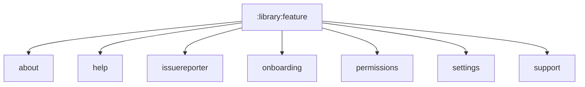

# `:library:feature` Logic Graph

## Purpose

Acts as the implicit Gradle parent for user-facing AppToolkit feature modules. It is an organizational container, not a runtime artifact.

## Owns

- Grouping for about, help, issue reporter, onboarding, permissions, settings, and support modules.

## Does not own

- Feature contracts or implementations; each child feature owns its complete current UI/domain/data slice.
- Cross-feature composition, owned by `:library:apptoolkit` and the host application.

## Depends on

No internal Gradle modules.

## Used by

No internal module declares a dependency on `:library:feature`; consumers select child feature modules.

## Flow chart

## Public contracts

No runtime contracts are exposed.

## Internal implementations

There is no implementation; this is an implicit Gradle hierarchy node.

## Current risks

No significant module-specific risks are currently identified.
