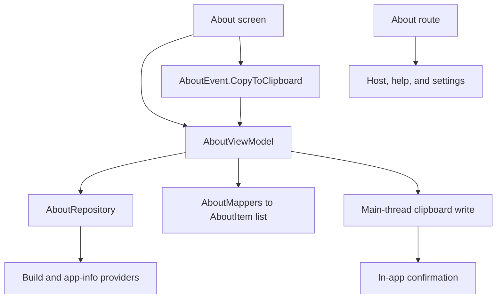

# `:library:feature:about` Logic Graph

## Purpose

Owns the AppToolkit About screen: host application, App Toolkit, and Google Play services metadata,
plus the tap-to-copy interaction for the entries it renders and the version-tap easter egg.

## Owns

- About information presentation (host application, App Toolkit, and Google Play services versions,
  and the host-formatted device report).
- Tap-to-copy for About entries, including the clipboard write and its in-app confirmation.
- The version-tap easter egg: konfetti on the fifth tap, and the seasonal themes unlock it records.
- The drawer navigation click handler and the library-owned extras destination.
- The GMS host factory used by consent, review, and update flows.

## Does not own

- Open-source licenses, owned by [`:library:feature:licenses`](../licenses/README.md).
- Privacy and legal entries, owned by [`:library:feature:privacy`](../privacy/README.md).
- Changelog retrieval, presentation, and in-app-update triggering, owned by
  [`:library:feature:changelog`](../changelog/README.md).
- The main top app bar and the default drawer repository, owned by
  [`:library:navigation`](../../navigation/README.md).
- Host main screen and host route keys, owned by `:sample`.
- Host identity strings, supplied as overridable defaults by `:library:core:common`.
- The device report itself, supplied by the host through `AboutSettingsProvider`.
- Root Navigation 3 entry assembly, owned by `:library:apptoolkit`.

## Depends on

- `:library:core:common` and `:library:core:ui` for shared state, platform helpers, and Compose.
- [`:library:core:datastore`](../../core/datastore/README.md) for `SeasonalThemeRepository`, which
  stores the easter egg unlock.
- [`:library:navigation`](../../navigation/README.md) for drawer models and routes.
- [`:library:feature:licenses`](../licenses/README.md) to open the licenses screen from the About
  list.
- `:library:integration:consent`, `:library:integration:review`, and `:library:integration:update`
  for the GMS host factory.

## Used by

- `:sample`, `:library:apptoolkit`, `:library:feature:faq`, and `:library:feature:settings`.

## Flow chart

## Architectural decisions

- About screen presentation is data-driven: `AboutRepository` returns the raw `AboutInfo` metadata
  and `ui/mappers` turns it into an ordered list of `AboutItem` models (headers and grouped
  preferences) with titles, summaries, actions, and card positions, so `AboutScreen` remains purely
  declarative and the data layer stays free of rendering concerns.
- Copying is a presentation interaction, not a repository query, so `AboutViewModel` performs the
  clipboard write itself, on the main dispatcher because writing the clipboard is a system UI
  interaction.
- A successful copy is confirmed in-app only below Android 13. From Android 13 the platform raises
  its own clipboard preview, so an in-app snackbar would report the same copy twice. A failed copy
  raises no system UI on any version, so it is always reported. The platform level is read through
  an injected `sdkIntProvider`, which keeps both paths testable without a device.
- `AboutItemAction.CopyToClipboard` carries the label, the exact text, and an optional confirmation
  message, so any row becomes copyable without a new event, and the clipboard receives what the row
  displays rather than a second lookup resolved under a different configuration. Both texts are
  `UiTextHelper`, so a row whose value is a string resource copies as readily as one holding a
  formatted value.
- Every row that displays a value copies it on tap, with two exceptions. Open source licenses
  navigates. The build version row copies nothing: it is where the easter egg lives, people tap it
  over and over, and copying on each tap filled the clipboard and covered the konfetti with
  confirmations. Rows that rendered as clickable but carried no action were the reason tapping most
  of this screen appeared to do nothing.
- The hidden version-tap gesture is `Preference.countsVersionTap`, not an `AboutItemAction`, so it
  can sit on a row whatever that row does.
- The fifth tap plays konfetti and raises `AboutEvent.EasterEggFound`. `AboutViewModel` records the
  unlock through `SeasonalThemeRepository`, which keeps the holiday palettes and snowfall available
  all year.
  Only the first unlock shows a snackbar, since nothing else points at where the reward went.
- Use cases are retained where they perform a named operation or combine concerns; repository calls
  that only forwarded data were not given synthetic wrappers.

## Verifying tap-to-copy

Do not judge a copy on an emulator that has clipboard sharing enabled. It cannot show the Android 13
confirmation, for reasons that have nothing to do with this module.

The emulator syncs the host clipboard into the guest by writing the primary clip itself, under the
label `host clipboard`, and it keeps writing while nothing at all is happening on screen. A trace of
the whole copy path on an API 37 emulator showed every tap reaching `setPrimaryClip` and returning,
and the clip present 10 to 20ms later carrying that label and a newer timestamp: the app's clip was
already gone.

SystemUI raises the preview from `ClipboardListener`, whose callback is posted rather than
immediate, and which reads whatever the clipboard holds by the time it runs. On an emulator that is
the sync's own clip, which is the case `shouldSuppressOverlay` drops, so no preview appears. Since
the screen stays silent on success from Android 13 onwards, a working row then looks like a dead
one, in both directions: no preview and no snackbar.

Verify on a physical device, where the preview appears on every tap, or switch off
`Extended Controls > Settings > General > Enable clipboard sharing` first.

## Public contracts

- `AboutSettingsProvider`, `AboutRepository`, `AboutInfo`, `AboutItem`, `AboutItemAction`,
  `AboutEvent`, `AboutScreen`, `LibraryExtrasScreen`, `handleNavigationItemClick`, and
  `GmsHostFactory`.

## Internal implementations

- Device/build-info mapping, About item assembly with grouped card position calculation
  (`ui/mappers`), Google Play services package inspection, and clipboard behavior.

## Current risks

`AboutSettingsProvider` is a host-facing data contract that still lives under `ui/providers`, where
the data layer reads it. Moving it would break every host that implements it, so it stays until a
breaking release.
