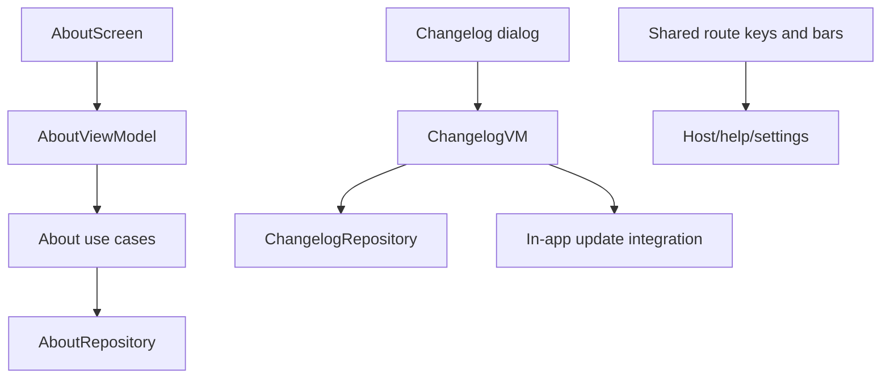

# `:library:feature:about` Logic Graph

## Purpose

Owns AppToolkit about, licenses, changelog, privacy, and shared main-navigation surfaces used by several settings/help flows.

## Owns

- About information/copy-device-info domain and presentation flows.
- Changelog retrieval/presentation and in-app-update triggering.
- Licenses and library-extras screens.
- Privacy/about provider contracts, AppToolkit route keys, drawer routes, bars/rails, and related navigation models/helpers.

## Does not own

- Host main screen and host route keys, owned by `:sample`.
- Support, consent, review, and update implementations, owned by their feature/integration modules.
- Root Navigation 3 entry assembly, owned by `:library:apptoolkit`.

## Depends on

- `:library:core:common`, `:library:core:datastore`, `:library:core:network`, `:library:core:ui`, and `:library:navigation` for shared state, persistence, HTTP, Compose, and navigation.
- `:library:integration:consent`, `:library:integration:review`, and `:library:integration:update` for privacy and Play flows.
- [`:library:feature:support`](../support/README.md) for support navigation/content integration.

## Used by

- `:sample`, `:library:apptoolkit`, `:library:feature:help`, and `:library:feature:settings`.

## Flow chart

## Public contracts

- About/privacy provider interfaces, route keys, navigation repository/models, about/changelog repositories/use cases/models, and screen/navigation composables.

## Internal implementations

- Device/build-info mapping, clipboard behavior, changelog HTTP/fallback logic, screen composition, and update-host creation.

## Current risks

The module's scope extends well beyond “about” into application navigation, changelog, privacy, licenses, and updates. Other features depend on it mainly for shared routes, making this a broad and change-sensitive feature boundary.
