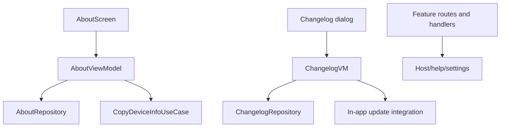

# `:library:feature:about` Logic Graph

## Purpose

Owns AppToolkit about, licenses, changelog, privacy, and shared main-navigation surfaces used by
several settings/help flows.

## Owns

- About information/copy-device-info domain and presentation flows.
- Changelog retrieval/presentation and in-app-update triggering.
- Licenses and library-extras screens.
- Privacy/about provider contracts, the feature-specific top app bar, and related navigation
  handlers.
- The default repository for hosts that use the four standard drawer entries unchanged.

## Does not own

- Host main screen and host route keys, owned by `:sample`.
- Host identity strings, supplied as overridable defaults by `:library:core:common`.
- Support, consent, review, and update implementations, owned by their feature/integration modules.
- Root Navigation 3 entry assembly, owned by `:library:apptoolkit`.
- Generic bottom navigation, rails, and drawer rendering, owned by
  [`:library:navigation`](../../navigation/README.md).
- Stable and typed AppToolkit route keys, owned by
  [`:library:navigation`](../../navigation/README.md).

## Depends on

- `:library:core:common`, `:library:core:datastore`, `:library:core:network`, `:library:core:ui`,
  and `:library:navigation` for shared state, persistence, HTTP, Compose, and navigation.
- `:library:integration:consent`, `:library:integration:review`, and `:library:integration:update`
  for privacy and Play flows.
- [`:library:feature:support`](../support/README.md) for support navigation/content integration.
- [`:library:navigation`](../../navigation/README.md) for drawer models, routes, and its host-facing
  repository contract.

## Used by

- `:sample`, `:library:apptoolkit`, `:library:feature:help`, and `:library:feature:settings`.

## Flow chart

## Public contracts

- About/privacy provider interfaces, `DefaultNavigationRepository`,
  about/changelog repositories/models, `CopyDeviceInfoUseCase`, `GetChangelogUseCase`, and
  screen/navigation composables.

## Internal implementations

- Device/build-info mapping, clipboard behavior, changelog HTTP/fallback logic, screen composition,
  and update-host creation.

## Current risks

The module still extends beyond “about” into changelog, privacy, licenses, updates, and a
feature-specific top app bar. Generic shell rendering has moved to `:library:navigation`, but the
remaining presentation surface is still a broad and change-sensitive feature boundary.
