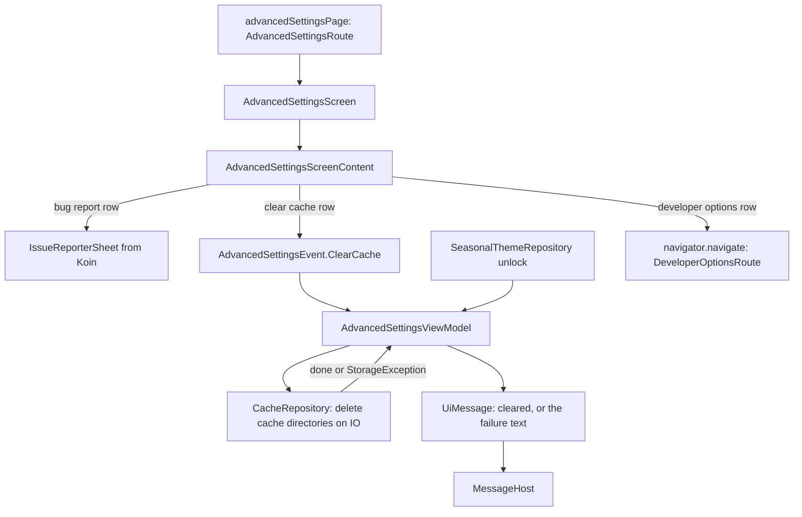

# `:library:feature:advanced` Logic Graph

## Purpose

Owns the advanced settings page: the bug report entry, clearing the app's cache, and the developer
options entry once it is unlocked.

## Owns

- `AdvancedSettingsScreen`, which wires the ViewModel, tracking, messages, the issue reporter sheet
  and navigation, and `AdvancedSettingsScreenContent`, the stateless list of rows.
- `AdvancedSettingsViewModel`, `AdvancedSettingsUiState`, `CacheClearStatus` and
  `AdvancedSettingsEvent`.
- `CacheRepository` and `DefaultCacheRepository`, which delete the app's cache directories.
- `advancedSettingsPage()`, the registration of `AdvancedSettingsRoute` as a detail of the settings
  list, and `advancedSettingsModule`.
- Its clear cache row in the settings search, a `settingsSearchProvider` bound as `advanced`.
- The page's localized strings, including the cache confirmation and failure texts.

## Does not own

- The issue reporter sheet. It is the `IssueReporterSheet` contract of `:library:core:ui`, bound by
  `:library:feature:issuereporter`.
- The developer options page, owned by [`:library:feature:developer`](../developer/README.md). This
  page opens `DeveloperOptionsRoute` by key.
- The easter egg unlock, stored by `SeasonalThemeRepository` in `:library:core:datastore` and
  recorded by [`:library:feature:about`](../about/README.md).
- The settings list whose row opens this page, owned by
  [`:library:feature:settings`](../settings/README.md).

## Depends on

- `:library:core:common` and `:library:core:ui`, and through `:library:core:ui` the keys of
  `:library:navigation` and `storageCall` and `SeasonalThemeRepository` of `:library:core:datastore`.
- No other feature module. The feature asks nothing of its host: the removed
  `AdvancedSettingsProvider` existed only to supply a bug-report URL, which the list stopped using
  once the issue reporter began submitting reports itself.

## Used by

- [`:library:apptoolkit`](../../apptoolkit/README.md), which calls `advancedSettingsPage()` from
  `toolkitPages()` and assembles `advancedSettingsModule`.

## Flow chart

## Architectural decisions

- The page is on `core.ui.screen`. Its rows are there from the start, so nothing in
  `AdvancedSettingsUiState` is a `Loadable`. `cacheClear` is a `CacheClearStatus`, a
  `TrackedStatus` whose labels are the ones the page has always reported in `screen_state`:
  `success` while idle, `loading` while clearing and `error` after a failed clear.
- A clear confirms with a snackbar, and a failure shows an error snackbar while the rows stay. The
  failure text comes from `toErrorMessage`, so full or busy storage shows its own text and anything
  else shows "Cache cleared with some errors".
- `CacheRepository.clearCache()` is a main-safe suspend function that throws a `StorageException`:
  `FAILED` when a directory was not fully deleted, `UNAVAILABLE` when the system refused access to
  one. `DefaultCacheRepository` runs the blocking recursive delete on the injected IO dispatcher,
  so the ViewModel takes no dispatcher. It logs an incomplete delete as a breadcrumb, since only it
  can see how many directories were left.
- The bug report row shows the `IssueReporterSheet` resolved from Koin with `getOrNull`. When no
  module binds one, the error reporting category is left out. The sheet's visibility is saved, so a
  rotation does not close it.
- The developer options row is hidden until the About screen's version easter egg is found. The
  ViewModel takes that as a `Flow<Boolean>` (`developerOptionsUnlocked`), which the Koin module maps
  from `SeasonalThemeRepository`'s unlock, the same flag that keeps the seasonal themes all year,
  so one discovery unlocks both.
- There is no domain layer: the ViewModel calls one repository and holds no reusable business rule.

## Public contracts

- `AdvancedSettingsScreen`, `advancedSettingsPage()`, `AdvancedSettingsViewModel`,
  `AdvancedSettingsUiState`, `CacheClearStatus`, `AdvancedSettingsEvent`, `CacheRepository`,
  `DefaultCacheRepository` and `advancedSettingsModule`. `AdvancedSettingsScreenContent` is
  internal.

## Current risks

Cache deletion is restricted to the app's cache locations (`cacheDir`, `codeCacheDir` and
`externalCacheDir`). Changes must keep that scope and keep the file work off the main thread.
`AdvancedSettingsViewModelTest` and `DefaultCacheRepositoryTest` cover the state and data behavior.
