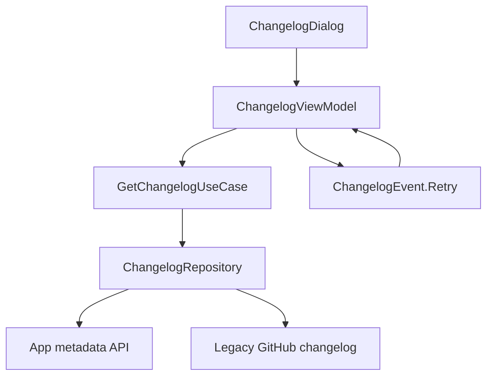

# `:library:feature:changelog` Logic Graph

## Purpose

Owns changelog retrieval and presentation: the package-aware Markdown fetch, its legacy fallback,
and the bottom sheet that renders it.

## Owns

- `ChangelogRepository` and `DefaultChangelogRepository`, including the Android App Metadata API
  call and the legacy GitHub fallback.
- `GetChangelogUseCase`, which picks the current-version section or the full history.
- `ChangelogViewModel`, `ChangelogUiState`, and the retry contract.
- `ChangelogDialog`, the modal bottom sheet the host shows from its drawer.

## Does not own

- The drawer entry that opens the dialog, owned by
  [`:library:navigation`](../../navigation/README.md) and the host shell.
- In-app update triggering, owned by `:library:integration:update`.
- The About screen and its metadata, owned by [`:library:feature:about`](../about/README.md).

## Depends on

- `:library:core:common`, `:library:core:datastore`, `:library:core:network`, and
  `:library:core:ui` for shared state, persistence, HTTP, and Compose.
- `:library:integration:update` for the Play update flow hosts pair with a new changelog.
- `compose-markdown` to render the fetched Markdown.

## Used by

- `:library:apptoolkit` and `:sample`.

## Flow chart

## Architectural decisions

- The package endpoint is authoritative and the legacy URL is a compatibility fallback, used only
  when the package name is blank or the endpoint answers 404, so a host that has not been published
  to the metadata API still shows release notes.
- The use case prefers the current version's section but falls back to the full history, so a
  version-format mismatch never hides content that was fetched successfully.
- The sheet keeps its header and action fixed while the body scrolls, so long release notes cannot
  push the dismissal action off-screen.
- Shared button labels come from `:library:core:ui` rather than being duplicated here.

## Public contracts

- `ChangelogRepository`, `GetChangelogUseCase`, `ChangelogViewModel`, `ChangelogUiState`,
  `ChangelogEvent`, `ChangelogDialog`, and `changelogModule`.

## Internal implementations

- HTTP fetch, status-to-domain error mapping, fallback selection, and Markdown rendering.

## Current risks

The legacy fallback keeps a second source of truth alive. Until every host is published to the
metadata API, a 404 silently changes which document the user reads.
