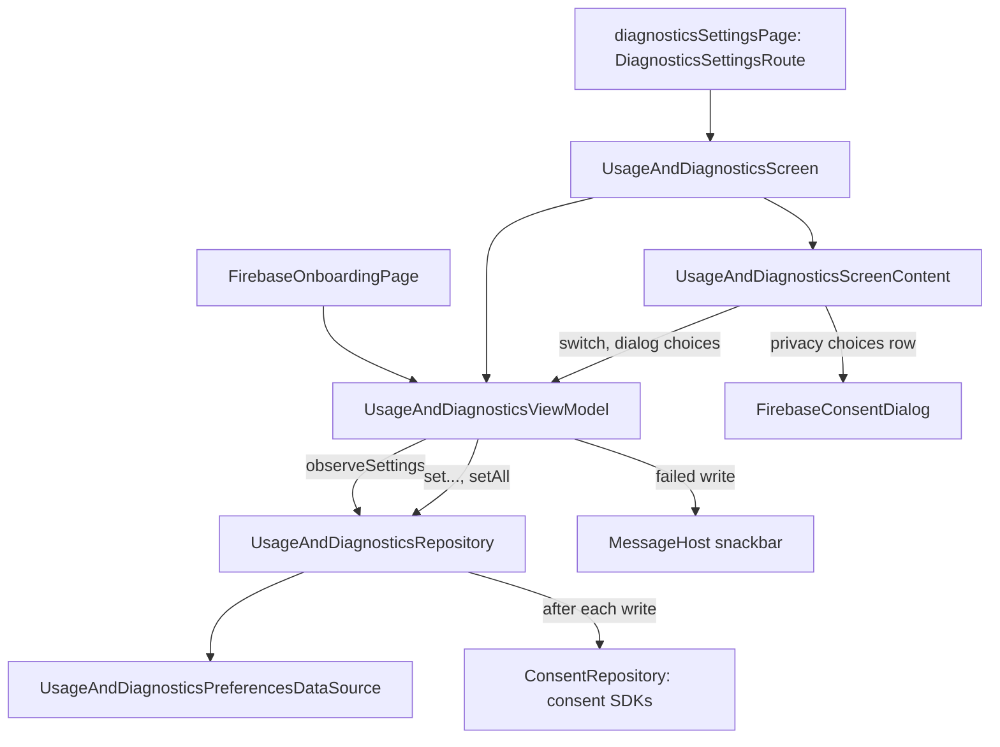

# `:library:feature:diagnostics` Logic Graph

## Purpose

Lets a person choose what the app reports and shares: the usage and diagnostics switch, and the
analytics and advertising consents behind it, on a settings page and on an onboarding page.

## Owns

- `UsageAndDiagnosticsScreen`, `UsageAndDiagnosticsViewModel`, `UsageAndDiagnosticsUiState` (whose
  `settings` is a `Loadable`) and `UsageAndDiagnosticsEvent`.
- `UsageAndDiagnosticsScreenContent`, the stateless switch, privacy choices row and privacy note,
  with its loading and failure states.
- `FirebaseConsentDialog`, the privacy choices dialog, and its pages.
- `FirebaseOnboardingPage`, the onboarding page that shows the switch and the dialog, with its own
  strings.
- `UsageAndDiagnosticsSettings`, `UsageAndDiagnosticsRepository`,
  `DefaultUsageAndDiagnosticsRepository` and `diagnosticsSettingsModule`.
- `diagnosticsSettingsPage()`, the registration of `DiagnosticsSettingsRoute`.

## Does not own

- Persistence, owned by [`:library:core:datastore`](../../core/datastore/README.md)
  (`UsageAndDiagnosticsPreferencesDataSource`).
- The consent SDK calls, owned by `:library:integration:consent` (`ConsentRepository`).
- The onboarding flow and its pager, owned by [`:library:feature:onboarding`](../onboarding/README.md);
  a host lists `FirebaseOnboardingPage` in its `OnboardingProvider`.
- The privacy page that opens this one, owned by [`:library:feature:privacy`](../privacy/README.md).

## Depends on

- `:library:core:common`, `:library:core:datastore`, `:library:core:ui` (which exposes navigation)
  and `:library:integration:consent`.
- No other feature module.

## Used by

- [`:library:apptoolkit`](../../apptoolkit/README.md), which calls `diagnosticsSettingsPage()` and
  includes `diagnosticsSettingsModule`.
- `:sample:feature:onboarding`, which lists `FirebaseOnboardingPage`.

## Flow chart

## Architectural decisions

- **On `core.ui.screen`.** `UsageAndDiagnosticsViewModel` follows the stored choices with
  `collectReport`. A failed read is `Loadable.Failed` with Retry, which restarts the collection; a
  failed write keeps the choices on screen and shows an error message through `MessageHost`. Both
  use the module's "An error occurred" text when the failure has no text of its own.
- **The repository applies consent.** `DefaultUsageAndDiagnosticsRepository` applies the stored
  choices to the consent SDKs after every write, so a change reaches them whether or not a screen
  is still open. The ViewModel only reads and writes, and takes no dispatcher, since the repository
  is main-safe.
- **One screen shape for both consent pages.** The settings screen is the ads screen's layout: one
  switch over a single row that opens the consent surface it belongs to, here
  `FirebaseConsentDialog`, the same dialog onboarding shows. The dialog and the onboarding page live
  here, with the state they read and write, so onboarding does not depend on this feature.
- **Whole answers are one write.** `AllowAllConsent` and `AllowEssentialConsent` are events, so both
  places that show the dialog agree on what "everything" and "essentials" cover. Both turn reporting
  on, cancel single-choice writes still in flight, and store the answer with `setAll`.
- **The onboarding page waits for the stored choices.** Its toggle shows off and its dialog stays
  closed until they arrive. It draws its messages through the page frame's snackbar host, or its
  own at the bottom of the page outside a frame.

## Public contracts

- `UsageAndDiagnosticsScreen()`, `diagnosticsSettingsPage()`, `FirebaseOnboardingPage(isSelected)`,
  `FirebaseConsentDialog(settings, ...)`, `UsageAndDiagnosticsViewModel`, `UsageAndDiagnosticsUiState`,
  `UsageAndDiagnosticsEvent`, `UsageAndDiagnosticsSettings`, `UsageAndDiagnosticsRepository` and
  `diagnosticsSettingsModule`. `UsageAndDiagnosticsScreenContent` and
  `FirebaseOnboardingPageContent` are internal.
- Consent defaults: every choice is granted in release builds and refused in debug builds until the
  person answers.

## Current risks

- `observeSettings()` combines one flow per key, so a whole-bundle write can show a mixed state for
  a frame. One snapshot of storage would remove it.
- `UsageAndDiagnosticsSettings` lives in a `domain/` package that holds only this model, and
  duplicates `ConsentSettings` from `:library:integration:consent`.
- Changes affect both settings and onboarding, and must keep the consent defaults, the stored
  values and the order in which the SDKs receive them.
