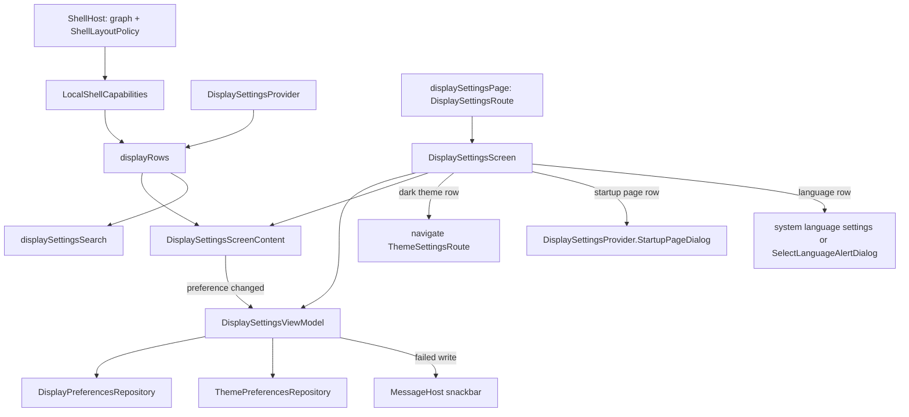

# `:library:feature:display` Logic Graph

## Purpose

Draws the display settings page: the person's own preferences. The dark theme and dynamic
colors, bouncy buttons, the startup page, the navigation labels and the language, each only where
it means something in the app. The shell's own variations are developer options, in
[`:library:feature:developer`](../developer/README.md).

## Owns

- `DisplaySettingsScreen`, `DisplaySettingsViewModel`, `DisplaySettingsUiState` (whose `settings`
  is a `Loadable` of `DisplaySettings`) and `DisplaySettingsEvent`.
- `DisplaySettingsScreenContent`, the stateless list with its loading and failure states.
- `DisplayRow`, `DisplayCategory` and `displayRows(capabilities, startup, sdkInt)`: which rows the
  page shows in this app, and under which heading.
- `DisplaySettingsProvider`, the contract a host implements to offer a startup page dialog, and say
  how many places it offers (`startupPageChoices`).
- The language and startup selection dialogs, `SelectLanguageAlertDialog` and
  `SelectStartupScreenAlertDialog`.
- Its rows in the settings search, `displaySettingsSearch(startup, sdkInt)`, a
  `settingsSearchProvider` bound as `display` that lists exactly `displayRows`. And
  `displaySettingsModule`.
- `displaySettingsPage()`, the registration of `DisplaySettingsRoute` as a detail of the settings
  list.
- Localized display settings resources.

## Does not own

- The stored preferences, owned by [`:library:core:datastore`](../../core/datastore/README.md)
  (`DisplayPreferencesRepository`, `ThemePreferencesRepository`).
- What the app's shell can show, `ShellCapabilities`, owned by
  [`:library:navigation`](../../navigation/README.md) and provided by `ShellHost`.
- The shell's overrides and their store, owned by [`:library:shell`](../../shell/README.md) and
  offered by [`:library:feature:developer`](../developer/README.md).
- The theme page the dark theme row opens, owned by [`:library:feature:theme`](../theme/README.md)
  and reached through `ThemeSettingsRoute`.
- Which startup pages exist, owned by the host's `DisplaySettingsProvider`.

## Depends on

- `:library:core:common`, `:library:core:datastore`, `:library:core:ui` and
  [`:library:navigation`](../../navigation/README.md) for the keys, the graph and the capabilities.
- No other feature module, and not `:library:shell`.

## Used by

- [`:library:apptoolkit`](../../apptoolkit/README.md), which calls `displaySettingsPage()` and
  includes `displaySettingsModule`.
- `:sample:feature:display`, which provides the sample's `DisplaySettingsProvider`.

## Rows

| Heading | Row | Shown when |
|---|---|---|
| Appearance | Dark theme, opening the theme page | always |
| | Dynamic colors | Android 12 or later |
| App behavior | Bounce buttons | always |
| Navigation | Startup page | the host supports one and offers more than one choice; without `startupPageChoices`, when the app has more than one tab |
| | Show labels on bottom bar | the app shows more than one tab in a bottom bar on some window (`hasMultipleTabs && usesBottomNavigation`) |
| Language | Language | always |

A heading without a row is left out, so an app without tabs shows Appearance, App behavior and
Language only.

## Flow chart

## Architectural decisions

- **The person's preferences only.** A row belongs here when it changes the person's experience in
  a way they would choose: theme, colors, feedback, startup page, labels, language. Overrides that
  force or compare the shell's own variations (app bar style, navigation bar style, tint, content
  width, hiding the bars on scroll, transitions, back swipe) are developer options.
- **One list for the page and its search.** `displayRows` decides the rows from
  `ShellCapabilities`, the host's `DisplaySettingsProvider` and the Android version. The page draws
  them and `displaySettingsSearch` lists them, so a row can never show without being searchable, or
  be found without showing. Each `DisplayRow` carries its heading, title and searched summary.
- **Rows follow the app as declared.** Capabilities come from the graph and the layout policy, not
  the window drawn now or a forced layout: an app that uses a bottom bar on phones keeps its labels
  row on a tablet. The labels row needs more than one tab, since the bar always labels the
  selected tab.
- **On `core.ui.screen`.** `DisplaySettingsViewModel` follows the theme mode, dynamic colors,
  bouncy buttons, bottom bar labels, language and startup page with one `collectReport`. A failed
  read is `Loadable.Failed` with Retry; a failed write keeps the preferences on screen and shows an
  error message. Every write is its own `launchReport`, so one never cancels another.
- **The screen owns platform calls and tap events.** Opening the theme page, the system language
  settings, the host's startup page dialog and the language dialog, and the GA4 events for each,
  stay in `DisplaySettingsScreen`. `DisplaySettingsScreenContent` takes the rows as a value, so it
  renders in a preview.
- **The host chooses the startup page.** `DisplaySettingsProvider.StartupPageDialog` returns a
  confirmed route, and the ViewModel stores it.

## Public contracts

- `DisplaySettingsScreen()`, `displaySettingsPage()`, `DisplaySettingsViewModel`,
  `DisplaySettingsUiState`, `DisplaySettings`, `DisplaySettingsEvent`, `DisplaySettingsProvider`
  (`supportsStartupPage`, `startupPageChoices`, `StartupPageDialog`), `SelectLanguageAlertDialog`,
  `SelectStartupScreenAlertDialog` and `displaySettingsModule`. `DisplaySettingsScreenContent`,
  `DisplayRow`, `DisplayCategory`, `displayRows` and `displaySettingsSearch` are internal.

## Current risks

- Hosts must keep the startup page dialog's contract and account for a stored route that is no
  longer available.
- A host that does not set `startupPageChoices` gets the tab count as an estimate of its choices.
