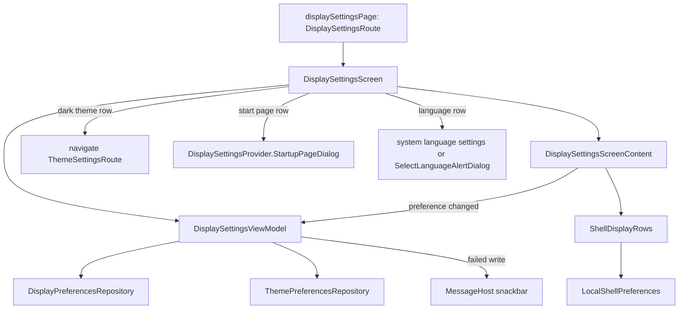

# `:library:feature:display` Logic Graph

## Purpose

Draws the display settings page: the dark theme and dynamic colors, bouncy buttons, the start page,
the bottom bar labels, the language, and the shell's layout choices an app's graph uses.

## Owns

- `DisplaySettingsScreen`, `DisplaySettingsViewModel`, `DisplaySettingsUiState` (whose `settings`
  is a `Loadable` of `DisplaySettings`) and `DisplaySettingsEvent`.
- `DisplaySettingsScreenContent`, the stateless list with its loading and failure states, and
  `ShellDisplayRows`, the rows for the shell's layout choices.
- `DisplaySettingsProvider`, the contract a host implements to offer a start page dialog.
- The language and startup selection dialogs, `SelectLanguageAlertDialog` and
  `SelectStartupScreenAlertDialog`.
- Its rows in the settings search (`SettingsSearchProvider`), and `displaySettingsModule`.
- `displaySettingsPage()`, the registration of `DisplaySettingsRoute` as a detail of the settings
  list.
- Localized display settings resources.

## Does not own

- The stored preferences, owned by [`:library:core:datastore`](../../core/datastore/README.md)
  (`DisplayPreferencesRepository`, `ThemePreferencesRepository`).
- The shell's layout settings and their store, owned by [`:library:shell`](../../shell/README.md)
  (`ShellSettings`, `ShellPreferences`).
- The theme page the dark theme row opens, owned by [`:library:feature:theme`](../theme/README.md)
  and reached through `ThemeSettingsRoute`.
- Which start pages exist, owned by the host's `DisplaySettingsProvider`.

## Depends on

- `:library:core:common`, `:library:core:datastore`, `:library:core:ui`,
  [`:library:navigation`](../../navigation/README.md) for the keys and the graph, and
  `:library:shell` for the layout choices it offers.
- No other feature module.

## Used by

- [`:library:apptoolkit`](../../apptoolkit/README.md), which calls `displaySettingsPage()` and
  includes `displaySettingsModule`.
- `:sample:core:apptoolkit`, which provides the sample's `DisplaySettingsProvider`.

## Flow chart

## Architectural decisions

- **On `core.ui.screen`.** `DisplaySettingsViewModel` follows the theme mode, dynamic colors,
  bouncy buttons, bottom bar labels, language and start page with one `collectReport`. A failed
  read is `Loadable.Failed` with Retry; a failed write keeps the preferences on screen and shows an
  error message. Every write is its own `launchReport`, so one never cancels another.
- **The shell's choices apply to the whole app at once.** The app bar style, hiding the app bar on
  scroll, the navigation colour, the content width limit, the bottom bar style, hiding it on scroll,
  the tab transition and the back swipe are read from `LocalShellSettings` and written through
  `LocalShellPreferences` by `ShellDisplayRows`, not through the ViewModel. The screen therefore
  works only as a page of `ShellHost`.
- **Rows follow the graph.** Each shell row shows only where `LocalShellGraph` gives it something
  to change: nothing about a bottom bar without tabs, no tab transition or start page with a single
  tab, and no content width row unless the app's `ShellLayoutPolicy` sets a maximum width. Like the
  other settings rows, they draw no leading icon.
- **The screen owns platform calls and tap events.** Opening the theme page, the system language
  settings, the host's start page dialog and the language dialog, and the GA4 events for each, stay
  in `DisplaySettingsScreen`. `DisplaySettingsScreenContent` takes the shell rows, the tab count and
  the width flag as values, so it renders in a preview with `InMemoryShellPreferences`.
- **The host chooses the start page.** `DisplaySettingsProvider.StartupPageDialog` returns a
  confirmed route, and the ViewModel stores it.

## Public contracts

- `DisplaySettingsScreen()`, `displaySettingsPage()`, `DisplaySettingsViewModel`,
  `DisplaySettingsUiState`, `DisplaySettings`, `DisplaySettingsEvent`, `DisplaySettingsProvider`,
  `SelectLanguageAlertDialog`, `SelectStartupScreenAlertDialog` and `displaySettingsModule`.
  `DisplaySettingsScreenContent` and `ShellDisplayRows` are internal.

## Current risks

- The shell rows write from composables through a CompositionLocal, and the module depends on all
  of `:library:shell` for `shell.settings`.
- Hosts must keep the start page dialog's contract and account for a stored route that is no
  longer available.
