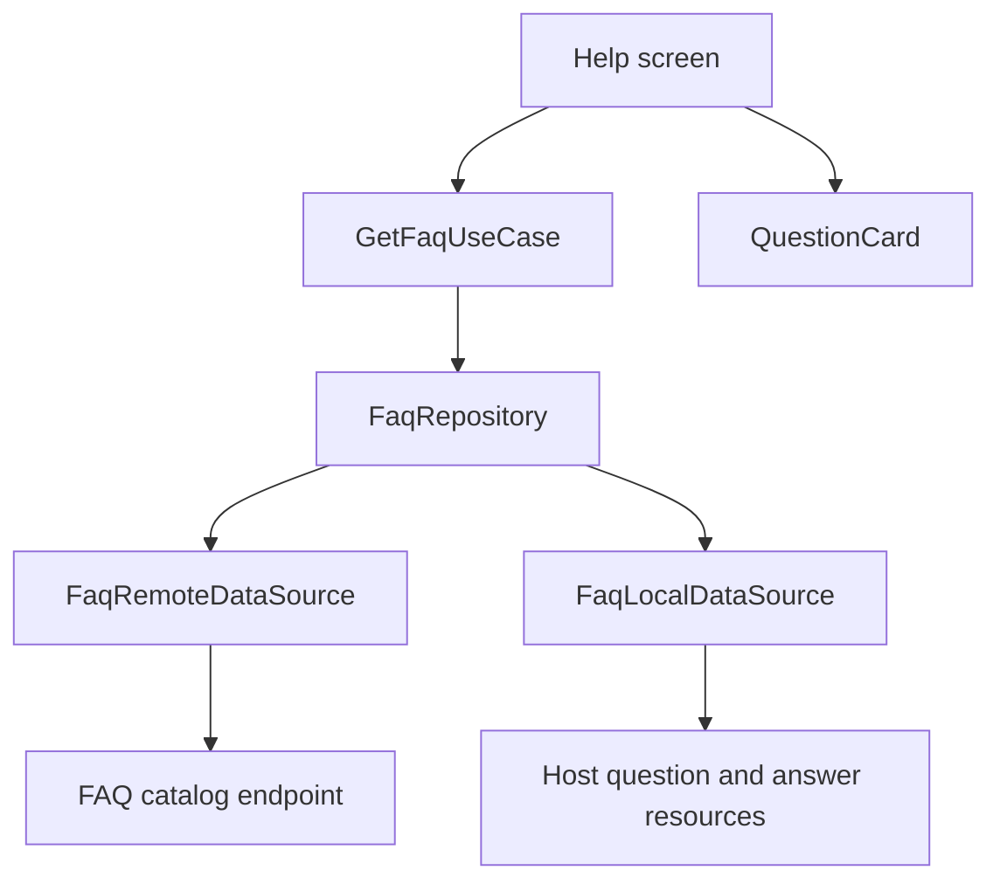

# `:library:feature:faq` Logic Graph

## Purpose

Owns the FAQ catalog: the remote questions, the on-device fallback, the domain model they share, and
the card that renders one question.

## Owns

- `FaqRepository` and `DefaultFaqRepository`, which prefer the remote catalog and fall back to the
  resources bundled in the host.
- `FaqRemoteDataSource`, `FaqLocalDataSource`, and the catalog DTOs and mappers.
- `GetFaqUseCase`, which trims, drops blanks, and de-duplicates before display.
- `FaqItem`, `FaqId`, and `QuestionCard`.
- The nine question and nine answer placeholder resources a host fills in.

## Does not own

- The Help screen that lists these questions, its Contact Us card, native ad slot, and overflow
  menu, all owned by [`:library:feature:help`](../help/README.md).
- The questions and answers themselves. The host declares them: `:sample:feature:faq` carries the
  sample's nine, translated across every supported locale.
- The catalog URL and product id, supplied by the host through `AppToolkitHostBuildConfig`.

## Depends on

- `:library:core:common` for the host build config, FAQ URL helpers, and shared constants.
- `:library:core:network` for the HTTP client and the `DataState` contract.
- `:library:core:ui` for the button, text, and grouped-card pieces `QuestionCard` renders.

## Used by

- `:library:apptoolkit` and [`:library:feature:help`](../help/README.md).

## Flow chart

## Architectural decisions

- The placeholder resources are declared `translatable="false"` and left empty on purpose. They are
  slots, not copy: the library renders whatever the host declares under those names, and the host
  translates it. Marking them translatable would make lint demand 25 translations of an empty
  string, and `MissingTranslation` is an error in this project.
- A host adds or reworks a question by changing its own FAQ module alone. Nothing in the library
  moves, which is the reason this module is separate from Help.
- Cleaning the catalog (trimming, dropping blanks, de-duplicating by id) lives in the use case, so
  both the remote and the local source can be consumed without each repeating it.

## Public contracts

- `FaqRepository`, `GetFaqUseCase`, `FaqItem`, `FaqId`, `QuestionCard`, and `faqModule`.

## Internal implementations

- Catalog HTTP fetch, DTO mapping, local resource loading, and the remote-then-local fallback.

## Current risks

The nine slots are a fixed count. A host with more or fewer questions has to supply them through the
remote catalog instead, because the local fallback is pinned to those resource names.
