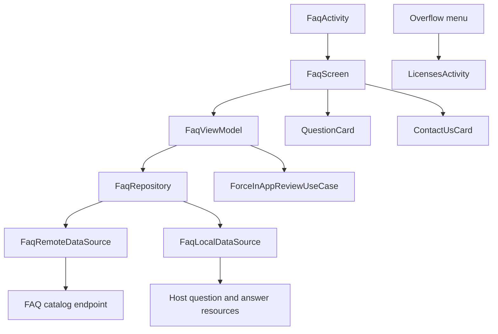

# `:library:feature:faq` Logic Graph

## Purpose

Owns the FAQ surface end to end: the catalog behind it, the screen that lists it, and the contact,
review, and store actions around it. This module replaced `:library:feature:help` in 3.0.0.

## Owns

- `FaqScreen`, `FaqActivity`, `FaqViewModel`, and their state, event, and action contracts.
- `FaqRepository` and `DefaultFaqRepository`, which normalize both sources, prefer the remote
  catalog, and fall back to the resources bundled in the host.
- `FaqRemoteDataSource`, `FaqLocalDataSource`, the catalog DTOs, and the DTO mappers under
  `data/remote/mappers`.
- `FaqItem`, `FaqId`, `QuestionCard`, `ContactUsCard`, `FaqNativeAdCard`, and the overflow menu.
- The nine question and nine answer placeholder resources a host fills in.

## Does not own

- Open-source licenses, owned by [`:library:feature:licenses`](../licenses/README.md); the overflow
  menu only opens them.
- In-app review implementation, owned by
  [`:library:integration:review`](../../integration/review/README.md).
- HTTP client construction, owned by [`:library:core:network`](../../core/network/README.md).
- Host identity strings, supplied as overridable defaults by `:library:core:common`.
- The questions and answers themselves, and the native ad unit. Both come from the host. See
  [Host requirements](#host-requirements).

## Host requirements

Two things the module renders but does not contain. Neither fails the build when it is missing, so
both are worth checking before shipping a host: the FAQ degrades silently at runtime, the ad
binding throws.

### The fallback FAQ, `question_1`–`question_9`

`FaqRepository` prefers the remote catalog and falls back to the bundled one whenever the remote
call throws or yields no questions, which also covers a catalog whose shape this module cannot map.
The bundled catalog is nine question/answer pairs read from host resources:

| Question             | Answer                          |
|----------------------|---------------------------------|
| `question_1`         | `summary_preference_faq_1`      |
| …                    | …                               |
| `question_9`         | `summary_preference_faq_9`      |

This module declares all eighteen as empty, untranslatable placeholders in
`res/values/untranslatable_strings.xml`, purely so it compiles on its own. They are slots, not copy:
the host declares the text and translates it, the way
[`:sample:feature:faq`](../../../sample/feature/faq/README.md) does. A host that does not gets a FAQ
screen showing nine blank rows the moment the remote catalog is unavailable, with nothing in the
build output to say why.

Provide fewer than nine only if the host is fine with the remainder rendering blank; the count is
fixed here, not derived from what the host declares.

### The FAQ native ad unit

`FaqScreenContent` resolves an `AdsConfig` from Koin under the `AdsQualifiers.HELP_NATIVE_AD`
qualifier. Unlike the FAQ strings this one is not optional: the lookup throws and the screen fails
to compose when no host has registered it, so every host must, the way `:sample:integration:ads`
does.

To opt out of the ad rather than the binding, register the config with a blank `bannerAdUnitId`.
The screen already skips the slot when the id is blank or the user has ads switched off.

## Depends on

- `:library:core:common`, `:library:core:datastore`, `:library:core:network`, and `:library:core:ui`
  for shared configuration, persistence access, networking, and UI.
- [`:library:navigation`](../../navigation/README.md) for feature routes.
- [`:library:integration:review`](../../integration/review/README.md) for review prompts.
- [`:library:feature:licenses`](../licenses/README.md), which the overflow menu opens.

## Used by

- `:library:apptoolkit`, `:library:feature:settings`, and `:sample`.

## Flow chart

## Architectural decisions

- The catalog and the screen live in one module because they have no independent consumers: nothing
  renders the FAQ but this screen, and nothing uses this screen without the FAQ. Splitting them
  bought a module boundary and no separation.
- The placeholder resources are declared `translatable="false"` and left empty on purpose. Marking
  them translatable would make lint demand 25 translations of an empty string, and
  `MissingTranslation` is an error in this project.
- A host adds or rewords a question by changing its own FAQ module alone. Nothing in the library
  moves, which is the reason the content is not declared here.
- There is no FAQ use case. Cleaning the catalog is transforming a data-source model into an
  application model, which is repository work, and the one thing a use case would have added is a
  layer the single caller does not need. `FaqViewModel` reads `FaqRepository` directly.
- Normalizing inside the repository, before the emptiness check rather than after it, is what makes
  the fallback correct: a remote catalog of nothing but blank rows now counts as empty and falls
  through to the local questions instead of rendering blank rows.

## Public contracts

- `FaqScreen`, `FaqActivity`, `FaqViewModel`, `FaqUiState`, `FaqEvent`, `FaqAction`,
  `FaqRepository`, `FaqItem`, `FaqId`, `QuestionCard`, and `faqModule`.

## Internal implementations

- Catalog HTTP fetch, DTO mapping, local resource loading, the remote-then-local fallback, and the
  screen's ad slot and overflow menu.

## Current risks

The nine slots are a fixed count. A host with more or fewer questions has to supply them through the
remote catalog instead, because the local fallback is pinned to those resource names.
