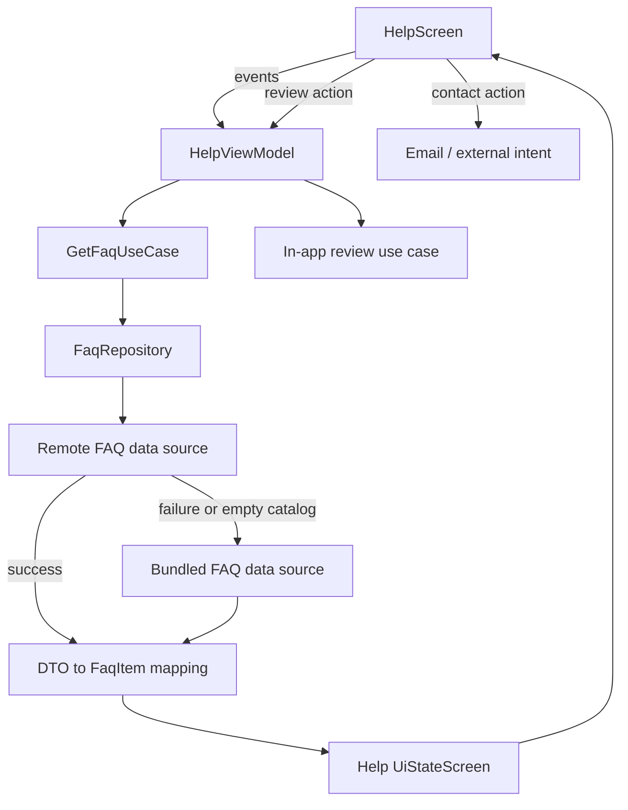

# `:library:feature:help` Logic Graph

## Purpose

Displays localized FAQ/help content, loading a product-specific catalog locally or remotely and
exposing contact/review actions.

## Owns

- Help screen/activity/ViewModel and their state/event/action contracts.
- FAQ domain model, repository contract, and `GetFaqUseCase`.
- Local and remote FAQ sources, DTOs, mapper, and repository implementation.

## Does not own

- About/navigation route definitions, owned by `:library:feature:about`.
- In-app review implementation, owned by `:library:integration:review`.
- HTTP client construction, owned by `:library:core:network`.
- Host identity strings, supplied as overridable defaults by `:library:core:common`.
- The bundled FAQ copy and the Help ad unit, both supplied by the host. See
  [Host requirements](#host-requirements).

## Host requirements

Two things the module renders but does not contain. Neither fails the build when it is missing, so
both are worth checking before shipping a host: the FAQ degrades silently at runtime, the ad
binding throws.

### The fallback FAQ, `question_1`–`question_9`

`FaqRepository` prefers the remote catalog and falls back to the bundled one whenever the remote
call throws or yields no questions, which also covers a catalog whose shape this module cannot map.
The bundled catalog is nine question/answer pairs read from host resources:

| Question             | Answer                          |
|----------------------|---------------------------------|
| `question_1`         | `summary_preference_faq_1`      |
| …                    | …                               |
| `question_9`         | `summary_preference_faq_9`      |

This module declares all eighteen as empty, untranslatable placeholders in
`res/values/untranslatable_strings.xml`, purely so it compiles on its own. The host is expected to
override every one of them, in each locale it supports, the way `:sample:core:apptoolkit` does. A
host that does not gets a Help screen showing nine blank rows the moment the remote catalog is
unavailable, with nothing in the build output to say why.

Provide fewer than nine only if the host is fine with the remainder rendering blank; the count is
fixed here, not derived from what the host declares.

### The Help native ad unit

`HelpScreenContent` resolves an `AdsConfig` from Koin under the `AdsQualifiers.HELP_NATIVE_AD`
qualifier. Unlike the FAQ strings this one is not optional: the lookup throws and the Help screen
fails to compose when no host has registered it, so every host must, the way
`:sample:integration:ads` does.

To opt out of the ad rather than the binding, register the config with a blank `bannerAdUnitId`.
The screen already skips the slot when the id is blank or the user has ads switched off.

## Depends on

- `:library:core:common`, `:library:core:datastore`, `:library:core:network`, and `:library:core:ui`
  for shared configuration, state, persistence access, networking, and UI.
- [`:library:navigation`](../../navigation/README.md) for feature navigation.
- [`:library:integration:review`](../../integration/review/README.md) for review prompts.
- [`:library:navigation`](../../navigation/README.md) for shared AppToolkit routes; the remaining
  About dependency supplies feature-specific settings/navigation integration.

## Used by

- `:sample`, `:library:apptoolkit`, and `:library:feature:settings`.

## Flow chart

## Architectural decisions

- The repository owns remote-versus-bundled fallback so the ViewModel receives one FAQ contract and
  does not know which source answered.
- Remote DTO mapping stays in the data layer; the localized bundled catalog is also a data source,
  not hardcoded composable content.
- Review and contact actions are triggered by UI intent but executed through their integration or
  platform boundary rather than embedded in card rendering.

## Public contracts

- Help presentation entry points/contracts, `FaqRepository`, `FaqItem`, and `GetFaqUseCase`.

## Internal implementations

- Catalog DTOs/mapping, local fallback, remote fetch, and help card/menu composition.

## Current risks

The module depends on the broad `about` feature for shared navigation definitions, creating more
coupling than the help flow itself requires.
