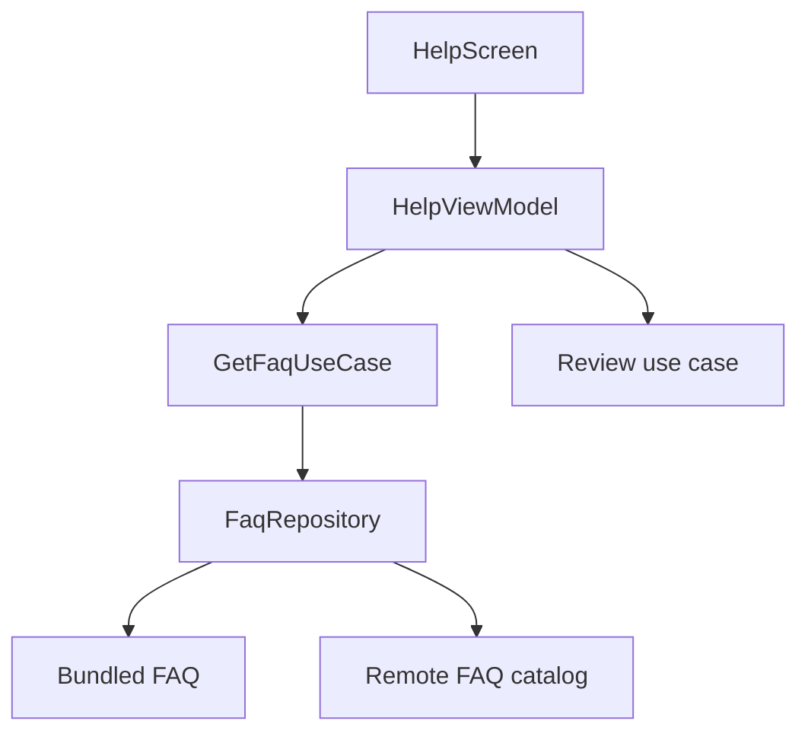

# `:library:feature:help` Logic Graph

## Purpose

Displays localized FAQ/help content, loading a product-specific catalog locally or remotely and
exposing contact/review actions.

## Owns

- Help screen/activity/ViewModel and their state/event/action contracts.
- FAQ domain model, repository contract, and `GetFaqUseCase`.
- Local and remote FAQ sources, DTOs, mapper, and repository implementation.

## Does not own

- About/navigation route definitions, owned by `:library:feature:about`.
- In-app review implementation, owned by `:library:integration:review`.
- HTTP client construction, owned by `:library:core:network`.

## Depends on

- `:library:core:common`, `:library:core:datastore`, `:library:core:network`, and `:library:core:ui`
  for shared configuration, state, persistence access, networking, and UI.
- [`:library:navigation`](../../navigation/README.md) for feature navigation.
- [`:library:integration:review`](../../integration/review/README.md) for review prompts.
- [`:library:feature:about`](../about/README.md) for shared AppToolkit routes/navigation surfaces.

## Used by

- `:sample`, `:library:apptoolkit`, and `:library:feature:settings`.

## Flow chart

## Public contracts

- Help presentation entry points/contracts, `FaqRepository`, `FaqItem`, and `GetFaqUseCase`.

## Internal implementations

- Catalog DTOs/mapping, local fallback, remote fetch, and help card/menu composition.

## Current risks

The module depends on the broad `about` feature for shared navigation definitions, creating more
coupling than the help flow itself requires.
