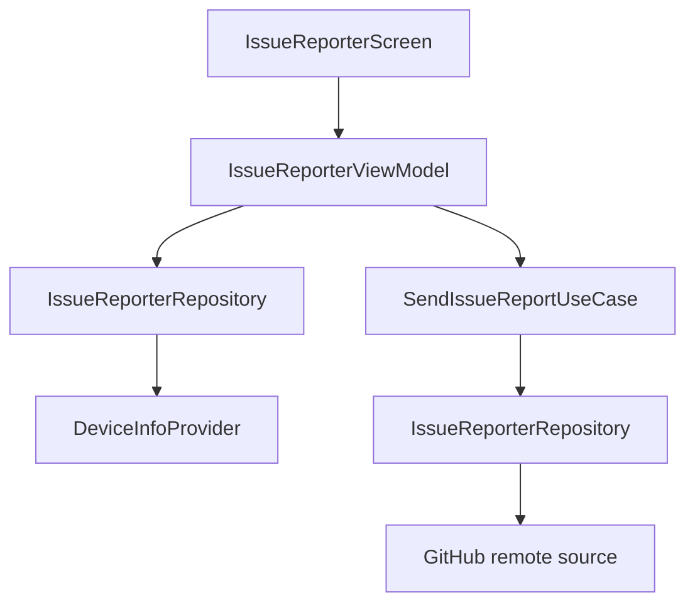

# `:library:feature:issuereporter` Logic Graph

## Purpose

Collects device/report data and submits structured issues to a configured GitHub repository.

## Owns

- Issue-report screen, activity, ViewModel, state, events, and actions.
- Report, device-info, GitHub-target, and result domain models.
- Report use case, repository/provider contracts, remote source, local device source, DTO, and mapper.

## Does not own

- GitHub credentials and repository selection, supplied through host configuration/DI.
- Generic HTTP client and errors, owned by `:library:core:network`.

## Depends on

- [`:library:core:common`](../../core/common/README.md) for dispatchers, Firebase reporting, and host constants.
- [`:library:core:network`](../../core/network/README.md) for Ktor/error handling.
- [`:library:core:ui`](../../core/ui/README.md) for screen/ViewModel contracts and UI components.
- [`:library:navigation`](../../navigation/README.md) for navigation support.

## Used by

- `:sample`, `:library:apptoolkit`, and `:library:feature:settings`.

## Flow chart

## Public contracts

- `IssueReporterRepository`, `SendIssueReportUseCase`, domain models, and presentation entry points/contracts.
- `DeviceInfoProvider` is the local data source's own contract, not a caller-facing one. Device
  capture is reached through `IssueReporterRepository.captureDeviceInfo()`; the ViewModel used to
  hold the provider directly, which put the UI layer on a data source.

## Internal implementations

- GitHub request DTO/mapping, device inspection, repository implementation, and screen composition.

## Current risks

The feature handles a host-provided GitHub token; logging and error changes must avoid exposing that credential.

## Migration notes

`DeviceInfo` was a mutable class that read `android.os.Build` in its field initialisers, built itself
from a `Context` through a `create()` companion, and imported a `core:ui` extension to read the
package version — a domain model depending on the UI module. It is now a plain data class; capture
lives in `DeviceInfoLocalDataSource` and the two renderings live in `domain/mappers`.

That last part matters more than it looks: the model's `toString()` was the device panel's text, so
making it a data class would silently have rendered `DeviceInfo(appVersionName=…)` on screen. The
formatting moved out with it as `toPlainText()`.

The payoff shows up in the tests, which used to `mockk<DeviceInfo>()` because the real thing needed a
device. They now build one outright.
