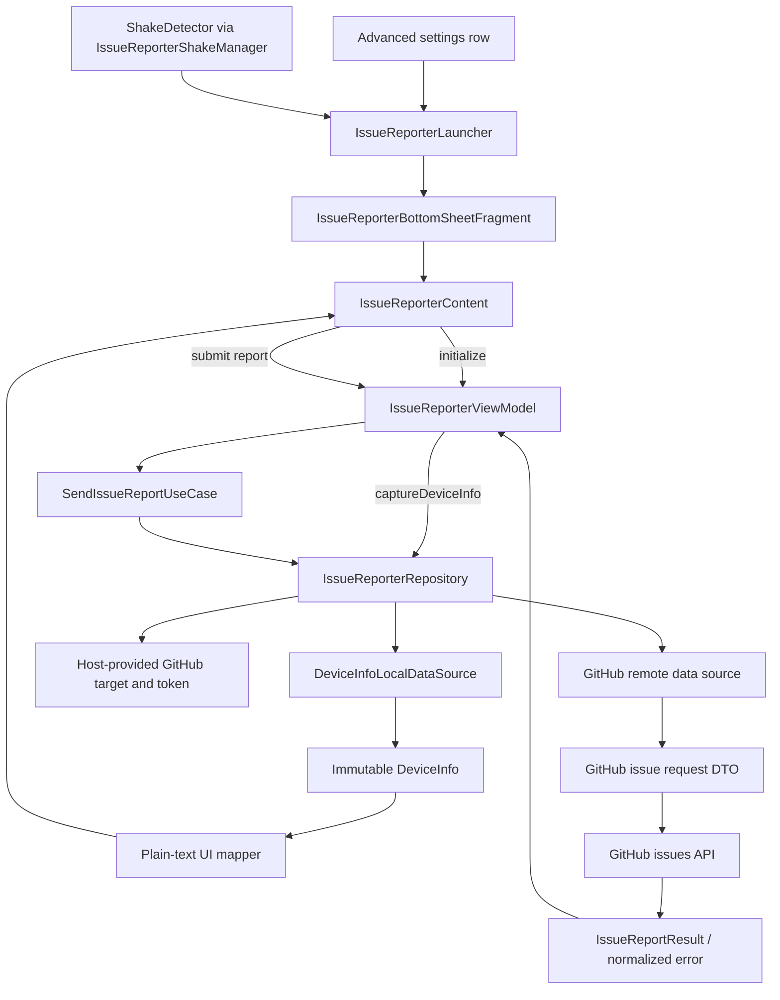

# `:library:feature:issuereporter` Logic Graph

## Purpose

Collects device/report data and submits structured issues to a configured GitHub repository.

## Owns

- Issue-report sheet content, its bottom-sheet container, launcher, ViewModel, state, events, and
  actions.
- Shake-to-report: the detector, the application-scoped manager that drives it, and the host
  configuration that enables it.
- Report, device-info, GitHub-target, and result domain models.
- Report use case, repository/provider contracts, remote source, local device source, DTO, and
  mapper.

## Does not own

- GitHub credentials and repository selection, supplied through host configuration/DI.
- Generic HTTP client and errors, owned by `:library:core:network`.

## Depends on

- [`:library:core:common`](../../core/common/README.md) for dispatchers, Firebase reporting, and
  host constants.
- [`:library:core:network`](../../core/network/README.md) for Ktor/error handling.
- [`:library:core:ui`](../../core/ui/README.md) for screen/ViewModel contracts and UI components.
- [`:library:navigation`](../../navigation/README.md) for navigation support.

## Used by

- `:sample`, `:library:apptoolkit`, and `:library:feature:settings`.

## Flow chart

## Architectural decisions

- The reporter is content, not a screen. It used to be an activity whose only job was to host the
  form and call `finish()`, reached through `openActivity`. It is now `IssueReporterContent`, shown
  in a modal bottom sheet over whatever the author was looking at, so reporting a problem no longer
  costs a task transition and no longer hides the screen the report is about.
- There is one presentation and one way in. `IssueReporterLauncher.show(activity)` is what both the
  advanced settings row and the shake gesture call. A Compose `ModalBottomSheet` would serve
  settings well and serve the gesture not at all, because the gesture is detected outside any
  composition; a `BottomSheetDialogFragment` holding a `ComposeView` can be shown from either, so
  the feature keeps one implementation instead of one per entry point.
- Shake detection is application-scoped, not per screen. Only the foreground activity can present
  anything, so one listener that follows the resumed activity replaces a sensor listener retrofitted
  into every activity of every host app. The accelerometer is registered on resume and unregistered
  on pause, because a sensor left registered keeps drawing power with nothing to show for it.
- The gesture is opt-in through `IssueReporterConfig`. This is a library shipping into several apps,
  and a listener nobody asked for is a cost nobody agreed to; a host that does not enable it
  registers nothing.
- The send action is a persistent bottom button, not the floating one the full screen used. A
  floating action button inside another floating surface reads as an unrelated second layer, and the
  sheet is one focused operation with one action that commits it.
- Every screen state renders through the same form. `ScreenState.Error` already carries its message
  as a snackbar and leaves `data` intact, so swapping the form for an error layout would throw away
  a report the author is still holding; loading only marks the send button busy.
- Device capture is a local data-source responsibility. The domain model is a plain immutable value
  and does not read Android globals or a `Context` during construction.
- The repository is the only data-layer entry point used by the ViewModel; the source-level
  `DeviceInfoProvider` remains an internal replacement seam.
- Plain-text rendering is an explicit mapper because a data class's generated `toString()` is not a
  user-facing or GitHub-report contract.
- Credentials are supplied by the host and used only at the remote boundary; logs and error models
  must never include the token.
- The form is `GeneralTextField` in its grouped style, and the description field is that component
  in its Markdown editor mode; both live in
  [`:library:core:ui`](../../core/ui/README.md#generaltextfield). The Markdown pieces moved there
  with it, because nothing about highlighting or a formatting bar is specific to a bug report. What
  stays here is what is: this screen reports every formatting action through `onMarkdownFormat`, and
  `Report` renders the issue body as Markdown sections with the device table in a collapsible block.
- The description field is an editor, not a preview. Highlighting is a length-preserving
  `VisualTransformation`, so offsets stay identity-mapped and the markers remain visible and
  editable; a Markdown renderer cannot stand in for it.
- The device-info panel owns its expansion with `rememberSaveable`. It was a file-level
  `mutableStateOf` shared by every instance in the process, which is why the panel reopened itself
  and never took part in saved instance state.
- Reports are always anonymous. The screen has no account section, and a report carries only the
  optional contact email the author types.

## Platform metadata ownership

DeviceInfoLocalDataSource reads package versions through core common's getVersionMetadata.
It does not depend on UI models or UI helpers. Device capture remains on the injected IO dispatcher,
and unavailable versions still produce a null name and version code -1.

## Public contracts

- `IssueReporterLauncher.show(activity)` is the entry point. `IssueReporterContent` is public for a
  host embedding the form in its own container; `IssueReporterBottomSheetFragment` is not, because
  how the reporter is presented is this module's decision.
- `IssueReporterConfig` and `IssueReporterShakeManager.install()` are the shake-gesture contract. A
  host enables the gesture by passing the config into `appToolkitModules` and calling `install()`
  from its `Application`.
- `IssueReporterRepository`, `SendIssueReportUseCase`, domain models, and presentation entry
  points/contracts.
- `DeviceInfoProvider` is the local data source's own contract, not a caller-facing one. Device
  capture is reached through `IssueReporterRepository.captureDeviceInfo()`; the ViewModel used to
  hold the provider directly, which put the UI layer on a data source.

## Internal implementations

- GitHub request DTO/mapping, device inspection, repository implementation, sheet composition, and
  the bottom-sheet fragment.
- `ShakeDetector`, whose thresholds are constructor parameters so they can be tuned against real
  devices without changing the gesture logic.

## Current risks

The feature handles a host-provided GitHub token; logging and error changes must avoid exposing that
credential.

Shake thresholds are a judgement, not a measurement. `ShakeDetector` guards against accidental
triggers three ways at once, a magnitude threshold, a minimum duration with a minimum number of
readings, and a cooldown, because any one of them alone fires when a phone is put down firmly. The
defaults are a starting point and want tuning on physical devices.

## Migration notes

`IssueReporterActivity`, its manifest entry, and `Theme.AppToolkit.IssueReporter` are gone, together
with the `LargeTopAppBarWithScaffold`, the back handling, and the FAB that only existed because the
reporter was a screen. Callers that started the activity now call `IssueReporterLauncher.show`.
`AdvancedSettingsProvider.bugReportUrl` went with them: it pointed at the repository's issues page
from before the reporter submitted directly, and nothing read it any more.

`DeviceInfo` was a mutable class that read `android.os.Build` in its field initialisers, built
itself
from a `Context` through a `create()` companion, and imported a `core:ui` extension to read the
package version, a domain model depending on the UI module. It is now a plain data class; capture
lives in `DeviceInfoLocalDataSource` and the two renderings live in `domain/mappers`.

That last part matters more than it looks: the model's `toString()` was the device panel's text, so
making it a data class would silently have rendered `DeviceInfo(appVersionName=…)` on screen. The
formatting moved out with it as `toPlainText()`.

The payoff shows up in the tests, which used to `mockk<DeviceInfo>()` because the real thing needed
a
device. They now build one outright.
