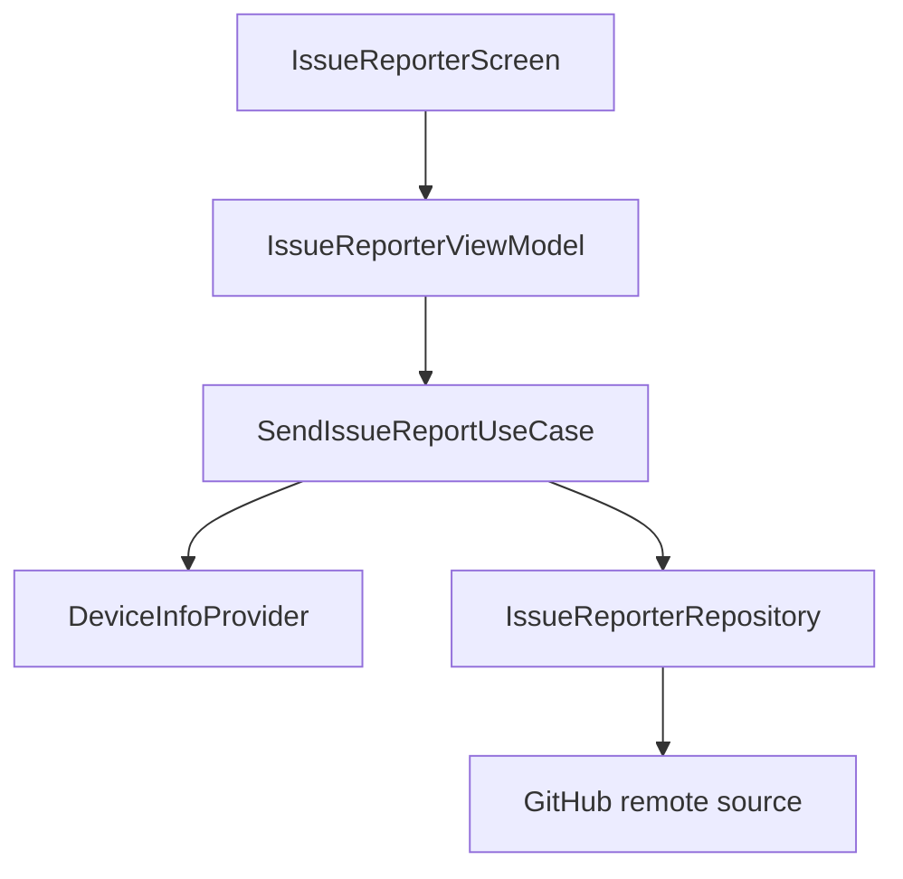

# `:library:feature:issuereporter` Logic Graph

## Purpose

Collects device/report data and submits structured issues to a configured GitHub repository.

## Owns

- Issue-report screen, activity, ViewModel, state, events, and actions.
- Report, device-info, GitHub-target, and result domain models.
- Report use case, repository/provider contracts, remote source, local device source, DTO, and mapper.

## Does not own

- GitHub credentials and repository selection, supplied through host configuration/DI.
- Generic HTTP client and errors, owned by `:library:core:network`.

## Depends on

- [`:library:core:common`](../../core/common/README.md) for dispatchers, Firebase reporting, and host constants.
- [`:library:core:network`](../../core/network/README.md) for Ktor/error handling.
- [`:library:core:ui`](../../core/ui/README.md) for screen/ViewModel contracts and UI components.
- [`:library:navigation`](../../navigation/README.md) for navigation support.

## Used by

- `:sample`, `:library:apptoolkit`, and `:library:feature:settings`.

## Flow chart

## Public contracts

- `IssueReporterRepository`, `DeviceInfoProvider`, `SendIssueReportUseCase`, domain models, and presentation entry points/contracts.

## Internal implementations

- GitHub request DTO/mapping, device inspection, repository implementation, and screen composition.

## Current risks

The feature handles a host-provided GitHub token; logging and error changes must avoid exposing that credential.
