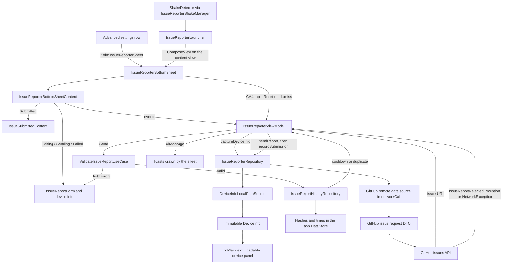

# `:library:feature:issuereporter` Logic Graph

## Purpose

Collects device/report data and submits structured issues to a configured GitHub repository.

## Owns

- `IssueReporterBottomSheet`, which wires the ViewModel, tracking, toasts and the sheet itself, and
  `IssueReporterBottomSheetContent`, the stateless editor and confirmation in the same file. Also
  the launcher for callers outside a composition.
- `IssueReporterViewModel`, `IssueReporterUiState`, `IssueSubmissionState` and
  `IssueReporterEvent`.
- The Koin binding of core UI's `IssueReporterSheet` contract to that sheet, which is how other
  features show it without depending on this module.
- Shake-to-report: the detector, the application-scoped manager that drives it, and the host
  configuration that enables it.
- Report, device-info, GitHub-target, and host configuration models.
- The report checks: `ValidateIssueReportUseCase`, `IssueReportValidation`,
  `IssueReportFieldError`, and `IssueReportHistoryRepository` with its DataStore-backed default,
  which holds back a report during the cooldown or as a duplicate (`IssueReportRefusal`).
- `IssueReporterRepository` and its default implementation, `IssueReportRejectedException`, the
  device-info provider contract, the GitHub remote source, the local device source, the request DTO,
  and its mapper.
- The `GithubToken` Koin qualifier and `toToken`, which decodes the host's token.
- The sheet's localized strings, including the texts for each GitHub refusal and each report check.

## Does not own

- GitHub credentials and repository selection, supplied through host configuration/DI.
- The HTTP client, `networkCall` and the `NetworkException` reasons, owned by
  `:library:core:network` and `:library:core:common`.
- The shared failure texts, such as no internet or a timeout, owned by `toUiText` in
  `:library:core:ui`.

## Depends on

- [`:library:core:common`](../../core/common/README.md) for the IO dispatcher of the device
  source, Firebase reporting, `NetworkException` and host constants.
- [`:library:core:network`](../../core/network/README.md) for Ktor and `networkCall`.
- [`:library:core:ui`](../../core/ui/README.md) for `core.ui.screen`, UI components and the
  `IssueReporterSheet` contract it binds.

## Used by

- [`:library:apptoolkit`](../../apptoolkit/README.md), which includes its Koin module, and `:sample`.
- [`:library:feature:advanced`](../advanced/README.md) reaches the sheet only through the
  `IssueReporterSheet` binding, not as a dependency.

## Flow chart

```mermaid
flowchart TD
    Settings[Advanced settings row] -->|Koin: IssueReporterSheet| Sheet[IssueReporterBottomSheet]
    Shake[ShakeDetector via IssueReporterShakeManager] --> Launcher[IssueReporterLauncher]
    Launcher -->|ComposeView on the content view| Sheet
    Sheet --> Content[IssueReporterBottomSheetContent]
    Content -->|Editing / Sending / Failed| Form[IssueReportForm and device info]
    Content -->|Submitted| Done[IssueSubmittedContent]
    Content -->|events| VM[IssueReporterViewModel]
    Sheet -->|GA4 taps, Reset on dismiss| VM
    VM -->|captureDeviceInfo| Repo[IssueReporterRepository]
    Repo --> Device[DeviceInfoLocalDataSource]
    Device --> Model[Immutable DeviceInfo]
    Model --> Plain[toPlainText: Loadable device panel]
    VM -->|Send| Validate[ValidateIssueReportUseCase]
    Validate -->|field errors| Form
    Validate -->|valid| History[IssueReportHistoryRepository]
    History -->|cooldown or duplicate| VM
    History --> Store[Hashes and times in the app DataStore]
    VM -->|sendReport, then recordSubmission| Repo
    Repo --> Remote[GitHub remote data source in networkCall]
    Remote --> DTO[GitHub issue request DTO]
    DTO --> Api[GitHub issues API]
    Api -->|issue URL| VM
    Api -->|IssueReportRejectedException or NetworkException| VM
    VM -->|UiMessage| Toasts[Toasts drawn by the sheet]
```

## Architectural decisions

- The reporter is a sheet, not a screen. It used to be an activity whose only job was to host the
  form and call `finish()`, reached through `openActivity`. It is now a modal bottom sheet over
  whatever the author was looking at, so reporting a problem no longer costs a task transition and
  no longer hides the screen the report is about.
- There is one sheet, reached two ways. `IssueReporterBottomSheet` is a Compose `ModalBottomSheet`,
  and a host already composing shows it directly, or through the `IssueReporterSheet` contract the
  way the advanced settings row does. The shake
  gesture cannot: it is detected by an application-scoped sensor listener with an `Activity` and no
  composition, so `IssueReporterLauncher` mounts a `ComposeView` on the activity's content view and
  puts the same composable in it. The mounting differs; the sheet does not.
- The sheet follows the `core.ui.screen` split. `IssueReporterBottomSheet` holds the ViewModel, the
  tracking, the GA4 tap events, the presence flag and the reset on dismissal.
  `IssueReporterBottomSheetContent` only renders the state and reports input through callbacks, so
  it previews with plain values.
- `IssueReporterPresence` is what keeps those two paths from stacking. A host composing the sheet is
  invisible to the launcher, which would otherwise mount a second one when the device is shaken on a
  screen already showing the reporter.
- Dismissing the sheet resets the ViewModel. The sheet holds no state of its own and the ViewModel
  is scoped to the screen that opened it, so without `IssueReporterEvent.Reset` an abandoned draft,
  or the confirmation card of a report already filed, would be waiting the next time it opened. A
  send in flight is left to finish rather than cancelled, and the reset runs when it lands.
- Shake detection is application-scoped, not per screen. Only the foreground activity can present
  anything, so one listener that follows the resumed activity replaces a sensor listener retrofitted
  into every activity of every host app. The accelerometer is registered on resume and unregistered
  on pause, because a sensor left registered keeps drawing power with nothing to show for it.
- The gesture is opt-in through `IssueReporterConfig`. This is a library shipping into several apps,
  and a listener nobody asked for is a cost nobody agreed to; a host that does not enable it
  registers nothing.
- The send action is a persistent bottom button, not the floating one the full screen used. A
  floating action button inside another floating surface reads as an unrelated second layer, and the
  sheet is one focused operation with one action that commits it.
- Submission is a state, not an inference. `IssueSubmissionState` names Editing, Sending, Failed
  and Submitted, and the sheet shows exactly one of them. Submitting replaces the editor outright,
  so the sheet shrinks to a confirmation and the shrinking is itself the signal that there is
  nothing left to do. The state is also the `TrackedStatus` the sheet reports in `screen_state`,
  with the labels it has always sent: `success` while editing or filed, `loading` while sending and
  `error` after a failed send.
- A failure goes back to the editor with the report intact, as `Failed`, because the next thing
  the author does is fix it and send again. The form stays, and the failure goes out as a message.
- The form fields survive submission and are cleared on dismissal. They are what the author wrote,
  and the confirmation is part of the same interaction; clearing them the moment the network
  answered would destroy that input while the author is still looking at the sheet. Done is a
  dismissal like any other and takes the same path.
- Done is the primary action on the confirmation and opening the issue is the quiet one, because
  finishing is the normal next step. There is deliberately no "report another": it adds a decision
  to what should be the simplest state in the feature, and reopening the reporter covers it.
- Failure messages use toasts so they do not cover the sheet's send button. The ViewModel queues
  them with `showMessage` like any screen, and the sheet shows the queue as toasts instead of
  through `MessageHost`, marking each one shown. Success is represented by the confirmation state,
  without a transient message. If the sheet is dismissed during a send, the send finishes and the
  pending reset clears its state and its messages before the next opening.
- Success takes the keyboard down, clears focus and fires a confirm haptic. The keyboard belongs to
  a form that is being replaced, and the sheet shrinking is easy to miss on a glance away.
- The data layer throws. GitHub's 401, 403, 410 and 422 answers are an
  `IssueReportRejectedException` with a `reason`, because each needs the host's setup changed and
  has its own text. Every other failure is a `NetworkException` from `networkCall` or the response
  status, and shows the shared text for its reason or "Failed to send report". GitHub's response
  body and an exception's message never reach the user.
- There is no send use case. It only forwarded one repository call and repeated the repository's
  breadcrumb, so the ViewModel calls `IssueReporterRepository.sendReport` directly.
- Device capture is a local data-source responsibility. The domain model is a plain immutable value
  and does not read Android globals or a `Context` during construction. The device panel captures
  lazily the first time it opens, as a `Loadable`: a failed capture shows its message in the panel
  and runs again the next time the panel opens.
- The repository is the only data-layer entry point used by the ViewModel; the source-level
  `DeviceInfoProvider` remains an internal replacement seam. The repository and the ViewModel take
  no dispatcher: Ktor suspends, and the device source moves its own platform reads to IO.
- Plain-text rendering is an explicit mapper because a data class's generated `toString()` is not a
  user-facing or GitHub-report contract.
- Credentials are supplied by the host and used only at the remote boundary; logs and error models
  must never include the token.
- The form is `GeneralTextField` in its grouped style, and the description field is that component
  in its Markdown editor mode; both live in
  [`:library:core:ui`](../../core/ui/README.md#generaltextfield). The Markdown pieces moved there
  with it, because nothing about highlighting or a formatting bar is specific to a bug report. What
  stays here is what is: the sheet reports every formatting action passed up through
  `onMarkdownFormat`, and `Report` renders the issue body as Markdown sections with the device table
  in a collapsible block.
- The description field is an editor, not a preview. Highlighting is a length-preserving
  `VisualTransformation`, so offsets stay identity-mapped and the markers remain visible and
  editable; a Markdown renderer cannot stand in for it.
- The device-info panel owns its expansion with `rememberSaveable`. It was a file-level
  `mutableStateOf` shared by every instance in the process, which is why the panel reopened itself
  and never took part in saved instance state.
- Reports are anonymous to the app. The screen has no account section, and a report carries only
  the contact email the author types, which is required so a maintainer can ask a follow-up
  question; one that cannot be answered is rarely worth filing.

### Report checks

Some people used the reporter to file greetings and unrelated text. A send now passes three gates,
in order, and only the first is about the text itself:

1. `ValidateIssueReportUseCase` checks every field, trimmed: an email in a valid form, a title of
   10 to 120 characters with at least 6 letters or digits, and a description of 40 to 5,000
   characters with at least 20. It refuses whitespace, punctuation or emoji alone, one character
   or one short run repeated over the whole text, a link with nothing around it, and a description
   that repeats the title. Each field gets its own `IssueReportFieldError`, shown beneath it
   through `GeneralTextField.errorText`, and editing a field clears its error.
2. `IssueReportHistoryRepository` holds back any report for five minutes after the last one.
3. It refuses a report whose normalized title and description were filed in the last 24 hours.

The cooldown and duplicate refusals are shown as a message because they belong to no field.

- Letters and digits are counted per Unicode code point in any script, never as English words, so
  a report in Chinese, Hindi or Arabic passes on the same terms. Nothing tries to recognise
  gibberish: guessing at meaning would refuse real reports.
- Repetition is judged on the whole text. A stack trace that repeats its frames under a distinct
  first line is not repetitive.
- Send stays enabled and the sheet looks the same; errors only appear after a send. A disabled
  button would not say what is wrong.
- The history lives in the app's DataStore, not the ViewModel, so dismissing and reopening the sheet
  lifts neither guard. It stores the time of the last report and a SHA-256 hash of each of the last
  ten, never the text or the email. A history that cannot be read or written holds nothing back: the
  checks protect maintainers, and must not stop a real bug from being reported.
- `send_issue` is logged by the ViewModel, once per attempt, with `validation_failure`: the first
  failing field and its reason, such as `email_invalid` or `description_too_short`, then `cooldown`
  or `duplicate`, or `none` for a report handed to GitHub. Only lengths and these names are sent.

## Platform metadata ownership

DeviceInfoLocalDataSource reads package versions through core common's getVersionMetadata.
It does not depend on UI models or UI helpers. Device capture remains on the injected IO dispatcher,
and unavailable versions still produce a null name and version code -1.

## Public contracts

- The `single<IssueReporterSheet>` binding in the module's Koin module. A feature that offers a
  bug report resolves it with `getOrNull()` and hides the entry when it is absent.
- `IssueReporterBottomSheet(onDismissRequest)` is the entry point for a host inside a composition,
  and `IssueReporterLauncher.show(activity)` for one that is not.
- `IssueReporterConfig` and `IssueReporterShakeManager.install()` are the shake-gesture contract. A
  host enables the gesture by passing the config into `appToolkitModules` and calling `install()`
  from its `Application`.
- `IssueReporterRepository`: `sendReport` returns the created issue's URL and throws
  `IssueReportRejectedException` or `NetworkException`; `captureDeviceInfo` returns a `DeviceInfo`.
  Both are main-safe.
- `IssueReportHistoryRepository`: `refusalFor` returns why a report cannot be sent now, or null,
  and `recordSubmission` remembers a filed one. Both are main-safe and never throw for storage.
- `ValidateIssueReportUseCase`, which returns an `IssueReportValidation`. Its limits are public
  constants.
- `IssueReporterViewModel`, `IssueReporterUiState`, `IssueSubmissionState`, `IssueReporterEvent`
  and the domain models.
- `DeviceInfoProvider` is the local data source's own contract, not a caller-facing one. Device
  capture is reached through `IssueReporterRepository.captureDeviceInfo()`.

## Internal implementations

- GitHub request DTO/mapping, device inspection, repository implementation,
  `IssueReporterBottomSheetContent`, `IssueSubmittedContent`, the form views, the UI mappers, and
  the `ComposeView` the launcher mounts.
- `ShakeDetector`, whose thresholds are constructor parameters so they can be tuned against real
  devices without changing the gesture logic.

## Current risks

The feature handles a host-provided GitHub token; logging and error changes must avoid exposing that
credential.

Shake thresholds are a judgement, not a measurement. `ShakeDetector` counts a shake each time the
acceleration rises above its threshold after settling back towards rest, and guards against
accidental triggers three ways at once: a magnitude threshold, a number of shakes spread over a
minimum duration, and a cooldown, because any one of them alone fires when a phone is put down
firmly. The defaults ask for six shakes, three back-and-forth movements, over at least 800 ms, so
the sheet takes a deliberate gesture. They are a starting point and want tuning on physical devices.

The report checks keep out careless and casual abuse, not a determined one: the history is on the
device, and clearing the app's data or changing the clock lifts it. The checks deliberately stop
short of judging meaning, so a long enough report of nonsense in real words still gets through.

## Migration notes

`IssueReporterActivity`, its manifest entry, and `Theme.AppToolkit.IssueReporter` are gone, together
with the `LargeTopAppBarWithScaffold`, the back handling, and the FAB that only existed because the
reporter was a screen. A host inside a composition now shows `IssueReporterBottomSheet`; one that
started the activity from outside a composition calls `IssueReporterLauncher.show`.
`AdvancedSettingsProvider.bugReportUrl` went with them: it pointed at the repository's issues page
from before the reporter submitted directly, and nothing read it any more.

`DeviceInfo` was a mutable class that read `android.os.Build` in its field initialisers, built
itself
from a `Context` through a `create()` companion, and imported a `core:ui` extension to read the
package version, a domain model depending on the UI module. It is now a plain data class; capture
lives in `DeviceInfoLocalDataSource` and the two renderings live in `domain/mappers`.

That last part matters more than it looks: the model's `toString()` was the device panel's text, so
making it a data class would silently have rendered `DeviceInfo(appVersionName=…)` on screen. The
formatting moved out with it as `toPlainText()`.

The payoff shows up in the tests, which used to `mockk<DeviceInfo>()` because the real thing needed
a
device. They now build one outright.

The move to `core.ui.screen` removed `IssueReporterContent`, `SendIssueReportUseCase`,
`IssueReportResult` and `IssueReporterAction`. A host that embedded `IssueReporterContent` shows
`IssueReporterBottomSheet` instead. Code that called the use case calls
`IssueReporterRepository.sendReport`, which returns the issue URL and throws where it used to
return `IssueReportResult.Error`. `DefaultIssueReporterRepository` no longer takes a
`DispatcherProvider`, and `IssueReporterViewModel` takes only the repository, the GitHub target,
the token and `TelemetryRepository`.
