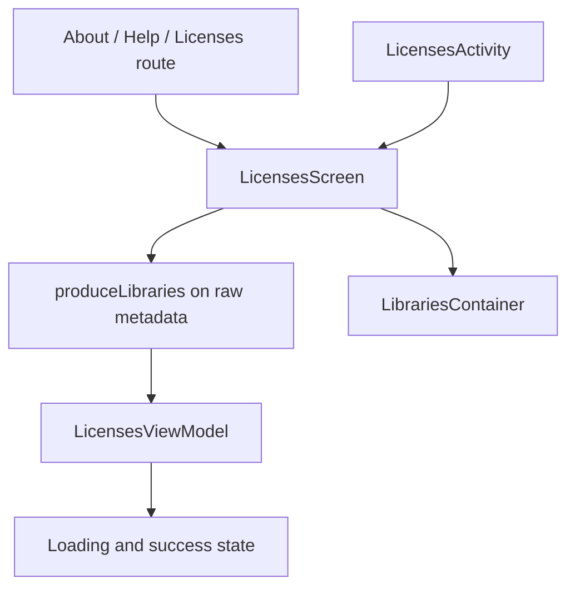

# `:library:feature:licenses` Logic Graph

## Purpose

Owns the open-source licenses surface: the list of bundled libraries, its standalone activity, and
the AboutLibraries metadata that backs them.

## Owns

- `LicensesScreen`, both standalone and embedded in a host scaffold.
- `LicensesActivity`, the internal entry point opened from About and Help.
- `LicensesViewModel` and `LicensesUiState`, which turn metadata parsing into loading and success
  states.
- The AboutLibraries Gradle plugin and its generated `raw/aboutlibraries` resource.

## Does not own

- The About list entry that opens this screen, owned by
  [`:library:feature:about`](../about/README.md).
- The Help overflow entry that opens this screen, owned by
  [`:library:feature:help`](../help/README.md).
- The `LicensesRoute` key and its Navigation 3 entry, owned by
  [`:library:navigation`](../../navigation/README.md) and `:library:apptoolkit`.

## Depends on

- `:library:core:common` and `:library:core:ui` for shared state, Compose, and the scaffold.
- `aboutlibraries-compose-m3` for the library list rendering and metadata producer.

## Used by

- `:library:apptoolkit`, `:library:feature:about`, and `:library:feature:help`.

## Flow chart

## Architectural decisions

- Metadata is parsed by the AboutLibraries Compose producer, which is inherently a composition-side
  API. The screen reports when parsing finishes and `LicensesViewModel` turns that into the same
  loading and success states the rest of the toolkit renders and tracks, instead of the screen
  building a `ScreenState` inline.
- The module carries the AboutLibraries plugin so the generated metadata resource stays next to the
  screen that reads it, and so modules that only link to licenses do not inherit the plugin.
- `isEmbedded` keeps a single screen usable both as an activity and inside an existing scaffold,
  rather than duplicating the list for the Navigation 3 destination.

## Public contracts

- `LicensesScreen`, `LicensesActivity`, `LicensesViewModel`, `LicensesUiState`, `LicensesEvent`, and
  `licensesModule`.

## Internal implementations

- AboutLibraries metadata production and badge configuration.

## Current risks

The bundled metadata is generated at build time by the AboutLibraries plugin, so a host that
shadows or reconfigures that plugin changes what this screen lists.
