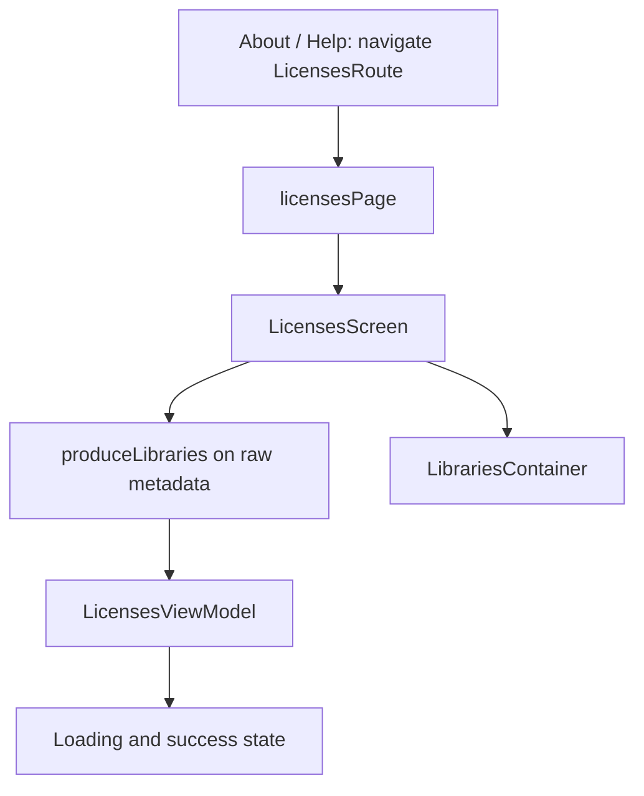

# `:library:feature:licenses` Logic Graph

## Purpose

Owns the open-source licenses surface: the list of bundled libraries, its shell page, and the
AboutLibraries metadata that backs them.

## Owns

- `LicensesScreen`, drawn inside the shell's page frame.
- `licensesPage()`, the registration of `LicensesRoute`, opened from About and Help.
- `LicensesViewModel` and `LicensesUiState`, which turn metadata parsing into loading and success
  states.
- The AboutLibraries Gradle plugin and its generated `raw/aboutlibraries` resource.

## Does not own

- The About list entry that opens this screen, owned by
  [`:library:feature:about`](../about/README.md).
- The Help overflow entry that opens this screen, owned by
  [`:library:feature:faq`](../faq/README.md).
- The `LicensesRoute` key, owned by [`:library:navigation`](../../navigation/README.md). Pages that
  open this one navigate to the key, so neither About nor Help depends on this module.

## Depends on

- `:library:core:common` and `:library:core:ui` for shared state, Compose, the page frame and, through
  `:library:core:ui`, the graph builder of `:library:navigation`.
- `aboutlibraries-compose-m3` for the library list rendering and metadata producer.

## Used by

- [`:library:apptoolkit`](../../apptoolkit/README.md), which calls `licensesPage()` from
  `toolkitPages()`.

## Flow chart

```mermaid
flowchart TD
    Entry[About / Help: navigate LicensesRoute] --> Page[licensesPage]
    Page --> Screen[LicensesScreen]
    Screen --> Producer[produceLibraries on raw metadata]
    Producer --> VM[LicensesViewModel]
    VM --> State[Loading and success state]
    Screen --> Container[LibrariesContainer]
```

## Architectural decisions

- Metadata is parsed by the AboutLibraries Compose producer, which is inherently a composition-side
  API. The screen reports when parsing finishes and `LicensesViewModel` turns that into the same
  loading and success states the rest of the toolkit renders and tracks, instead of the screen
  building a `ScreenState` inline.
- The module carries the AboutLibraries plugin so the generated metadata resource stays next to the
  screen that reads it, and so modules that only link to licenses do not inherit the plugin.
- The page is `PaneRole.None`, not a detail: it opens from About, itself a detail beside the
  settings list, and a detail opened from a detail would replace it instead of stacking on it.
- The screen pads its list by `contentPadding()` and draws no scaffold of its own; the shell's page
  frame supplies the app bar and title.

## Public contracts

- `LicensesScreen`, `licensesPage()`, `LicensesViewModel`, `LicensesUiState`, `LicensesEvent`, and
  `licensesModule`.

## Internal implementations

- AboutLibraries metadata production and badge configuration.

## Current risks

The bundled metadata is generated at build time by the AboutLibraries plugin, so a host that
shadows or reconfigures that plugin changes what this screen lists.
