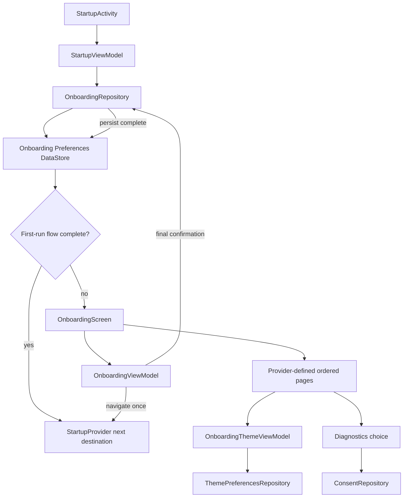

# `:library:feature:onboarding` Logic Graph

## Purpose

Owns startup routing and the multi-page onboarding flow, including theme choice, diagnostics
consent, and completion persistence.

## Owns

- `OnboardingThemeViewModel`, which keeps the theme onboarding page independent from DataStore and
  exposes the shared immutable theme-preferences model.

- Startup and onboarding screens, activities, ViewModels, state/events/actions.
- `StartupProvider` and `OnboardingProvider` host extension contracts.
- Onboarding repository, page models, controls, and consent/theme pages.

## Does not own

- Host-specific startup/onboarding provider implementations, owned by `:sample`.
- Consent SDK orchestration, owned by `:library:integration:consent`.
- Theme implementation and settings repositories, owned by core design system/DataStore and settings
  modules.

## Depends on

- `:library:core:common`, `:library:core:datastore`, `:library:core:network`, and `:library:core:ui`
  for shared contracts, completion persistence, errors, and UI.
- [`:library:navigation`](../../navigation/README.md) for startup navigation.
- [`:library:integration:consent`](../../integration/consent/README.md) for consent application.
- [`:library:feature:settings`](../settings/README.md) for diagnostics/theme settings flows.

## Used by

- `:sample` and `:library:apptoolkit`.

## Flow chart

## Architectural decisions

- Startup routing and onboarding presentation are separate state holders: startup decides whether
  the flow is required, while onboarding owns page progress and completion.
- The host supplies page/routing extension points, but toolkit state holders persist confirmed
  choices. Presentation callbacks do not write DataStore directly.
- Theme and consent pages use their owning repositories/ViewModels so onboarding does not become a
  second implementation of settings behavior.
- Completion is written only after the final confirmed action; navigation is emitted separately as
  a one-off effect.

## Public contracts

- Startup/onboarding provider contracts, repository/models, and presentation entry points.

## Internal implementations

- Page ordering/rendering, completion persistence adapter, consent dialog, and celebration state.

## Current risks

The onboarding module coordinates consent, persisted theme/diagnostics state, host routing, and
settings UI; changes require checking several module contracts together.
