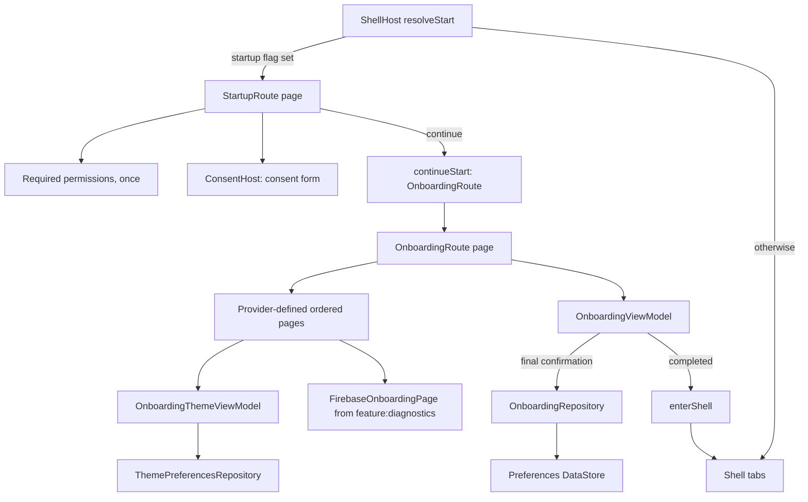

# `:library:feature:onboarding` Logic Graph

## Purpose

Owns the first launch: the startup screen (consent and runtime permissions) and the multi-page
onboarding flow, including theme choice and completion persistence. Both are start screens of the
shell, drawn before its tabs.

## Owns

- `onboardingPages()`, which registers `StartupRoute` and `OnboardingRoute` as pages without a
  title and offers both as start screens (`startScreens`).
- The startup and onboarding screens, their ViewModels and state, event and action contracts, and
  the page glue that performs their actions: the permission request, the consent form, and handing
  over (`continueStart(OnboardingRoute)`, then `enterShell()`).
- `OnboardingThemeViewModel`, which keeps the theme onboarding page independent from DataStore and
  exposes the shared immutable theme-preferences model.
- `StartupProvider` and `OnboardingProvider` host extension contracts.
- Onboarding repository, page models, controls, and the theme and finish pages.

## Does not own

- Deciding whether the first launch runs. The app starts on `StartupRoute` from
  `ShellHost(resolveStart = ...)` while its startup flag is set; see [Using it](#using-it).
- Host-specific startup/onboarding provider implementations, owned by `:sample`.
- Consent SDK orchestration, owned by `:library:integration:consent`.
- The diagnostics page and the privacy choices dialog it opens, owned by
  [`:library:feature:diagnostics`](../diagnostics/README.md) (`FirebaseOnboardingPage`) along with
  the state they read and write. A host lists it among its pages through `OnboardingProvider`.
- Theme implementation and settings repositories, owned by core design system and DataStore.

## Depends on

- `:library:core:common`, `:library:core:datastore`, `:library:core:network`, and `:library:core:ui`
  for shared contracts, completion persistence, errors, and UI.
- [`:library:navigation`](../../navigation/README.md) for the keys, the graph builder and the
  shell navigator.
- [`:library:integration:consent`](../../integration/consent/README.md) for the consent form, run
  through `ConsentHost(activity)`.
- No other feature module.

## Used by

- [`:library:apptoolkit`](../../apptoolkit/README.md), which calls `onboardingPages()` from
  `toolkitPages()`, and `:sample:feature:onboarding`, which provides the pages and permissions.

## Using it

```kotlin
ShellHost(
    graph = graph,
    resolveStart = { if (dataStore.startup.first()) StartupRoute else startKeyFor(storedTab) },
    onReady = { keepSplashVisible = false },
)
```

Neither screen has the shell under it, so back from either leaves the app. Finishing onboarding
writes completion and enters the shell on its start tab; the next launch then resolves past
`StartupRoute`.

## Flow chart


```mermaid
flowchart TD
    Host[ShellHost resolveStart] -->|startup flag set| Startup[StartupRoute page]
    Host -->|otherwise| Tabs[Shell tabs]
    Startup --> Permissions[Required permissions, once]
    Startup --> ConsentForm[ConsentHost: consent form]
    Startup -->|continue| Continue[continueStart: OnboardingRoute]
    Continue --> Onboarding[OnboardingRoute page]
    Onboarding --> Pages[Provider-defined ordered pages]
    Pages --> Theme[OnboardingThemeViewModel]
    Theme --> ThemeRepo[ThemePreferencesRepository]
    Pages --> Diagnostics[FirebaseOnboardingPage from feature:diagnostics]
    Onboarding --> VM[OnboardingViewModel]
    VM -->|final confirmation| Completion[OnboardingRepository]
    Completion --> Store[Preferences DataStore]
    VM -->|completed| Enter[enterShell]
    Enter --> Tabs
```

## Architectural decisions

- Start screens, not activities. The first launch runs inside the one activity, so consent and
  permission requests go through `LocalActivity.current`, and the shell's start is decided once in
  `resolveStart` instead of by a launcher activity that forwarded to the main one.
- Startup and onboarding are separate state holders: startup asks for permissions and consent,
  while onboarding owns page progress and completion.
- Permissions are requested once per screen instance, saved across the resume the system dialog
  causes, so a person who declined is not asked again on the spot. Consent is asked for on each
  resume until it has resolved.
- Each action reaches a single collector, the page glue in `OnboardingPages.kt`; the screens only
  send events.
- The host supplies page/routing extension points, but toolkit state holders persist confirmed
  choices. Presentation callbacks do not write DataStore directly.
- Theme and consent pages use their owning repositories/ViewModels so onboarding does not become a
  second implementation of settings behavior.
- On large screens the pages keep to a column at most 640dp wide, centred, so a tablet shows them
  at a readable width instead of stretched across the window.
- Completion is written only after the final confirmed action; navigation is emitted separately as
  a one-off effect.

## Public contracts

- `onboardingPages()`, the startup/onboarding provider contracts, repository and models, and the
  presentation entry points.

## Internal implementations

- Page ordering/rendering, completion persistence adapter, and celebration state.

## Current risks

- The app decides when the first launch runs. An app that forgets the `resolveStart` check never
  shows onboarding, and one that never clears its startup flag shows it on every launch.
- The module coordinates consent, persisted theme state and the host's pages; changes require
  checking several module contracts together.
