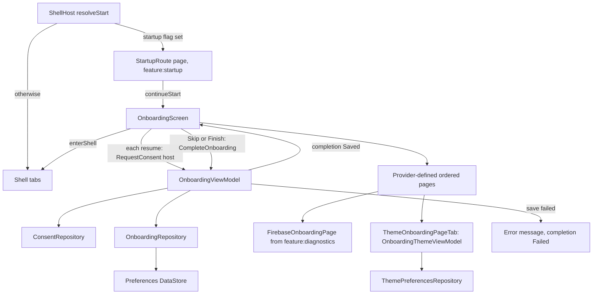

# `:library:feature:onboarding` Logic Graph

## Purpose

Owns the multi-page onboarding flow of a first launch, including theme choice and completion
persistence. It is a start screen of the shell, drawn before its tabs, and follows the startup
screen of [`:library:feature:startup`](../startup/README.md).

## Owns

- `onboardingPages()`, which registers `OnboardingRoute` as a page without a title and offers it
  as a start screen (`startScreens`).
- `OnboardingScreen`, with `OnboardingScreenContent` in the same file, `OnboardingViewModel`, its
  state (`OnboardingUiState`, `OnboardingCompletion`) and `OnboardingEvent`. The screen asks for
  consent on each resume and calls `enterShell()` once completion is saved.
- `onboardingModule`, which binds `OnboardingThemeViewModel`.
- `ThemeOnboardingPageTab`, `OnboardingThemeViewModel`, `OnboardingThemeUiState` and
  `OnboardingThemeEvent`: the theme page reads the stored theme preferences and the seasonal
  unlock, and saves each choice through `ThemePreferencesRepository`. Its theme mode and palette
  choices are `ThemeModePicker` and `ThemePalettePicker` from `:library:core:ui`, the same ones the
  theme settings page shows; only the title, subtitle and AMOLED card are this page's own.
- The `OnboardingProvider` host extension contract.
- `OnboardingRepository` and `DefaultOnboardingRepository`, page models, controls, and the default
  and finish pages.

## Does not own

- The startup screen before it, `StartupProvider` and the permission request, owned by
  [`:library:feature:startup`](../startup/README.md), which hands over to `OnboardingRoute` by key.
- Deciding whether the first launch runs. The app starts on `StartupRoute` from
  `ShellHost(resolveStart = ...)` while its startup flag is set; see [Using it](#using-it).
- Host-specific onboarding provider implementations, owned by `:sample:feature:onboarding`.
- Consent SDK orchestration, owned by `:library:integration:consent`.
- The diagnostics page and the privacy choices dialog it opens, owned by
  [`:library:feature:diagnostics`](../diagnostics/README.md) (`FirebaseOnboardingPage`) along with
  the state they read and write. A host lists it among its pages through `OnboardingProvider`.
- Theme implementation and settings repositories, owned by core design system and DataStore.

## Depends on

- `:library:core:common`, `:library:core:datastore`, `:library:core:network`, and `:library:core:ui`
  for shared contracts, completion persistence, errors, and UI.
- [`:library:navigation`](../../navigation/README.md) for the keys, the graph builder and the
  shell navigator.
- [`:library:integration:consent`](../../integration/consent/README.md) for `ConsentRepository`,
  which the ViewModel asks with a `ConsentHost` built from the activity.
- No other feature module.

## Used by

- [`:library:apptoolkit`](../../apptoolkit/README.md), which calls `onboardingPages()` from
  `toolkitPages()`, and `:sample:feature:onboarding`, which provides the pages and binds the
  ViewModel.

## Using it

```kotlin
ShellHost(
    graph = graph,
    resolveStart = { if (dataStore.startup.first()) StartupRoute else startKeyFor(storedTab) },
    onReady = { keepSplashVisible = false },
)
```

The startup screen hands over to onboarding. Neither has the shell under it, so back from either
leaves the app. Finishing onboarding writes completion and enters the shell on its start tab; the
next launch then resolves past `StartupRoute`.

The host binds the provider, the repository and the onboarding ViewModel, as
`:sample:feature:onboarding` does:

```kotlin
single<OnboardingProvider> { AppOnboardingProvider() }
single<OnboardingRepository> { DefaultOnboardingRepository(dataStore = get()) }
viewModel {
    OnboardingViewModel(
        onboardingRepository = get(),
        consentRepository = get(),
        telemetryRepository = get(),
    )
}
```

## Flow chart


```mermaid
flowchart TD
    Host[ShellHost resolveStart] -->|startup flag set| Startup[StartupRoute page, feature:startup]
    Host -->|otherwise| Tabs[Shell tabs]
    Startup -->|continueStart| Screen[OnboardingScreen]
    Screen -->|each resume: RequestConsent host| VM[OnboardingViewModel]
    VM --> Consent[ConsentRepository]
    Screen --> Pages[Provider-defined ordered pages]
    Pages --> Theme[ThemeOnboardingPageTab: OnboardingThemeViewModel]
    Theme --> ThemeRepo[ThemePreferencesRepository]
    Pages --> Diagnostics[FirebaseOnboardingPage from feature:diagnostics]
    Screen -->|Skip or Finish: CompleteOnboarding| VM
    VM --> Completion[OnboardingRepository]
    Completion --> Store[Preferences DataStore]
    VM -->|completion Saved| Screen
    VM -->|save failed| Message[Error message, completion Failed]
    Screen -->|enterShell| Tabs
```

## Architectural decisions

- Start screens, not activities. The first launch runs inside the one activity, so consent and
  permission requests go through `LocalActivity.current`, and the shell's start is decided once in
  `resolveStart` instead of by a launcher activity that forwarded to the main one.
- Startup and onboarding are separate modules: startup asks for permissions and consent, while
  onboarding owns page progress and completion. They meet only at `OnboardingRoute`, a key in
  `:library:navigation`.
- `OnboardingScreen` owns the ViewModel, tracking, the consent host, navigation and the snackbar
  host. `OnboardingScreenContent` renders the pager and reports through `OnboardingEvent`.
- The ViewModel runs the consent request with the `ConsentHost` the screen sends, for that request
  only, so it keeps no activity once the request ends. A resume restarts a request still waiting.
- Completion is written only after Skip or Finish. The ViewModel marks it
  `OnboardingCompletion.Saved` in state and the screen enters the shell when it sees that, so a
  save that ends during a rotation still leaves. The stored flag, `isOnboardingCompleted`, is not
  used to navigate: it is already true when onboarding is opened again from the developer options.
- A failed completion write shows an error message and leaves the pages on screen, since finishing
  is the only way out. `screen_state` reports `success` while the pages show, `loading` while
  saving and `error` after a failed save.
- The screen provides its snackbar host as `LocalPageSnackbarHostState`, so a page's own ViewModel
  (the theme page, the diagnostics page) shows its messages above the footer.
- The host supplies page/routing extension points, but toolkit state holders persist confirmed
  choices. Presentation callbacks do not write DataStore directly.
- Theme and consent pages use their owning repositories/ViewModels so onboarding does not become a
  second implementation of settings behavior. The theme page shows the Toolkit's default theme
  until the stored preferences arrive, and a failed write shows an error message.
- On large screens the pages keep to a column at most 640dp wide, centred, so a tablet shows them
  at a readable width instead of stretched across the window.

## Public contracts

- `onboardingPages()` and `onboardingModule`.
- `OnboardingScreen()` and `ThemeOnboardingPageTab()`, `DefaultOnboardingPage`,
  `FinishOnboardingPage`.
- `OnboardingViewModel(onboardingRepository, consentRepository, telemetryRepository)`, which the
  host binds, with `OnboardingUiState`, `OnboardingCompletion` and `OnboardingEvent`.
- `OnboardingThemeViewModel`, `OnboardingThemeUiState` and `OnboardingThemeEvent`.
- `OnboardingProvider`, `OnboardingPage`, `OnboardingRepository` and `DefaultOnboardingRepository`,
  whose `setOnboardingCompleted()` throws `StorageException` when the write fails.

## Internal implementations

- `OnboardingScreenContent` and `ThemeOnboardingPageTabContent`, page ordering and rendering, and
  celebration state.

## Current risks

- The app decides when the first launch runs. An app that forgets the `resolveStart` check never
  shows onboarding, and one that never clears its startup flag shows it on every launch.
- The module coordinates consent, persisted theme state and the host's pages; changes require
  checking several module contracts together.
- `ConsentRepository.requestConsent()` is a suspend call that completes or throws. The ViewModel
  reports a failure without blocking onboarding, and cancelling its wait does not cancel the
  shared UMP round trip owned by the repository.
