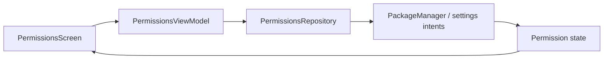

# `:library:feature:permissions` Logic Graph

## Purpose

Displays application permission state and coordinates Android permission-management actions.

## Owns

- Permissions screen/activity/ViewModel and event/action contracts.
- `PermissionsRepository` and its Android implementation.

## Does not own

- General privacy/settings composition, owned by `:library:feature:settings` and `:library:feature:about`.
- Generic permission helpers/constants, owned by `:library:core:common`.

## Depends on

- `:library:core:common`, `:library:core:network`, and `:library:core:ui` for platform helpers, dispatchers/errors, and presentation foundations.
- [`:library:navigation`](../../navigation/README.md) for navigation support.
- [`:library:feature:settings`](../settings/README.md) for settings-related contracts/UI composition.

## Used by

- `:sample` and `:library:apptoolkit`.

## Flow chart

## Public contracts

- `PermissionsRepository` and permissions presentation entry points/contracts.

## Internal implementations

- Android permission inspection and screen rendering.

## Current risks

The feature depends on the broad settings module even though the primary permission repository is self-contained, increasing feature coupling.
