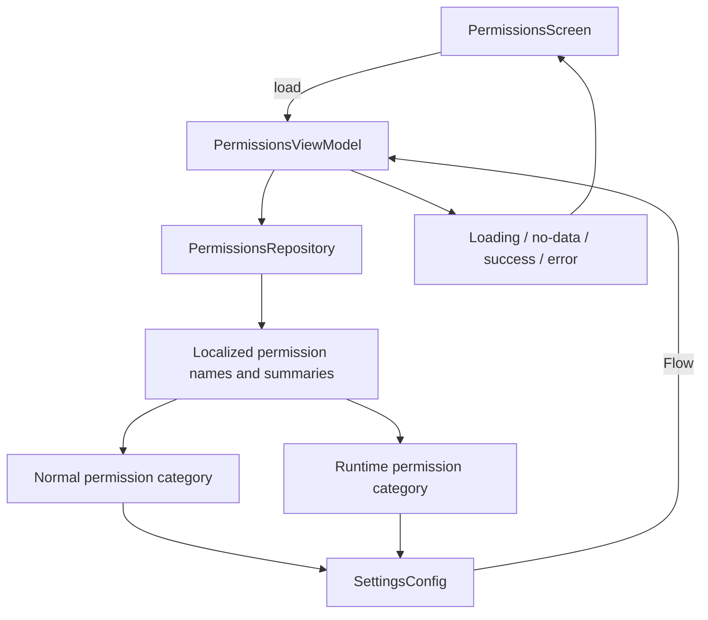

# `:library:feature:permissions` Logic Graph

## Purpose

Displays a localized explanation of the permissions used by AppToolkit hosts.

## Owns

- Permissions screen/activity/ViewModel and event/action contracts.
- `PermissionsRepository` and its resource-backed implementation, which builds the normal/runtime
  permission catalog.

## Does not own

- General privacy/settings composition, owned by `:library:feature:settings` and
  `:library:feature:about`.
- Generic permission helpers/constants, owned by `:library:core:common`.
- Runtime grant inspection or system-settings actions; this screen is descriptive and does not
  claim to report current grant state.

## Depends on

- `:library:core:common`, `:library:core:network`, and `:library:core:ui` for platform helpers,
  dispatchers/errors, and presentation foundations.
- [`:library:navigation`](../../navigation/README.md) for navigation support.
- [`:library:feature:settings`](../settings/README.md) for settings-related contracts/UI
  composition.

## Used by

- `:sample` and `:library:apptoolkit`.

## Flow chart

## Architectural decisions

- This feature intentionally has no `domain` package: its ViewModel consumes one repository and
  contains no reusable business rule or repository coordination that would justify a use case.
- The screen is a disclosure catalog, not a permission checker. It does not query `PackageManager`
  or infer whether a runtime permission is currently granted.
- Resource-backed catalog assembly stays in the repository so the ViewModel handles only
  loading/error state and the composable renders the shared settings models.
- The repository emits through a `Flow` on the injected IO dispatcher, matching the feature's
  screen-state pipeline even though the current catalog is produced in one shot.

## Public contracts

- `PermissionsRepository` and permissions presentation entry points/contracts.

## Internal implementations

- Localized catalog assembly and screen rendering.

## Current risks

The feature depends on the broad settings module even though the primary permission repository is
self-contained, increasing feature coupling.
